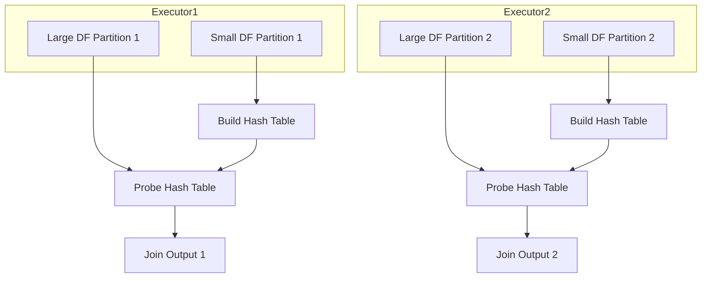

# Hash join

A hash join in Spark:

1. Uses a `hash table built` from one side (usually the smaller DataFrame).
2. The other side (larger) is streamed and matched using this hash table.
3. It's efficient for `equi-joins (= condition)`

In spark, `Hash Join` plays a role at `per node level` and the strategy is used to `join partitions` available on the node.

1. Create `hash table` based `join key` of `small table`
2. `Loop` over `large table` and matched the `hashed join key`.

Hash Join is performed by first creating a Hash Table based on `join_key` of smaller relation
and then looping over larger relation to match the `hashed join_key` values.

**Also, this is only supported for '=' join.**

## Two Variants in Spark

Type                | When Used                                          | Build Side
--------------------|----------------------------------------------------|----------------------------
Broadcast Hash Join | One side small enough to broadcast                 | Broadcast side
Shuffle Hash Join   | No broadcast, both sides are large; Spark shuffles | Smaller side (post shuffle)

## ⚙️ Requirements for Hash Join

1. `Join condition` must be equality only (`colA = colB`)
2. Supported join types: `inner, left outer, right outer, semi, anti`

## 🔁 Execution Flow

General Hash Join (shuffle-based or broadcast):

1. `Build Phase`: Hash table is built from the smaller DataFrame on the `join key`.
2. `Probe Phase`: Each row from the larger DataFrame probes the hash table to find matches.
3. Matching rows are emitted.

