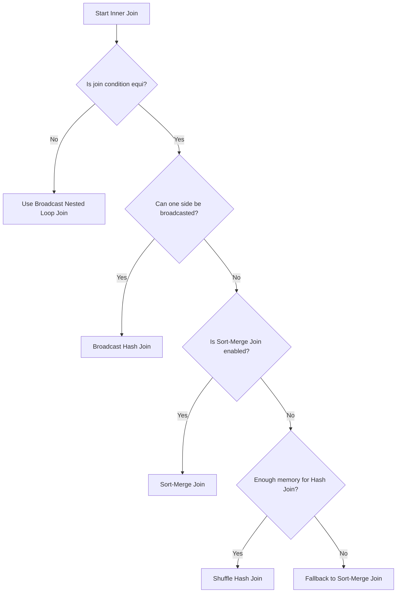

# Inner Join

An inner join returns only the rows where there is a match on the join condition in both tables.

It's the most common join type.

## Use Cases

Use Case                   | Why Inner Join?
---------------------------|------------------------------
Combine related data       | e.g., Orders + Customers
Data integrity enforcement | Ensures referenced keys exist
Filtering matching rows    | Efficient data narrowing

## Spark Join Strategy for Inner Join

Depending on data size and config, Spark will choose one of:

Join Strategy              | Trigger Condition
---------------------------|------------------------------------------------------
Broadcast Hash Join        | If one side fits autoBroadcastJoinThreshold
Sort-Merge Join            | If both sides large and join keys sortable
Shuffle Hash Join          | If preferSortMergeJoin is disabled + memory available
Broadcast Nested Loop Join | If non-equi join (e.g., <>, <, etc.)

## Flow

## Efficient Inner Joins in Spark

Tip                                 | Why it helps
------------------------------------|------------------------------------------
Broadcast small tables              | Avoids full shuffle
Repartition on join keys            | Ensures co-location of data
Use JOIN ... USING if keys are same | Cleaner syntax
Avoid skew in join keys             | Prevents out-of-memory & performance hits

## Pitfalls

Issue                  | Solution
-----------------------|-----------------------------
Data skew on join keys | Use salting or skew hints
Nulls in join keys     | Inner join skips those rows
Over-partitioned data  | Can lead to many small tasks
