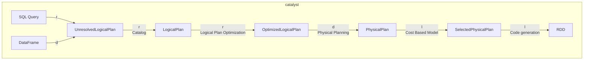

# Spark Catalyst

The Catalyst is responsible for optimizing SQL queries.

The optimization process goes through multiple steps:

1. Query abstraction into an AST
2. Logical optimization
3. Physical optimization
4. Code generation

