# Hopping Windows

A hopping window has a fixed time length, and it moves forward or `hops` at a time interval smaller than the window's length.

For example, a hopping window can be one minute long and advance every ten seconds.

Hopping windows have a fixed size with advances smaller than the length of the window.

So, from the illustration above, hopping windows can produce overlapping results.

## ✅ Scenario

1. Window size: 1 hour
2. Hop (slide interval): 30 minutes
3. Data stream: Events arriving every 15 minutes

```mermaid
gantt
    title Hopping Window Example (Window Size: 1h, Slide: 30m)
    dateFormat  HH:mm
    axisFormat  %H:%M

    section Event Timeline
    Event1       :a1, 10:00, 15m
    Event2       :a2, 10:15, 15m
    Event3       :a3, 10:30, 15m
    Event4       :a4, 10:45, 15m
    Event5       :a5, 11:00, 15m

    section Hopping Windows (1h size, every 30m)
    Window1      :w1, 10:00, 1h
    Window2      :w2, 10:30, 1h
    Window3      :w3, 11:00, 1h
```



## Hopping window queries (spark <3.4)

```sql
CREATE OR REPLACE TEMP VIEW events AS
SELECT * FROM VALUES
  (1001, 1, TIMESTAMP('2025-07-20 10:00:00'), 'click', 50),
  (1002, 2, TIMESTAMP('2025-07-20 10:05:00'), 'view', 30),
  (1003, 1, TIMESTAMP('2025-07-20 10:10:00'), 'click', 70),
  (1004, 3, TIMESTAMP('2025-07-20 10:15:00'), 'purchase', 90),
  (1005, 2, TIMESTAMP('2025-07-20 10:20:00'), 'click', 20)
AS events (event_id, user_id, event_time, event_type, value);
SELECT
  window.start AS window_start,
  window.end AS window_end,
  COUNT(*) AS events_in_window
FROM (
  SELECT window(event_time, '1 hour', '30 minutes') AS window
  FROM events
)
GROUP BY window
ORDER BY window_start;
```

## Hop operator

```sql
CREATE OR REPLACE TEMP VIEW events AS
SELECT * FROM VALUES
  (1001, 1, TIMESTAMP('2025-07-20 10:00:00'), 'click', 50),
  (1002, 2, TIMESTAMP('2025-07-20 10:05:00'), 'view', 30),
  (1003, 1, TIMESTAMP('2025-07-20 10:10:00'), 'click', 70),
  (1004, 3, TIMESTAMP('2025-07-20 10:15:00'), 'purchase', 90),
  (1005, 2, TIMESTAMP('2025-07-20 10:20:00'), 'click', 20)
AS events (event_id, user_id, event_time, event_type, value);
SELECT
  window.start AS window_start,
  window.end AS window_end,
  COUNT(*) AS events_in_window
FROM TABLE(
  hop(
    TABLE events,
    DESCRIPTOR(event_time),
    INTERVAL 30 MINUTES,  -- Slide
    INTERVAL 1 HOUR       -- Window size
  )
)
GROUP BY window;
```
