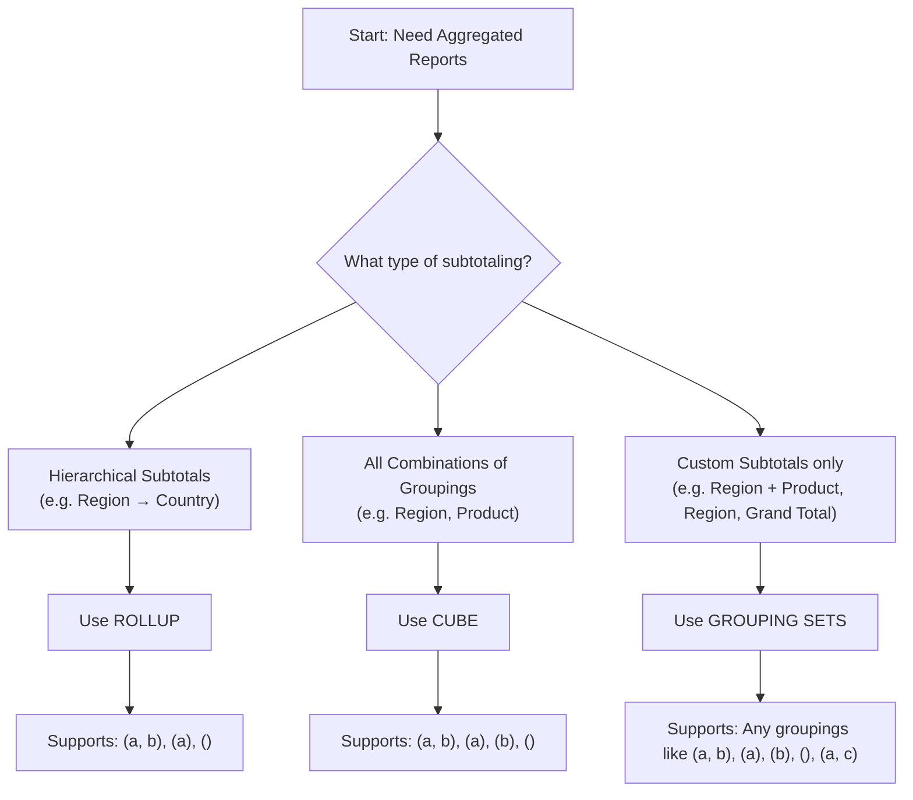

# group set

`GROUPING SETS` allows you to define multiple groupings in a single query, providing flexibility to specify exactly which groupings you want.

`GROUPING SETS` allow you to compute `multiple groupings` in a single query, acting like a controlled `GROUP BY CUBE`.

It's used to:

1. Avoid multiple UNION ALL queries
2. Generate subtotal and grand total rows

## Use Case

When you need specific combinations of grouped aggregations.

## Syntax

ANSI SQL style — supported in Spark SQL.

```sql
    SELECT
        date,
        region,
        product,
        SUM(amount) AS total_sales
    FROM
        sales_dt
    GROUP BY
        GROUPING SETS (
            (date, region, product),
            (date, region),
            (region, product),
            (region),
            ()
        )
```

This query calculates total sales for each of the specified grouping sets:

1. (date, region, product)
2. (date, region)
3. (region, product)
4. (region),
5. an overall total.

## When to Use What?

Use Case                 | Use
-------------------------|--------------
Subtotals with hierarchy | ROLLUP
All possible subtotals   | CUBE
Custom combinations      | GROUPING SETS

## Flow



##  When to Use

Goal                        | Use GROUPING SETS
----------------------------|------------------
Subtotals                   | ✅
Report summaries            | ✅
Avoid UNION of many queries | ✅
Custom rollups              | ✅
