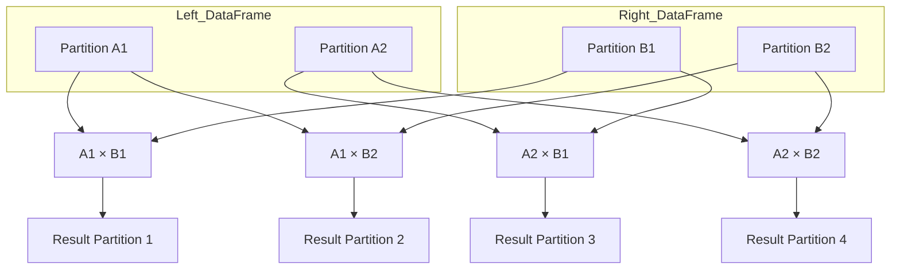

# Cartesian join

This `join type` is the simplest to use because the `join expression` is not needed.

Its behavior can be a bit dangerous because it joins every single row in the left dataset with every row in the right dataset.

The size of the joined dataset is the product of the size of the two datasets.

1. A Cartesian Join (cross join) returns every combination of rows from two DataFrames.
2. For two DataFrames A (m rows) and B (n rows), the result will have m * n rows.
3. It does not require any join condition.
4. ⚠️ It’s expensive! Used cautiously (e.g., for generating pairs or combinations)

## Cartesian Join Flow in Spark

1. Both DataFrames are fully shuffled across executors.
2. Every partition of the left DataFrame is paired with every partition of the right.
3. This forms a cross product.
4. Output grows quadratically, i.e., numPartitionsA * numPartitionsB.

## Flow Representation

## Key Points

1. Spark performs a full cartesian between partitions.
2. It is not a broadcast join, both sides may be large.
3. Can cause OutOfMemoryError if used improperly.
4. Avoid unless:
    - One side is small (use broadcast + explode)
    - You're intentionally creating combinations
