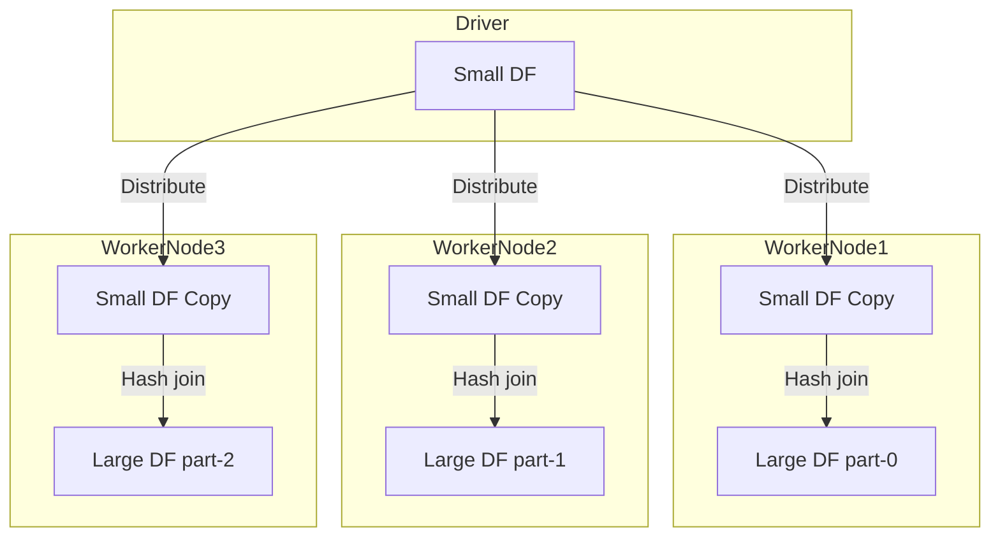

# Broadcast Hash Join

This join strategy is applicable only when `one of the datasets` is small enough to `fit into memory`.

Knowing that the `shuffle hash join` is an `expensive operation`, the broadcast hash join avoids `shuffling both datasets` and instead shuffles only the smaller one.

Similar to the shuffle hash join strategy, this one also consists of two steps.

1. The first one is to broadcast a copy of the entire smaller dataset to each of the partitions of the larger dataset.
2. The second step is to iterate through each row in the larger dataset and look up the corresponding rows in the smaller dataset with matching column values.

A BroadcastHashJoin is also a very common way for Spark to join two tables under the special condition that one of your tables is small.

1. Broadcast the data on each worker node.
2. Create hash table based join key of small table
3. Loop over large table and matched the hashed join key.

No shuffling and parallelism is maintained.

In broadcast hash join, copy of one of the join relations are being sent to all the worker nodes and it saves shuffling cost.

This is useful when you are joining a large relation with a smaller one.

It is also known as `map-side join(associating worker nodes with mappers)`.

Spark deploys this join strategy when the size of one of the join relations is less than the threshold values(default 10 M).

The spark property which defines this threshold is

      spark.sql.autoBroadcastJoinThreshold;

Broadcast relations are shared among executors using the `BitTorrent protocol`.

## Flow



1. The broadcast relation should fit completely into the memory of each executor as well as the driver.
In Driver, because driver will start the data transfer.
2. Only supported for '=' join.
3. Supported for all join types `(inner, left, right) except full outer joins`.
4. When the broadcast size is small, it is usually faster than other join strategies.
5. Copy of relation is broadcast over the network. Therefore, being a `network-intensive operation` could cause out of memory errors or performance issues when broadcast size is big(for instance, when explicitly specified to use broadcast join/changes in the default threshold).
You can't make changes to the broadcast relation, after broadcast.
6. Even if you do, they won't be available to the worker nodes(because the copy is already shipped).

## SQL

```sql
SELECT /*+ BROADCAST(small_df) */
  *
FROM small_df
JOIN large_df
  ON small_df.id = large_df.id
```

Spark will:

1. Broadcast small_df
2. Build a hash table on id
3. Each executor probes this with partitions of large_df
