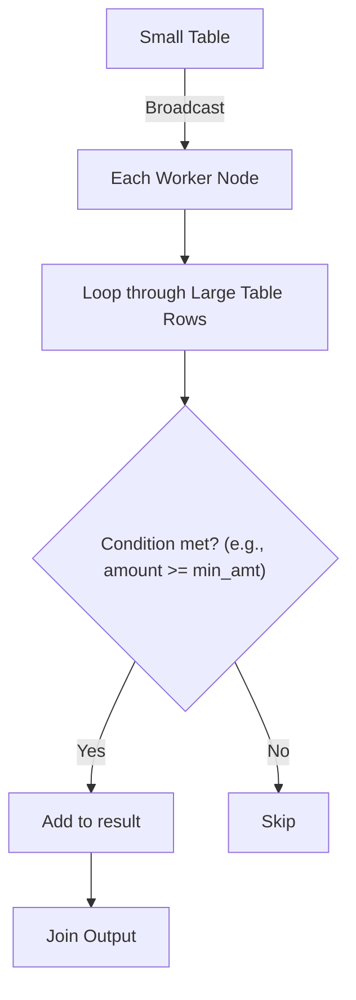

# non equi join

A non-equi join is a join not based solely on equality (=) conditions. It uses operators like:

1. `<, >, <=, >=`
2. `!=, BETWEEN, or even complex expressions`

These joins are not hashable, so Spark can't use broadcast/hash joins efficiently — it must fall back to more expensive join strategies.

A non-equi inner join is a type of join where the join condition is not an equality condition.

Unlike a traditional inner join, where you join tables based on equal values of columns, a non-equi join can use conditions like greater than (`>`) or less than (`<`) for joining.

Keep in mind that non-equi joins can be more complex and computationally expensive compared to equi joins, especially with large datasets.

## Use Cases

Non-equi joins are useful in scenarios such as:

1. `Range-based joins` where you need to join data based on ranges of values (e.g., date ranges, numerical ranges).
2. `Time-series data joins` where you may want to join on overlapping time intervals.

## Flow

