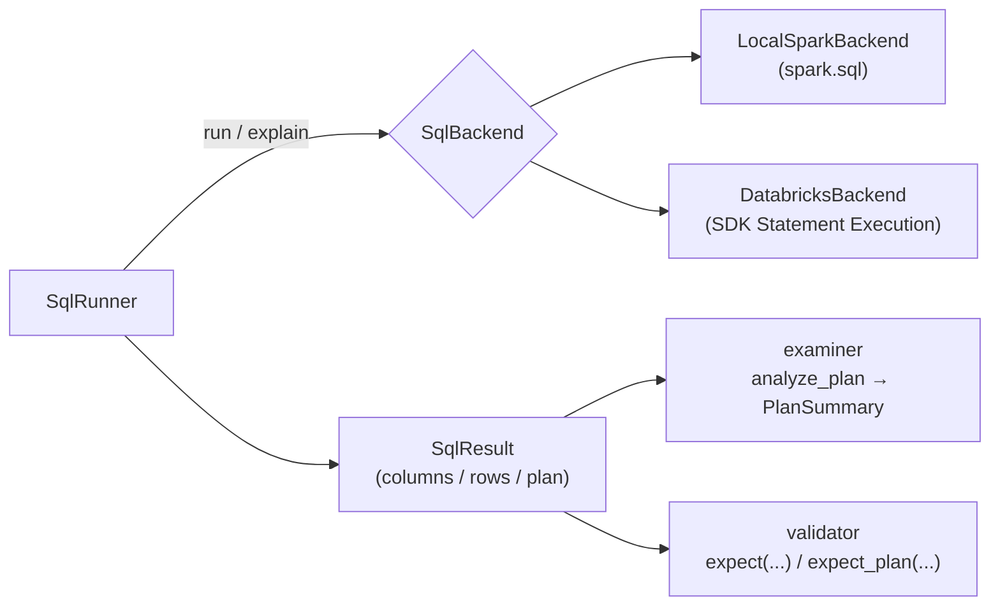

# :material-play-box-multiple: SQL Runner

A backend-agnostic library for **running**, **examining**, and **validating** SQL —
against a local `SparkSession` or a Databricks SQL warehouse — living in
`src/spark_sql/runner`.

The same runner/examiner/validator code drives both engines, so an example under
`sql/` can be validated locally in the pytest suite *and* checked on Databricks
with no call-site changes.

______________________________________________________________________

## :material-sitemap: Architecture



The runner never creates a `SparkSession` — it is always injected (project
convention). The examiner and validator operate only on `SqlResult` /
`PlanSummary`, so they are identical across backends and never touch
authentication.

______________________________________________________________________

## :material-cog: Components

| Module          | Purpose                                                                                                                 |
| --------------- | ----------------------------------------------------------------------------------------------------------------------- |
| `result.py`     | `SqlResult` — immutable, backend-neutral snapshot of one statement (columns, rows, backend, optional plan).             |
| `backends.py`   | `SqlBackend` ABC + `LocalSparkBackend` (injected `SparkSession`) + `DatabricksBackend` (SDK Statement Execution API).   |
| `runner.py`     | `SqlRunner` — run single statements, run whole `.sql` files, capture `EXPLAIN` plans.                                   |
| `examiner.py`   | `analyze_plan`, `PlanSummary`, `summarize`, `SqlExaminer` — count shuffles / joins / scans; describe result shape.      |
| `validator.py`  | Functional `expect_*` assertions plus the fluent `expect(...)` / `expect_plan(...)` builders raising `ValidationError`. |
| `exceptions.py` | `RunnerError` → `BackendError`, `ValidationError` (also an `AssertionError`).                                           |

______________________________________________________________________

## :material-rocket-launch: Quick Start — local Spark

```python
from pyspark.sql import SparkSession
from spark_sql.runner import SqlRunner, expect

spark = SparkSession.builder.master("local[*]").getOrCreate()
runner = SqlRunner.local(spark)

result = runner.run("SELECT 1 AS n")
expect(result).non_empty().scalar(1)
```

Run every statement in a repository `.sql` file — reusing the same comment-aware
splitter the pytest suite uses, so the file executes exactly as it is tested:

```python
# queries_only=True runs the DDL/setup but returns only query results
results = runner.run_file("sql/nulls/nulls.sql", queries_only=True)
for result in results:
    print(result.columns, result.row_count)
```

______________________________________________________________________

## :material-magnify-scan: Examining plans

`SqlExaminer` captures `EXPLAIN FORMATTED` and parses it into a `PlanSummary`
that counts the execution operators the performance pages reason about.

```python
from spark_sql.runner import SqlExaminer, expect_plan

summary = SqlExaminer(runner).plan_summary(
    "SELECT a.id FROM t1 a JOIN t2 b ON a.id = b.id"
)
print(summary.exchanges, summary.join_strategies, summary.scans)
expect_plan(summary).broadcast_join().no_cartesian()
```

!!! note "Textual plan analysis"

    Operator detection is textual (Spark's own plan-node names), which keeps the
    examiner backend-neutral: a plan captured from local Spark and one captured
    from a Databricks warehouse are analyzed the same way.

______________________________________________________________________

## :material-check-decagram: Validating results

All checks raise `ValidationError`, which subclasses `AssertionError`, so they
read naturally inside pytest.

```python
from spark_sql.runner import expect, expect_plan

expect(result).non_empty().row_count(5).columns(["id", "name"])
expect(result).rows([(1, "a"), (2, "b")])          # order-insensitive by default
expect_plan(summary).no_shuffle().broadcast_join()
```

| Target                        | Checks                                                                                                                      |
| ----------------------------- | --------------------------------------------------------------------------------------------------------------------------- |
| Result — `expect(result)`     | `non_empty`, `empty`, `row_count`, `min_rows`, `columns(..., exact=)`, `scalar`, `rows(..., ignore_order=)`, `contains_row` |
| Plan — `expect_plan(summary)` | `no_shuffle`, `shuffle_count`, `broadcast_join`, `no_cartesian`, `contains(token)`                                          |

______________________________________________________________________

## :material-database: Databricks backend

`DatabricksBackend` runs statements via
`WorkspaceClient.statement_execution.execute_statement` — the same Statement
Execution API the [MCP server](mcp-server.md) uses. Authentication is resolved by
`spark_sql.util.cli_env.get_workspace_client` (profile → host/token → SDK
default).

```python
from spark_sql.runner import SqlRunner, expect

runner = SqlRunner.databricks(profile="my-workspace", warehouse_name="Starter Endpoint")
expect(runner.run("SELECT count(*) AS c FROM samples.nyctaxi.trips")).non_empty()
```

The warehouse is resolved from `warehouse_id` / `warehouse_name` arguments, else
from `DATABRICKS_WAREHOUSE_ID` / `DATABRICKS_WAREHOUSE_NAME`.

!!! tip "Environment layering (`APP_ENV`)"

    `spark_sql.util.cli_env.load_env_layers` loads `.env` then `.env.$(APP_ENV)`
    (default `dev`), the same layering `make dab-*` and the MCP server use, so the
    profile, host, and warehouse values resolve identically across tools.

______________________________________________________________________

## :material-folder-play: Runnable examples

The `examples/` folder contains standalone scripts that drive this library. Run
them from the repository root:

```bash
uv run python examples/run_statement.py
uv run python examples/run_sql_file.py sql/window/ranking/ranking.sql
uv run python examples/examine_plan.py
uv run python examples/validate_results.py
uv run python examples/databricks_backend.py   # no-op until APP_ENV / Databricks env is set
```

| Script                  | Shows                                                                                        |
| ----------------------- | -------------------------------------------------------------------------------------------- |
| `run_statement.py`      | Run one statement, `summarize()` it, `expect(...)` assertions, capture the physical plan.    |
| `run_sql_file.py`       | Execute a whole `.sql` file (`run_file`, `queries_only=True`) and print each result.         |
| `examine_plan.py`       | `SqlExaminer.plan_summary` + `expect_plan(...)` — assert broadcast-join / shuffle behaviour. |
| `validate_results.py`   | Validate a real `sql/` example and catch a failing `ValidationError`.                        |
| `databricks_backend.py` | Same API against `SqlRunner.databricks(...)`; resolves config via `load_env_layers`.         |

Spark artifacts (`spark-warehouse`, `metastore_db`, `derby.log`) are rooted under
the `DATA_HOME` directory (default `/tmp/spark-sql-examples`); the local Spark
master honours `SPARK_MASTER` (default `local[*]`).

______________________________________________________________________

## :material-flask-outline: Testing

The library is covered by `tests/runner/` and reuses the session-scoped `spark`
fixture in `tests/conftest.py`.

```bash
uv run pytest tests/runner -q
```

The Databricks backend is unit-tested with a mocked `WorkspaceClient` (no live
workspace needed), so the full suite runs offline.
