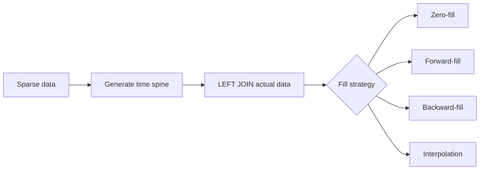

# :material-table-sync: Gap Fill

Real-world time series are often **sparse**: some dates or hours have no events.
Gap filling generates a complete, contiguous sequence of time buckets and fills missing entries using a chosen strategy.

---

## :material-magnify: Why Gap Fill?

Without gap filling, rolling averages and charts silently skip missing periods, distorting results.



---

## :material-calendar-range: Step 1 — Generate a Date Spine

```sql
SELECT EXPLODE(
    SEQUENCE(DATE '2024-01-01', DATE '2024-01-07', INTERVAL 1 DAY)
) AS sale_date;
```

For hourly resolution:

```sql
SELECT EXPLODE(
    SEQUENCE(
        TIMESTAMP '2024-06-01 00:00:00',
        TIMESTAMP '2024-06-01 23:00:00',
        INTERVAL 1 HOUR
    )
) AS event_hour;
```

---

## :material-table-merge-cells: Step 2 — Build a Complete Grid

Cross-join the spine with all dimension values (e.g., regions) to get every `(date, region)` combination:

```sql
CREATE OR REPLACE TEMP VIEW full_grid AS
SELECT d.sale_date, r.region
FROM date_spine AS d
CROSS JOIN (SELECT DISTINCT region FROM sparse_sales) AS r;
```

---

## :material-numeric-0-circle-outline: Zero-Fill

Replace missing values with `0`:

```sql
SELECT
    g.sale_date,
    g.region,
    COALESCE(s.revenue, 0.0) AS revenue
FROM full_grid AS g
LEFT JOIN sparse_sales AS s
    ON g.sale_date = s.sale_date
    AND g.region = s.region
ORDER BY g.region, g.sale_date;
```

---

## :material-arrow-right-bold: Forward-Fill

Carry the last known value forward into gaps using `LAST_VALUE IGNORE NULLS`:

```sql
WITH joined AS (
    SELECT g.sale_date, g.region, s.revenue
    FROM full_grid AS g
    LEFT JOIN sparse_sales AS s
        ON g.sale_date = s.sale_date AND g.region = s.region
)

SELECT
    sale_date,
    region,
    LAST_VALUE(revenue IGNORE NULLS) OVER (
        PARTITION BY region
        ORDER BY sale_date
        ROWS BETWEEN UNBOUNDED PRECEDING AND CURRENT ROW
    ) AS ffill_revenue
FROM joined
ORDER BY region, sale_date;
```

---

## :material-arrow-left-bold: Backward-Fill

Fill NULLs with the **next** known value using `FIRST_VALUE IGNORE NULLS`:

```sql
WITH joined AS (
    SELECT g.sale_date, g.region, s.revenue
    FROM full_grid AS g
    LEFT JOIN sparse_sales AS s
        ON g.sale_date = s.sale_date AND g.region = s.region
)

SELECT
    sale_date,
    region,
    FIRST_VALUE(revenue IGNORE NULLS) OVER (
        PARTITION BY region
        ORDER BY sale_date
        ROWS BETWEEN CURRENT ROW AND UNBOUNDED FOLLOWING
    ) AS bfill_revenue
FROM joined
ORDER BY region, sale_date;
```

---

## :material-chart-line: Linear Interpolation

Fill gaps with values on the straight line between the surrounding known points:

```sql
WITH joined AS (
    SELECT g.sale_date, g.region, s.revenue,
        DATEDIFF(g.sale_date, DATE '2024-01-01') AS day_offset
    FROM full_grid AS g
    LEFT JOIN sparse_sales AS s
        ON g.sale_date = s.sale_date AND g.region = s.region
),
with_anchors AS (
    SELECT *,
        LAST_VALUE(revenue IGNORE NULLS) OVER (
            PARTITION BY region ORDER BY sale_date
            ROWS BETWEEN UNBOUNDED PRECEDING AND CURRENT ROW) AS prev_value,
        LAST_VALUE(day_offset IGNORE NULLS) OVER (
            PARTITION BY region ORDER BY sale_date
            ROWS BETWEEN UNBOUNDED PRECEDING AND CURRENT ROW) AS prev_offset,
        FIRST_VALUE(revenue IGNORE NULLS) OVER (
            PARTITION BY region ORDER BY sale_date
            ROWS BETWEEN CURRENT ROW AND UNBOUNDED FOLLOWING) AS next_value,
        FIRST_VALUE(day_offset IGNORE NULLS) OVER (
            PARTITION BY region ORDER BY sale_date
            ROWS BETWEEN CURRENT ROW AND UNBOUNDED FOLLOWING) AS next_offset
    FROM joined
)
SELECT sale_date, region, revenue AS raw_revenue,
    CASE
        WHEN revenue IS NOT NULL THEN revenue
        WHEN prev_offset = next_offset THEN prev_value
        ELSE ROUND(prev_value
            + (next_value - prev_value)
              * (day_offset - prev_offset)
              / NULLIF(next_offset - prev_offset, 0), 2)
    END AS interpolated_revenue
FROM with_anchors
ORDER BY region, sale_date;
```

---

## :material-chart-bell-curve: Rolling Average on Filled Series

Combine zero-fill with a rolling window for correct moving averages:

```sql
WITH filled AS (
    SELECT g.sale_date, g.region, COALESCE(s.revenue, 0.0) AS revenue
    FROM full_grid AS g
    LEFT JOIN sparse_sales AS s
        ON g.sale_date = s.sale_date AND g.region = s.region
)
SELECT sale_date, region, revenue,
    ROUND(AVG(revenue) OVER (
        PARTITION BY region ORDER BY sale_date
        ROWS BETWEEN 6 PRECEDING AND CURRENT ROW
    ), 2) AS ma_7d
FROM filled
ORDER BY region, sale_date;
```

---

## :material-alert-circle-outline: Gap Detection

Report each contiguous block of missing dates:

```sql
WITH flagged AS (
    SELECT g.sale_date, g.region, s.revenue IS NULL AS in_gap,
        SUM(CASE WHEN s.revenue IS NOT NULL THEN 1 ELSE 0 END) OVER (
            PARTITION BY g.region ORDER BY g.sale_date
            ROWS BETWEEN UNBOUNDED PRECEDING AND CURRENT ROW
        ) AS gap_group
    FROM full_grid AS g
    LEFT JOIN sparse_sales AS s
        ON g.sale_date = s.sale_date AND g.region = s.region
)
SELECT region, MIN(sale_date) AS gap_start, MAX(sale_date) AS gap_end, COUNT(*) AS gap_days
FROM flagged
WHERE in_gap
GROUP BY region, gap_group
ORDER BY region, gap_start;
```

---

## :material-table-check: Strategy Comparison

| Strategy | Best for | Behaviour on leading NULLs |
|----------|----------|---------------------------|
| Zero-fill | Counts, events | Always 0 |
| Forward-fill | Prices, last-known state | NULL until first data point |
| Backward-fill | Initialisation from future | NULL after last data point |
| Interpolation | Smooth continuous metrics | Requires both neighbours |

!!! warning "Choosing the wrong strategy distorts analytics"
    Zero-filling revenue gaps inflates averages. Forward-filling event counts can misrepresent activity.
    Choose the strategy that matches the business meaning of a missing value.

## :material-animation-play: Interactive Demo

> Click the buttons below the chart to switch between fill strategies.
> **Purple** bars = original data. **Orange** bars = filled values.

<div id="viz-gapfill" class="ts-viz"></div>
