# :material-skip-next: Hopping Windows

A hopping window has a fixed time length, and it moves forward or `hops` at a time interval smaller than the window's length.

For example, a hopping window can be one minute long and advance every ten seconds.

Hopping windows have a fixed size with advances smaller than the length of the window.

So, from the illustration above, hopping windows can produce overlapping results.

## :material-check-circle-outline: Scenario

1. Window size: 1 hour
2. Hop (slide interval): 30 minutes
3. Data stream: Events arriving every 15 minutes

```mermaid
gantt
    title Hopping Window Example (Window Size: 1h, Slide: 30m)
    dateFormat  HH:mm
    axisFormat  %H:%M

    section Event Timeline
    Event1       :a1, 10:00, 15m
    Event2       :a2, 10:15, 15m
    Event3       :a3, 10:30, 15m
    Event4       :a4, 10:45, 15m
    Event5       :a5, 11:00, 15m

    section Hopping Windows (1h size, every 30m)
    Window1      :w1, 10:00, 1h
    Window2      :w2, 10:30, 1h
    Window3      :w3, 11:00, 1h
```



## :material-skip-next: Hopping window queries (spark <3.4)

```sql
CREATE OR REPLACE TEMP VIEW events AS
SELECT * FROM VALUES
  (1001, 1, TIMESTAMP('2025-07-20 10:00:00'), 'click', 50),
  (1002, 2, TIMESTAMP('2025-07-20 10:05:00'), 'view', 30),
  (1003, 1, TIMESTAMP('2025-07-20 10:10:00'), 'click', 70),
  (1004, 3, TIMESTAMP('2025-07-20 10:15:00'), 'purchase', 90),
  (1005, 2, TIMESTAMP('2025-07-20 10:20:00'), 'click', 20)
AS events (event_id, user_id, event_time, event_type, value);
SELECT
  window.start AS window_start,
  window.end AS window_end,
  COUNT(*) AS events_in_window
FROM (
  SELECT window(event_time, '1 hour', '30 minutes') AS window
  FROM events
)
GROUP BY window
ORDER BY window_start;
```

## :material-skip-next: Hop operator

```sql
CREATE OR REPLACE TEMP VIEW events AS
SELECT * FROM VALUES
  (1001, 1, TIMESTAMP('2025-07-20 10:00:00'), 'click', 50),
  (1002, 2, TIMESTAMP('2025-07-20 10:05:00'), 'view', 30),
  (1003, 1, TIMESTAMP('2025-07-20 10:10:00'), 'click', 70),
  (1004, 3, TIMESTAMP('2025-07-20 10:15:00'), 'purchase', 90),
  (1005, 2, TIMESTAMP('2025-07-20 10:20:00'), 'click', 20)
AS events (event_id, user_id, event_time, event_type, value);
SELECT
  window.start AS window_start,
  window.end AS window_end,
  COUNT(*) AS events_in_window
FROM TABLE(
  hop(
    TABLE events,
    DESCRIPTOR(event_time),
    INTERVAL 30 MINUTES,  -- Slide
    INTERVAL 1 HOUR       -- Window size
  )
)
GROUP BY window;
```

## :material-animation-play: Interactive Demo

> Hover any window row to highlight the events it contains and see the event count.

<div id="viz-hopping" class="ts-viz"></div>

---

## :material-table: Properties

| Property | Value |
|----------|-------|
| Window size | Fixed (e.g., 1 hour) |
| Slide interval | Fixed, smaller than window size (e.g., 30 min) |
| Overlap | Yes — each event can appear in multiple windows |
| Events per window | Bounded by data within the window duration |
| Typical use | Near-real-time trend tracking, smoothed event counts |

---

## :material-compare: Hopping vs Tumbling vs Sliding

| Factor | Hopping | Tumbling | Sliding (row-based) |
|--------|---------|----------|---------------------|
| Window size | Fixed time | Fixed time | Fixed row count |
| Advances by | Slide interval < size | Size (no overlap) | 1 row at a time |
| Overlap | Yes | No | Yes |
| Event membership | Multiple windows | Exactly one window | One result per row |
| SQL function | `window(ts, size, slide)` | `window(ts, size)` | `OVER (ROWS BETWEEN ...)` |

---

## :material-magnify: Behavior Notes

1. The number of windows an event belongs to equals `CEIL(window_size / slide_interval)`. A 1-hour window with a 30-min slide means each event appears in up to 2 windows.
2. Bucket boundaries are aligned to the Unix epoch by default — pass a `startTime` string to `window()` to shift alignment.
3. The `hop()` TVF (Spark 3.4+) is the streaming-compatible equivalent of `window(ts, size, slide)`.
4. Smaller slide intervals produce smoother trends but generate more output rows and require more computation.
5. Use `EXPLAIN` to verify that Spark is using the `TimeWindowGroupLimit` optimisation for hopping window queries.
