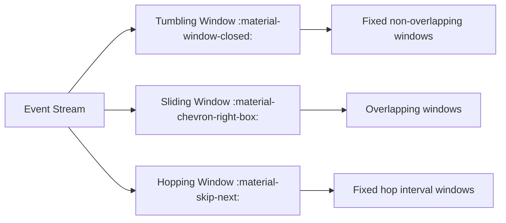

# :material-timeline: Timeseries data

Time series queries in Apache Spark (particularly with Spark SQL or PySpark) are very useful for analyzing data that changes over time—such as logs, stock prices, sensor data, etc.

These queries typically involve timestamps and require understanding window functions, date manipulation, and aggregation over time intervals.

### :material-sitemap: Overview

## 🔍 What Is a Time Series Query?

A time series query analyzes data that changes over time, where each row is associated with a timestamp. In Spark, these queries are optimized using window functions, time-based grouping, and ordered operations.

## 📌 Core Concepts of Time Series Queries

### :material-timeline: 1. Timestamp Columns

All time series queries require a proper timestamp field (e.g., event_time, created_at, etc.).

### :material-timeline: 2. Ordering

Time series analysis depends on ordering, often by timestamp. Sorting and partitioning by time enables correct window calculations.

### :material-timeline: 3. Time Windows

Spark has powerful support for windowed aggregations using:

1. Window functions (ROW_NUMBER(), LAG(), etc.)
2. Time-based grouping (e.g., group by 5-minute intervals)
3. Sliding and tumbling windows

## 🔁 Concept Comparison

Feature Tumbling Window Hopping Window  Sliding Window
Fixed Size  ✅ Yes   ✅ Yes   ✅ Yes
Overlap ❌ No    ✅ Yes   ✅ Yes
Event Count 1 window max    Few windows Many windows
Use Case    Hourly reports, batch   Near-real-time trends   Moving averages, smoothing
Examples    10:00–11:00, 11:00–12:00    10:00–11:00, 10:30–11:30    Every 5m for last 1h
