# :material-window-closed: Tumbling window

1. A Group by Time Intervals (Tumbling Window)
2. Count events per 1-hour window
3. window() is a Spark SQL function that creates time buckets.

### :material-sitemap: Overview

```mermaid
gantt
    dateFormat HH:mm
    axisFormat %H:%M
    section Window 1
    00:00 - 01:00 :a1, 00:00, 60m
    section Window 2
    01:00 - 02:00 :a2, 01:00, 60m
    section Window 3
    02:00 - 03:00 :a3, 02:00, 60m
```



## :material-window-closed: Concept

:material-repeat: Tumbling Window Concept

1. Window size: 1 hour
2. No overlap (non-overlapping, fixed-size intervals)
3. Each event belongs to exactly one window.

## :material-window-closed: Flow

```mermaid
gantt
    title Tumbling Window Example (Window Size: 1 Hour)
    dateFormat  HH:mm
    axisFormat  %H:%M

    section Event Timeline
    Event1       :e1, 10:05, 1m
    Event2       :e2, 10:15, 1m
    Event3       :e3, 10:45, 1m
    Event4       :e4, 11:05, 1m
    Event5       :e5, 11:45, 1m
    Event6       :e6, 12:15, 1m

    section Tumbling Windows (1 Hour, No Overlap)
    Window1      :w1, 10:00, 1h
    Window2      :w2, 11:00, 1h
    Window3      :w3, 12:00, 1h
```



```sql
CREATE OR REPLACE TEMP VIEW events AS
SELECT * FROM VALUES
  (1001, 1, TIMESTAMP('2025-07-20 10:00:00'), 'click', 50),
  (1002, 2, TIMESTAMP('2025-07-20 10:05:00'), 'view', 30),
  (1003, 1, TIMESTAMP('2025-07-20 10:10:00'), 'click', 70),
  (1004, 3, TIMESTAMP('2025-07-20 10:15:00'), 'purchase', 90),
  (1005, 2, TIMESTAMP('2025-07-20 10:20:00'), 'click', 20)
AS events (event_id, user_id, event_time, event_type, value);
SELECT 
  window(event_time, '1 hour') AS time_window,
  COUNT(*) AS event_count
FROM events
GROUP BY window(event_time, '1 hour')
```

## :material-window-closed: Hourly Events (Tumbling Time Window)

```sql
-- Create or replace the temporary view
CREATE OR REPLACE TEMP VIEW events AS
SELECT * FROM VALUES
  (1001, 1, TIMESTAMP('2025-07-20 10:00:00'), 'click', 50),
  (1002, 2, TIMESTAMP('2025-07-20 11:05:00'), 'view', 30),
  (1003, 1, TIMESTAMP('2025-07-20 10:10:00'), 'click', 70),
  (1004, 3, TIMESTAMP('2025-07-20 11:15:00'), 'purchase', 90),
  (1005, 2, TIMESTAMP('2025-07-20 10:20:00'), 'click', 20)
AS events (event_id, user_id, event_time, event_type, value);

-- Query with window function
SELECT 
  window.start AS start_time,
  window.end AS end_time,
  COUNT(*) AS events_in_hour
FROM (
  SELECT window(event_time, '1 hour') AS window
  FROM events
) e
GROUP BY window
ORDER BY start_time;
```

## :material-window-closed: Tumbling window using tumble operator

```sql
CREATE OR REPLACE TEMP VIEW events AS
SELECT * FROM VALUES
  (1001, 1, TIMESTAMP('2025-07-20 10:00:00'), 'click', 50),
  (1002, 2, TIMESTAMP('2025-07-20 11:05:00'), 'view', 30),
  (1003, 1, TIMESTAMP('2025-07-20 10:10:00'), 'click', 70),
  (1004, 3, TIMESTAMP('2025-07-20 11:15:00'), 'purchase', 90),
  (1005, 2, TIMESTAMP('2025-07-20 10:20:00'), 'click', 20)
AS events (event_id, user_id, event_time, event_type, value);
SELECT
  window.start AS window_start,
  window.end AS window_end,
  COUNT(*) AS events_in_window
FROM TABLE(
  tumble(
    TABLE events,
    DESCRIPTOR(event_time),
    INTERVAL 1 HOUR
  )
)
GROUP BY window;
```

## :material-animation-play: Interactive Demo

> Hover any event dot to see its revenue and which window it belongs to.
> Window totals are shown at the bottom of each bucket.

<div id="viz-tumbling" class="ts-viz"></div>
