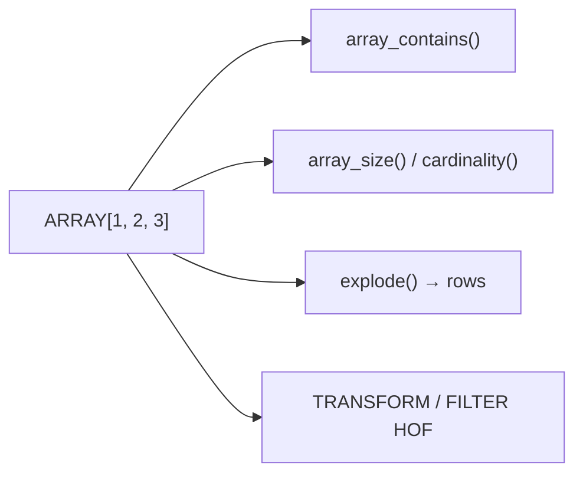

# :material-code-array: Array Data Type

An `ARRAY` is an ordered, zero-indexed collection of elements of the same type.

### :material-sitemap: Overview



## 📌 Syntax

```sql
-- Type declaration
ARRAY<element_type>

-- Literal
ARRAY(1, 2, 3)
ARRAY('a', 'b', 'c')
```

## 🔍 Behavior

1. All elements must be the same type (or implicitly castable).
2. Arrays are **0-indexed** with `GET()`, **1-indexed** with `ELEMENT_AT()`.
3. Arrays can contain NULLs.
4. Supports nesting: `ARRAY<ARRAY<INT>>`, `ARRAY<STRUCT<...>>`.

## 🧪 Examples

```sql
-- Create and access
SELECT ARRAY(10, 20, 30)[0] AS first;       -- 10
SELECT ELEMENT_AT(ARRAY(10, 20, 30), 2);     -- 20

-- Size
SELECT SIZE(ARRAY('a', 'b', 'c'));            -- 3

-- Contains
SELECT ARRAY_CONTAINS(ARRAY(1, 2, 3), 2);    -- true

-- Sort
SELECT SORT_ARRAY(ARRAY(3, 1, 2));            -- [1, 2, 3]

-- Aggregate into array
SELECT COLLECT_LIST(col) FROM VALUES (1), (2), (1) AS t(col);
-- [1, 2, 1]
```

See [Array Functions](../../../../function/collection/array.md) for the full function reference.
