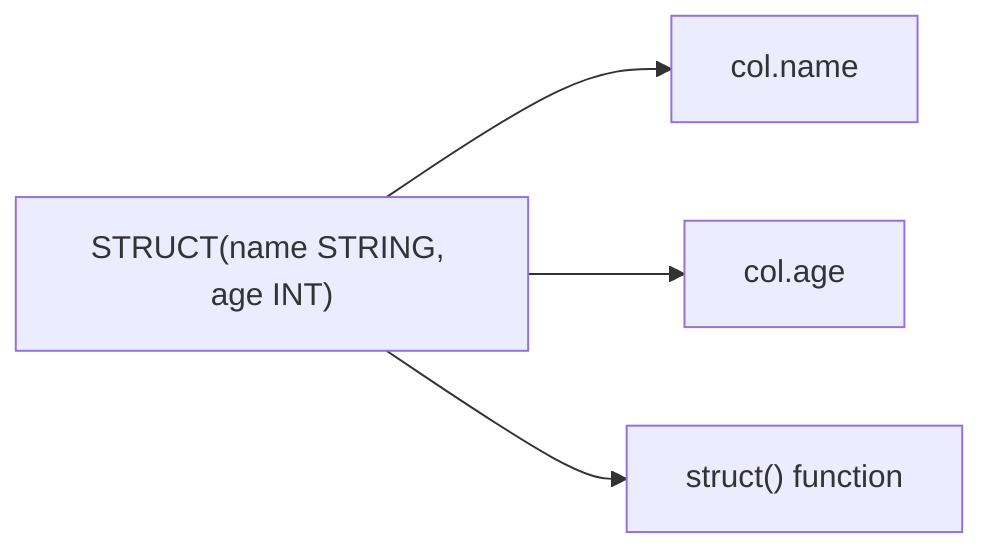

# :material-code-braces: Struct Data Type

A `STRUCT` groups multiple named fields into a single composite column — like a row within
a row. Each field has a name and a type.

### :material-sitemap: Overview



## 📌 Syntax

```sql
-- Type declaration
STRUCT<name: STRING, age: INT>

-- Create with NAMED_STRUCT
SELECT NAMED_STRUCT('name', 'Alice', 'age', 30) AS person;

-- Create with STRUCT (auto-named col1, col2, ...)
SELECT STRUCT('Alice', 30) AS person;
```

## 🔍 Behavior

1. Fields are accessed with **dot notation**: `col.field_name`.
2. Structs can be nested: `STRUCT<address: STRUCT<city: STRING>>`.
3. Two structs are equal if all fields match.
4. Structs map naturally to JSON objects and Parquet nested groups.

## 🧪 Examples

### Create and Access

```sql
SELECT person.name, person.age
FROM (
  SELECT NAMED_STRUCT('name', 'Alice', 'age', 30) AS person
);
-- Result: Alice, 30
```

### Nested Structs

```sql
SELECT person.address.city
FROM (
  SELECT NAMED_STRUCT(
    'name', 'Alice',
    'address', NAMED_STRUCT('city', 'NYC', 'state', 'NY')
  ) AS person
);
-- Result: NYC
```

### Create from Table Columns

```sql
CREATE OR REPLACE TEMP VIEW employees AS
SELECT * FROM VALUES ('Alice', 'Smith', 50000), ('Bob', 'Jones', 60000)
AS employees(first, last, salary);

SELECT NAMED_STRUCT('first', first, 'last', last) AS name, salary
FROM employees;
```

See [Struct Functions](../../../../function/collection/struct.md) for the full function reference.
