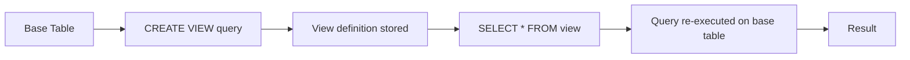

# :material-eye: View Examples

Examples of creating and using views in Spark SQL.

### :material-sitemap: Overview



---

## 🧪 Temporary View

```sql
CREATE OR REPLACE TEMP VIEW recent_orders AS
SELECT * FROM orders WHERE order_date >= current_date() - 7;
```

## 🧪 Permanent View

```sql
CREATE OR REPLACE VIEW active_customers AS
SELECT * FROM customers WHERE is_active = true;
```

---

## 🧠 When to Use

| Scenario | Recommendation |
|----------|----------------|
| Reuse logic across queries | Create a view |
| Scope limited to session | Temp view |
| Share across users | Permanent view |
