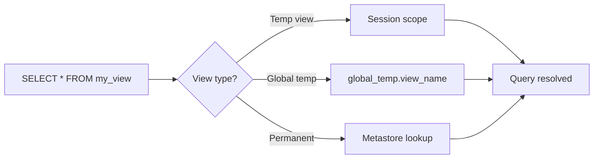

# :material-frequently-asked-questions: FAQ

### :material-sitemap: Overview



## 1. View Not Found

Attribute|Description
---|---
Symptom|Table or view not found: my_view
Cause|Temporary views are session-scoped — if you switch notebooks, restart cluster, or run in another job, it's gone.<br/>Global temp views require `global_temp.` prefix.
Fix|For temporary views: recreate them in the current session.<br/>For global views: use `global_temp.` prefix.<br/>For permanent views: make sure the database is in context.

For global views:

```sql
SELECT * FROM global_temp.view_name;
```

For permanent views: make sure the database is in context:

```sql
USE my_database;
```

## 2. View Uses Outdated Schema

Attribute|Description
---|---
Symptom|View query fails after table schema changes.
Cause|Views store query logic, not snapshots. Column drops/renames break the definition.
Fix|Recreate the view with updated column names.

```sql
CREATE OR REPLACE VIEW my_view AS
SELECT new_col_name, ...
```

## 3. Permission Errors

Symptom|Description
---|---
Permission denied|User does not have SELECT privilege
Cause|In Unity Catalog, permissions must be granted both on the view and the underlying tables.
Fix|Grant the necessary permissions.

```sql
GRANT SELECT ON VIEW my_view TO `user@example.com`;
GRANT SELECT ON TABLE base_table TO `user@example.com`;
```

## 4. Performance Issues

Symptom|Description
---|---
Slow query performance|Views always re-run the underlying query.
Cause|Views always re-run the underlying query.
Fix|If it's slow.

```sql
CREATE OR REPLACE VIEW my_view AS
SELECT new_col_name, ...
```

Convert to a Delta table with CREATE TABLE AS SELECT (materialized form) and Cache it.

```python
spark.sql("CACHE TABLE my_view")
```

## 5. Not Supported in Certain Contexts

Some commands (e.g., OPTIMIZE, VACUUM) don't work on views because they're not physical data.
`Fix`: Run those commands on the base table, not the view.
