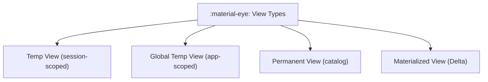

# :material-eye: Views

Views are saved SQL queries that behave like virtual tables. They can simplify
complex logic and improve reuse.

### :material-sitemap: Overview



---

## :material-pin: View Types

| Type | Description |
|------|-------------|
| Temporary view | Session-scoped |
| Global temp view | Shared across sessions in the same application |
| Permanent view | Persisted in the metastore |

---

## :material-flask-outline: Example

```sql
CREATE OR REPLACE VIEW active_customers AS
SELECT * FROM customers WHERE is_active = true;
```

---

## :material-brain: When to Use

| Scenario | Recommendation |
|----------|----------------|
| Simplify complex queries | Create a view |
| Share logic across teams | Permanent view |
| Scratch analysis | Temp view |
