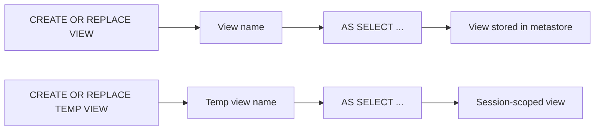

# :material-code-tags: View Syntax

Views are created with `CREATE VIEW` or `CREATE TEMP VIEW` statements.

### :material-sitemap: Overview



---

## 📌 Create View

```sql
CREATE OR REPLACE VIEW my_view AS
SELECT * FROM orders WHERE amount > 100;
```

## 📌 Create Temp View

```sql
CREATE OR REPLACE TEMP VIEW my_temp_view AS
SELECT * FROM orders WHERE amount > 100;
```

---

## 🧠 When to Use

| Scenario | Recommendation |
|----------|----------------|
| Persist query logic | Use permanent views |
| Session-only logic | Use temp views |
