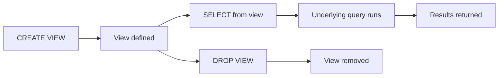

# :material-eye: View Overview

Views are virtual tables defined by a stored SQL query.
They simplify complex logic and promote reuse.

### :material-sitemap: Overview



---

## 📌 Example

```sql
CREATE OR REPLACE VIEW high_value_orders AS
SELECT * FROM orders WHERE amount > 1000;
```

---

## 🔍 Behavior Notes

1. Views do not store data; they store a query definition.
2. Querying a view runs its underlying SQL.
3. Use views to standardize business logic.

---

## 🧠 When to Use

| Scenario | Recommendation |
|----------|----------------|
| Reuse common filters | Create a view |
| Simplify reporting | Use views |
| Store intermediate results | Use temp views |
