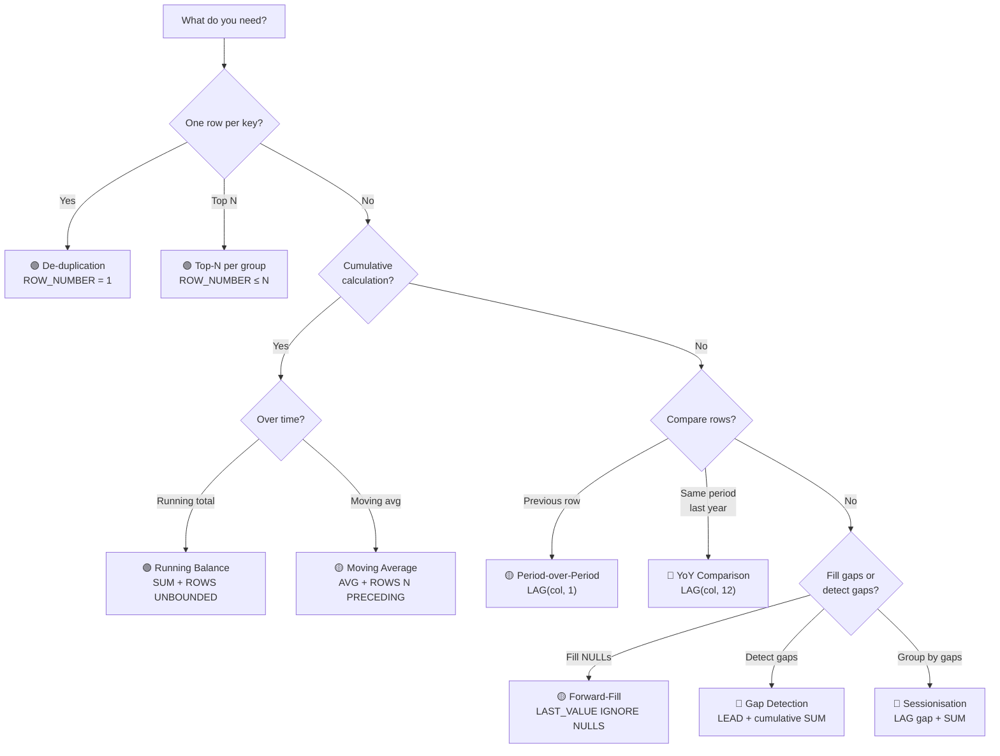

# :material-lightbulb-on: Real-World Window Function Patterns

Ten production-ready patterns that solve common data engineering problems using window functions.
Each pattern includes full SQL, expected output, and performance considerations.

!!! abstract "Pattern Complexity Guide"
    | :material-circle: | Level | Patterns |
    |:-:|-------|----------|
    | 🟢 | Beginner | De-duplication, Top-N, Running Balance |
    | 🟡 | Intermediate | Period-over-Period, Percentile Scoring, Forward-Fill |
    | 🔴 | Advanced | Sessionisation, Gap Detection, YoY Comparison, Median |

---

## :material-sitemap: Decision Flowchart



---

## :material-flask-outline: Shared Dataset

```sql
CREATE OR REPLACE TEMP VIEW sales AS
SELECT * FROM VALUES
  ('North', 'Alice', '2024-01-01', 100),
  ('North', 'Alice', '2024-01-05', 200),
  ('North', 'Alice', '2024-01-10', 300),
  ('North', 'Bob',   '2024-01-02', 150),
  ('North', 'Bob',   '2024-01-06', 300),
  ('South', 'Carol', '2024-01-03', 400),
  ('South', 'Carol', '2024-01-07', 500)
AS sales(region, rep, sale_date, amount);
```

---

## :material-numeric-1-circle: De-duplication

Remove duplicate rows by keeping the most recent sale per rep using `ROW_NUMBER`.

=== "Standard"

    ```sql
    SELECT region, rep, sale_date, amount
    FROM (
        SELECT
            region, rep, sale_date, amount,
            ROW_NUMBER() OVER (PARTITION BY rep ORDER BY sale_date DESC) AS rn
        FROM sales
    )
    WHERE rn = 1;
    ```

=== "QUALIFY (Spark 3.3+)"

    ```sql
    SELECT region, rep, sale_date, amount
    FROM sales
    QUALIFY ROW_NUMBER() OVER (PARTITION BY rep ORDER BY sale_date DESC) = 1;
    ```

=== "Pipe Syntax (Spark 4.0)"

    ```sql
    FROM sales
    |> SELECT *, ROW_NUMBER() OVER (PARTITION BY rep ORDER BY sale_date DESC) AS rn
    |> WHERE rn = 1
    |> SELECT region, rep, sale_date, amount;
    ```

```
-- Result:
-- | region | rep   | sale_date  | amount |
-- |--------|-------|------------|--------|
-- | North  | Alice | 2024-01-10 |    300 |
-- | North  | Bob   | 2024-01-06 |    300 |
-- | South  | Carol | 2024-01-07 |    500 |
```

!!! tip "Performance"
    For very large tables, add a date filter before the window to reduce the partition size.
    `ROW_NUMBER` is cheaper than `RANK` when you only need one row per key.

---

## :material-numeric-2-circle: Top-N Per Group

Return the top 2 sales per region, ranked by amount descending.

=== "Standard"

    ```sql
    SELECT region, rep, sale_date, amount
    FROM (
        SELECT
            region, rep, sale_date, amount,
            ROW_NUMBER() OVER (PARTITION BY region ORDER BY amount DESC) AS rn
        FROM sales
    )
    WHERE rn <= 2;
    ```

=== "QUALIFY"

    ```sql
    SELECT region, rep, sale_date, amount
    FROM sales
    QUALIFY ROW_NUMBER() OVER (PARTITION BY region ORDER BY amount DESC) <= 2;
    ```

```
-- Result:
-- | region | rep   | sale_date  | amount |
-- |--------|-------|------------|--------|
-- | North  | Alice | 2024-01-10 |    300 |
-- | North  | Bob   | 2024-01-06 |    300 |
-- | South  | Carol | 2024-01-07 |    500 |
-- | South  | Carol | 2024-01-03 |    400 |
```

!!! note "ROW_NUMBER vs RANK vs DENSE_RANK"
    - `ROW_NUMBER` — exactly N rows, ties broken arbitrarily
    - `RANK` — may return more than N rows if there are ties
    - `DENSE_RANK` — no gaps in ranking, useful for "top N distinct values"

---

## :material-numeric-3-circle: Running Balance

Compute a cumulative sales total per rep ordered chronologically.

```sql
SELECT
    rep,
    sale_date,
    amount,
    SUM(amount) OVER (
        PARTITION BY rep
        ORDER BY sale_date
        ROWS BETWEEN UNBOUNDED PRECEDING AND CURRENT ROW
    ) AS running_balance
FROM sales
ORDER BY rep, sale_date;
-- Result:
-- | rep   | sale_date  | amount | running_balance |
-- |-------|------------|--------|-----------------|
-- | Alice | 2024-01-01 |    100 |             100 |
-- | Alice | 2024-01-05 |    200 |             300 |
-- | Alice | 2024-01-10 |    300 |             600 |
-- | Bob   | 2024-01-02 |    150 |             150 |
-- | Bob   | 2024-01-06 |    300 |             450 |
-- | Carol | 2024-01-03 |    400 |             400 |
-- | Carol | 2024-01-07 |    500 |             900 |
```

---

## :material-numeric-4-circle: Period-over-Period Comparison

Compute the MoM (sale-over-sale) delta percentage relative to the previous sale for each rep.

```sql
SELECT
    rep,
    sale_date,
    amount,
    LAG(amount) OVER (PARTITION BY rep ORDER BY sale_date) AS prev_amount,
    ROUND(
        100.0 * (amount - LAG(amount) OVER (PARTITION BY rep ORDER BY sale_date))
              / LAG(amount) OVER (PARTITION BY rep ORDER BY sale_date),
        1
    ) AS delta_pct
FROM sales
ORDER BY rep, sale_date;
-- Result:
-- | rep   | sale_date  | amount | prev_amount | delta_pct |
-- |-------|------------|--------|-------------|-----------|
-- | Alice | 2024-01-01 |    100 |        NULL |      NULL |
-- | Alice | 2024-01-05 |    200 |         100 |     100.0 |
-- | Alice | 2024-01-10 |    300 |         200 |      50.0 |
-- | Bob   | 2024-01-02 |    150 |        NULL |      NULL |
-- | Bob   | 2024-01-06 |    300 |         150 |     100.0 |
-- | Carol | 2024-01-03 |    400 |        NULL |      NULL |
-- | Carol | 2024-01-07 |    500 |         400 |      25.0 |
```

---

## :material-numeric-5-circle: Sessionisation

Detect gaps of more than 3 days between consecutive sales for the same rep and assign a session id by accumulating gap flags.

```sql
SELECT
    rep,
    sale_date,
    gap_flag,
    SUM(gap_flag) OVER (PARTITION BY rep ORDER BY sale_date
                        ROWS BETWEEN UNBOUNDED PRECEDING AND CURRENT ROW) AS session_id
FROM (
    SELECT
        rep,
        sale_date,
        CASE
            WHEN DATEDIFF(
                sale_date,
                LAG(sale_date) OVER (PARTITION BY rep ORDER BY sale_date)
            ) > 3 THEN 1
            ELSE 0
        END AS gap_flag
    FROM sales
)
ORDER BY rep, sale_date;
-- Result:
-- | rep   | sale_date  | gap_flag | session_id |
-- |-------|------------|----------|------------|
-- | Alice | 2024-01-01 |        0 |          0 |
-- | Alice | 2024-01-05 |        1 |          1 |  -- 4-day gap → new session
-- | Alice | 2024-01-10 |        1 |          2 |  -- 5-day gap → new session
-- | Bob   | 2024-01-02 |        0 |          0 |
-- | Bob   | 2024-01-06 |        1 |          1 |  -- 4-day gap → new session
-- | Carol | 2024-01-03 |        0 |          0 |
-- | Carol | 2024-01-07 |        1 |          1 |  -- 4-day gap → new session
```

---

## :material-numeric-6-circle: Percentile Scoring

Assign each rep a percentile rank and quartile bucket across their region using `PERCENT_RANK` and `NTILE(4)`.

```sql
SELECT
    region,
    rep,
    amount,
    ROUND(PERCENT_RANK() OVER (PARTITION BY region ORDER BY amount), 2) AS pct_rank,
    NTILE(4)             OVER (PARTITION BY region ORDER BY amount)     AS quartile
FROM sales
ORDER BY region, amount;
-- Result:
-- | region | rep   | amount | pct_rank | quartile |
-- |--------|-------|--------|----------|----------|
-- | North  | Alice |    100 |     0.00 |        1 |
-- | North  | Bob   |    150 |     0.25 |        1 |
-- | North  | Alice |    200 |     0.50 |        2 |
-- | North  | Alice |    300 |     0.75 |        3 |
-- | North  | Bob   |    300 |     0.75 |        4 |
-- | South  | Carol |    400 |     0.00 |        1 |
-- | South  | Carol |    500 |     1.00 |        4 |
```

---

## :material-brain: When to Use

| Scenario | Pattern |
|----------|---------|
| Remove duplicates, keep latest row | `ROW_NUMBER` + filter `rn = 1` |
| Leaderboard / top-N per category | `ROW_NUMBER` + filter `rn <= N` |
| Cumulative metrics over time | `SUM ... ROWS BETWEEN UNBOUNDED PRECEDING AND CURRENT ROW` |
| Compare each period to previous | `LAG(metric) OVER (PARTITION BY ... ORDER BY date)` |
| Group activity into sessions | LAG gap flag + cumulative `SUM` for session id |
| Percentile distribution within groups | `PERCENT_RANK` + `NTILE(n)` |

---

## :material-numeric-7-circle: Forward-Fill (Last Observation Carried Forward)

Fill `NULL` readings with the most recent non-null value in each sensor's timeline.

```sql
CREATE OR REPLACE TEMP VIEW sensor_readings AS
SELECT * FROM VALUES
  ('S1', '2024-01-01', 10.0),
  ('S1', '2024-01-02', NULL),
  ('S1', '2024-01-03', NULL),
  ('S1', '2024-01-04', 12.5),
  ('S1', '2024-01-05', NULL)
AS sensor_readings(sensor_id, reading_date, value);

SELECT
    sensor_id,
    reading_date,
    value,
    LAST_VALUE(value IGNORE NULLS) OVER (
        PARTITION BY sensor_id
        ORDER BY reading_date
        ROWS BETWEEN UNBOUNDED PRECEDING AND CURRENT ROW
    ) AS value_ffill
FROM sensor_readings
ORDER BY sensor_id, reading_date;
-- Result:
-- | sensor_id | reading_date | value | value_ffill |
-- |-----------|--------------|-------|-------------|
-- | S1        | 2024-01-01   |  10.0 |        10.0 |
-- | S1        | 2024-01-02   |  NULL |        10.0 |  -- carried forward
-- | S1        | 2024-01-03   |  NULL |        10.0 |  -- carried forward
-- | S1        | 2024-01-04   |  12.5 |        12.5 |  -- new reading
-- | S1        | 2024-01-05   |  NULL |        12.5 |  -- carried forward
```

---

## :material-numeric-8-circle: Gap Detection

Flag rows where the gap to the next event exceeds a threshold,
then group consecutive events into "streaks".

```sql
SELECT
    rep,
    sale_date,
    amount,
    days_to_next,
    -- A new streak starts whenever there is a gap > 5 days (or it is the first row)
    SUM(
        CASE WHEN days_to_next > 5 OR days_to_next IS NULL THEN 1 ELSE 0 END
    ) OVER (
        PARTITION BY rep
        ORDER BY sale_date DESC
        ROWS BETWEEN UNBOUNDED PRECEDING AND CURRENT ROW
    ) AS streak_id
FROM (
    SELECT
        rep,
        sale_date,
        amount,
        DATEDIFF(
            LEAD(sale_date) OVER (PARTITION BY rep ORDER BY sale_date),
            sale_date
        ) AS days_to_next
    FROM sales
)
ORDER BY rep, sale_date;
```

---

## :material-numeric-9-circle: Median and Approximate Percentiles

Compute median and arbitrary percentiles within each partition.

```sql
SELECT DISTINCT
    region,
    PERCENTILE_APPROX(amount, 0.5)          AS median_amount,
    PERCENTILE_APPROX(amount, 0.25)         AS p25,
    PERCENTILE_APPROX(amount, 0.75)         AS p75,
    PERCENTILE_APPROX(amount, array(0.05, 0.95))
                                             AS p5_p95
FROM sales
GROUP BY region;

-- Exact percentile (small datasets only — triggers full sort)
SELECT DISTINCT
    region,
    PERCENTILE(amount, 0.5) AS exact_median
FROM sales
GROUP BY region;
```

!!! tip "Window vs GROUP BY for percentiles"
    Percentile functions are aggregate functions, not window functions in Spark SQL.
    Use them with `GROUP BY` (or `OVER` with a full-partition frame and `DISTINCT`) for
    per-group percentiles. For row-level percentile rank, use `PERCENT_RANK()` or
    `CUME_DIST()` as window functions.

---

## :material-numeric-10-circle: Year-over-Year (YoY) Comparison

Compare each month's revenue to the same month in the prior year.

```sql
WITH monthly AS (
    SELECT
        DATE_TRUNC('month', order_date)  AS month,
        region,
        SUM(amount)                      AS revenue
    FROM orders
    GROUP BY 1, 2
)
SELECT
    month,
    region,
    revenue,
    LAG(revenue, 12) OVER (
        PARTITION BY region
        ORDER BY month
    )                                                          AS revenue_prior_year,
    ROUND(
        100.0 * (revenue - LAG(revenue, 12) OVER (PARTITION BY region ORDER BY month))
              / NULLIF(LAG(revenue, 12) OVER (PARTITION BY region ORDER BY month), 0),
        1
    )                                                          AS yoy_pct
FROM monthly
ORDER BY region, month;
```

---

## :material-brain: Extended Pattern Summary

| # | Pattern | Key Function | Frame | Complexity |
|:-:|---------|-------------|-------|:----------:|
| 1 | De-duplication — keep latest | `ROW_NUMBER` DESC | None (ranking) | 🟢 |
| 2 | Top-N per group | `ROW_NUMBER` | None (ranking) | 🟢 |
| 3 | Running balance | `SUM` | `ROWS UNBOUNDED PRECEDING TO CURRENT ROW` | 🟢 |
| 4 | Period-over-period delta | `LAG(col, 1)` | None (navigation) | 🟡 |
| 5 | Sessionisation | `LAG` gap flag + cumulative `SUM` | `ROWS UNBOUNDED PRECEDING TO CURRENT ROW` | 🔴 |
| 6 | Percentile scoring | `PERCENT_RANK`, `NTILE` | None (ranking) | 🟡 |
| 7 | Forward-fill NULLs | `LAST_VALUE IGNORE NULLS` | `ROWS UNBOUNDED PRECEDING TO CURRENT ROW` | 🟡 |
| 8 | Gap detection / streaks | `LEAD` gap + cumulative `SUM` | `ROWS UNBOUNDED PRECEDING TO CURRENT ROW` | 🔴 |
| 9 | Median / percentile | `PERCENTILE_APPROX` | GROUP BY (aggregate) | 🔴 |
| 10 | Year-over-year comparison | `LAG(col, 12)` | None (navigation) | 🔴 |

---

## :material-speedometer: Performance Best Practices

| Tip | Reason |
|-----|--------|
| Pre-filter before windowing | Reduces partition size → less shuffle data |
| Combine windows with same `OVER` spec | One shuffle stage instead of multiple |
| Use `ROWS` not `RANGE` when possible | `ROWS` is position-based (faster), `RANGE` requires value comparison |
| Add `PARTITION BY` on high-cardinality keys | Smaller partitions = better parallelism |
| Avoid `UNBOUNDED FOLLOWING` on large partitions | Forces buffering entire partition in memory |
| Use `QUALIFY` to avoid wrapper subquery | Cleaner plan — one fewer project node |
| Cache input when reusing same windowed result | Avoid recomputing the shuffle stage |

---

## :material-arrow-right: Related

- [Window Types](window/index.md) — full function reference (ranking, aggregate, navigation)
- [Frame Specification](frame/index.md) — ROWS vs RANGE deep dive
- [NULL Handling in Windows](nulls/null_options_wf.md) — `IGNORE NULLS`, `RESPECT NULLS`
- [Patterns: Running Total](../patterns/running_total.md) — extended running total patterns
- [Patterns: Top-N](../patterns/top_n.md) — advanced top-N variations
