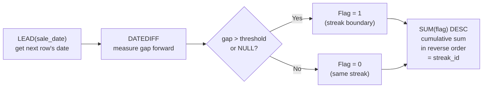

# :material-numeric-8-circle: Gap Detection

Flag rows where the gap to the next event exceeds a threshold,
then group consecutive events into "streaks".

---

## :material-flask-outline: Practical Examples

```sql
CREATE OR REPLACE TEMP VIEW sales AS
SELECT * FROM VALUES
  ('Alice', '2024-01-01', 100),
  ('Alice', '2024-01-03', 200),   -- 2 days after prev → same streak
  ('Alice', '2024-01-05', 150),   -- 2 days after prev → same streak
  ('Alice', '2024-01-15', 300),   -- 10 days after prev → GAP
  ('Alice', '2024-01-16', 250),   -- 1 day after prev  → same streak
  ('Bob',   '2024-01-02', 150),
  ('Bob',   '2024-01-04', 200),   -- 2 days after prev → same streak
  ('Bob',   '2024-01-20', 350)    -- 16 days after prev → GAP
AS sales(rep, sale_date, amount);
```

### Step 1 — Measure the Gap to the Next Row

Use `LEAD` to look ahead and compute the distance to the next event:

```sql
SELECT
    rep,
    sale_date,
    amount,
    LEAD(sale_date) OVER (PARTITION BY rep ORDER BY sale_date) AS next_date,
    DATEDIFF(
        LEAD(sale_date) OVER (PARTITION BY rep ORDER BY sale_date),
        sale_date
    ) AS days_to_next
FROM sales
ORDER BY rep, sale_date;
```

??? success "Expected Output"

    | rep   | sale_date  | amount | next_date  | days_to_next |
    |-------|------------|-------:|------------|-------------:|
    | Alice | 2024-01-01 |    100 | 2024-01-03 |            2 |
    | Alice | 2024-01-03 |    200 | 2024-01-05 |            2 |
    | Alice | 2024-01-05 |    150 | 2024-01-15 |           10 |
    | Alice | 2024-01-15 |    300 | 2024-01-16 |            1 |
    | Alice | 2024-01-16 |    250 | NULL       |         NULL |
    | Bob   | 2024-01-02 |    150 | 2024-01-04 |            2 |
    | Bob   | 2024-01-04 |    200 | 2024-01-20 |           16 |
    | Bob   | 2024-01-20 |    350 | NULL       |         NULL |

    - `days_to_next > 5` → gap detected (Alice Jan-05 → Jan-15, Bob Jan-04 → Jan-20).
    - `NULL` → last row in the partition (no next event).

### Step 2 — Assign Streak IDs

A streak breaks when `days_to_next > threshold` or at the end of the partition.
Scanning in **reverse order** (`ORDER BY sale_date DESC`), each break increments
the streak counter:

```sql
SELECT
    rep,
    sale_date,
    amount,
    days_to_next,
    CASE WHEN days_to_next > 5 OR days_to_next IS NULL THEN 'GAP' ELSE '' END AS gap_flag,
    SUM(
        CASE WHEN days_to_next > 5 OR days_to_next IS NULL THEN 1 ELSE 0 END
    ) OVER (
        PARTITION BY rep
        ORDER BY sale_date DESC
        ROWS BETWEEN UNBOUNDED PRECEDING AND CURRENT ROW
    ) AS streak_id
FROM (
    SELECT
        rep,
        sale_date,
        amount,
        DATEDIFF(
            LEAD(sale_date) OVER (PARTITION BY rep ORDER BY sale_date),
            sale_date
        ) AS days_to_next
    FROM sales
)
ORDER BY rep, sale_date;
```

??? success "Expected Output"

    | rep   | sale_date  | amount | days_to_next | gap_flag | streak_id |
    |-------|------------|-------:|-------------:|----------|----------:|
    | Alice | 2024-01-01 |    100 |            2 |          |         2 |
    | Alice | 2024-01-03 |    200 |            2 |          |         2 |
    | Alice | 2024-01-05 |    150 |           10 | GAP      |         2 |
    | Alice | 2024-01-15 |    300 |            1 |          |         1 |
    | Alice | 2024-01-16 |    250 |         NULL | GAP      |         1 |
    | Bob   | 2024-01-02 |    150 |            2 |          |         2 |
    | Bob   | 2024-01-04 |    200 |           16 | GAP      |         2 |
    | Bob   | 2024-01-20 |    350 |         NULL | GAP      |         1 |

    **Reading the streaks:**

    - **Alice streak 2** = Jan 01, 03, 05 (all within 5 days of each other)
    - **Alice streak 1** = Jan 15, 16 (starts after the 10-day gap)
    - **Bob streak 2** = Jan 02, 04
    - **Bob streak 1** = Jan 20 (starts after the 16-day gap)

    Streak IDs count down because we scan in reverse — streak 1 is always the
    most recent.

---

## :material-information-outline: How It Works



| Step | Window Function | Purpose |
|------|-----------------|---------|
| 1 | `LEAD(sale_date)` | Look ahead to the next event date |
| 2 | `DATEDIFF(next, current)` | Compute the gap in days |
| 3 | `CASE WHEN gap > 5 OR NULL` | Flag rows at the end of a streak |
| 4 | `SUM(flag) ... ORDER BY date DESC` | Assign streak IDs by counting breaks from the end |

!!! note "Why scan in reverse?"
    The gap is measured **forward** (current → next), so the flag sits on the
    **last row** of each streak. By accumulating in reverse (`ORDER BY sale_date DESC`),
    all rows in the same streak receive the same ID.

!!! tip "Threshold is configurable"
    Replace `> 5` with any business rule: `> 1` for strict consecutive days,
    `> 30` for monthly activity detection, etc.

---

## :material-swap-horizontal: Alternative — LAG-Based Gap Detection

Instead of looking **forward** with `LEAD`, you can look **backward** with `LAG`.
The flag then sits on the **first row** of a new streak, so the cumulative sum
scans in normal order (no reverse needed).

### Step 1 — Measure the Gap from the Previous Row

```sql
SELECT
    rep,
    sale_date,
    amount,
    LAG(sale_date) OVER (PARTITION BY rep ORDER BY sale_date) AS prev_date,
    DATEDIFF(
        sale_date,
        LAG(sale_date) OVER (PARTITION BY rep ORDER BY sale_date)
    ) AS days_since_prev
FROM sales
ORDER BY rep, sale_date;
```

??? success "Expected Output"

    | rep   | sale_date  | amount | prev_date  | days_since_prev |
    |-------|------------|-------:|------------|----------------:|
    | Alice | 2024-01-01 |    100 | NULL       |            NULL |
    | Alice | 2024-01-03 |    200 | 2024-01-01 |               2 |
    | Alice | 2024-01-05 |    150 | 2024-01-03 |               2 |
    | Alice | 2024-01-15 |    300 | 2024-01-05 |              10 |
    | Alice | 2024-01-16 |    250 | 2024-01-15 |               1 |
    | Bob   | 2024-01-02 |    150 | NULL       |            NULL |
    | Bob   | 2024-01-04 |    200 | 2024-01-02 |               2 |
    | Bob   | 2024-01-20 |    350 | 2024-01-04 |              16 |

    - `days_since_prev > 5` → gap detected (this row starts a new streak).
    - `NULL` → first row in the partition (also starts a new streak).

### Step 2 — Assign Streak IDs (Forward Scan)

Flag the **first row** of each streak, then accumulate forward:

```sql
SELECT
    rep,
    sale_date,
    amount,
    days_since_prev,
    CASE WHEN days_since_prev > 5 OR days_since_prev IS NULL THEN 'NEW' ELSE '' END AS streak_start,
    SUM(
        CASE WHEN days_since_prev > 5 OR days_since_prev IS NULL THEN 1 ELSE 0 END
    ) OVER (
        PARTITION BY rep
        ORDER BY sale_date
        ROWS BETWEEN UNBOUNDED PRECEDING AND CURRENT ROW
    ) AS streak_id
FROM (
    SELECT
        rep,
        sale_date,
        amount,
        DATEDIFF(
            sale_date,
            LAG(sale_date) OVER (PARTITION BY rep ORDER BY sale_date)
        ) AS days_since_prev
    FROM sales
)
ORDER BY rep, sale_date;
```

??? success "Expected Output"

    | rep   | sale_date  | amount | days_since_prev | streak_start | streak_id |
    |-------|------------|-------:|----------------:|--------------|----------:|
    | Alice | 2024-01-01 |    100 |            NULL | NEW          |         1 |
    | Alice | 2024-01-03 |    200 |               2 |              |         1 |
    | Alice | 2024-01-05 |    150 |               2 |              |         1 |
    | Alice | 2024-01-15 |    300 |              10 | NEW          |         2 |
    | Alice | 2024-01-16 |    250 |               1 |              |         2 |
    | Bob   | 2024-01-02 |    150 |            NULL | NEW          |         1 |
    | Bob   | 2024-01-04 |    200 |               2 |              |         1 |
    | Bob   | 2024-01-20 |    350 |              16 | NEW          |         2 |

    **Reading the streaks:**

    - **Alice streak 1** = Jan 01, 03, 05 (all within 5 days of each other)
    - **Alice streak 2** = Jan 15, 16 (starts after the 10-day gap)
    - **Bob streak 1** = Jan 02, 04
    - **Bob streak 2** = Jan 20 (starts after the 16-day gap)

    Streak IDs count **up** (1, 2, 3...) — streak 1 is always the earliest.

---

## :material-compare: LEAD vs LAG Comparison

| Aspect | LEAD approach | LAG approach |
|--------|---------------|--------------|
| Looks at | Next row | Previous row |
| Flag sits on | Last row of streak | First row of new streak |
| Cumulative scan | Reverse (`DESC`) | Forward (`ASC`) |
| Streak numbering | Counts down from end | Counts up from start |
| Simpler logic? | Slightly complex (reverse) | More intuitive (forward) |

!!! tip "Prefer LAG for gap detection"
    The LAG approach is generally easier to reason about: "this row is far from
    the previous one → it starts a new streak." The forward cumulative sum avoids
    the reverse-order trick needed by the LEAD approach.

---

## :material-lightbulb-outline: When to Use

- Detect missing data in a time series (e.g., days with no transactions).
- Identify streaks of consecutive activity (login streaks, winning streaks).
- Data quality monitoring — flag unexpected gaps in scheduled jobs.

---

## :material-arrow-right: Related

- [Sessionisation](sessionisation.md) — group events into sessions based on gap thresholds
- [Forward-Fill](forward_fill.md) — fill gaps instead of detecting them
