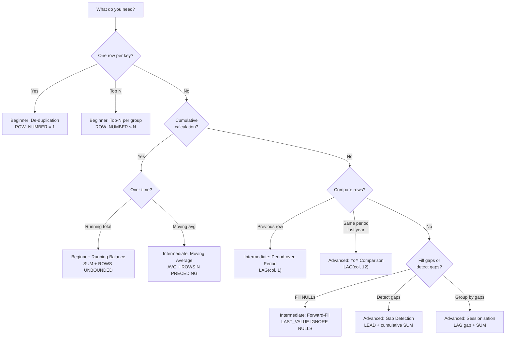

# :material-lightbulb-on: Real-World Window Function Patterns

Ten production-ready patterns that solve common data engineering problems using window functions.
Each pattern includes full SQL, expected output, and performance considerations.

!!! abstract "Pattern Complexity Guide"
    | :material-circle: | Level | Patterns |
    |:-:|-------|----------|
    | :material-circle:{ style="color: green" } | Beginner | De-duplication, Top-N, Running Balance |
    | :material-circle:{ style="color: orange" } | Intermediate | Period-over-Period, Percentile Scoring, Forward-Fill |
    | :material-circle:{ style="color: red" } | Advanced | Sessionisation, Gap Detection, YoY Comparison, Median |

---

## :material-sitemap: Decision Flowchart



---

## :material-flask-outline: Shared Dataset

All beginner and intermediate patterns use this dataset unless otherwise noted.

```sql
CREATE OR REPLACE TEMP VIEW sales AS
SELECT * FROM VALUES
  ('North', 'Alice', '2024-01-01', 100),
  ('North', 'Alice', '2024-01-05', 200),
  ('North', 'Alice', '2024-01-10', 300),
  ('North', 'Bob',   '2024-01-02', 150),
  ('North', 'Bob',   '2024-01-06', 300),
  ('South', 'Carol', '2024-01-03', 400),
  ('South', 'Carol', '2024-01-07', 500)
AS sales(region, rep, sale_date, amount);
```

---

## :material-book-open-variant: Patterns

| # | Pattern | Key Function | Frame | Complexity | Page |
|:-:|---------|-------------|-------|:----------:|------|
| 1 | De-duplication — keep latest | `ROW_NUMBER` DESC | None (ranking) | :material-circle:{ style="color: green" } | [deduplication.md](deduplication.md) |
| 2 | Top-N per group | `ROW_NUMBER` | None (ranking) | :material-circle:{ style="color: green" } | [top_n.md](top_n.md) |
| 3 | Running balance | `SUM` | `ROWS UNBOUNDED PRECEDING TO CURRENT ROW` | :material-circle:{ style="color: green" } | [running_balance.md](running_balance.md) |
| 4 | Period-over-period delta | `LAG(col, 1)` | None (navigation) | :material-circle:{ style="color: orange" } | [period_comparison.md](period_comparison.md) |
| 5 | Sessionisation | `LAG` gap flag + cumulative `SUM` | `ROWS UNBOUNDED PRECEDING TO CURRENT ROW` | :material-circle:{ style="color: red" } | [sessionisation.md](sessionisation.md) |
| 6 | Percentile scoring | `PERCENT_RANK`, `NTILE` | None (ranking) | :material-circle:{ style="color: orange" } | [percentile.md](percentile.md) |
| 7 | Forward-fill NULLs | `LAST_VALUE IGNORE NULLS` | `ROWS UNBOUNDED PRECEDING TO CURRENT ROW` | :material-circle:{ style="color: orange" } | [forward_fill.md](forward_fill.md) |
| 8 | Gap detection / streaks | `LEAD` gap + cumulative `SUM` | `ROWS UNBOUNDED PRECEDING TO CURRENT ROW` | :material-circle:{ style="color: red" } | [gap_detection.md](gap_detection.md) |
| 9 | Median / percentile | `PERCENTILE_APPROX` | GROUP BY (aggregate) | :material-circle:{ style="color: red" } | [median.md](median.md) |
| 10 | Year-over-year comparison | `LAG(col, 12)` | None (navigation) | :material-circle:{ style="color: red" } | [yoy_comparison.md](yoy_comparison.md) |

---

## :material-speedometer: Performance Best Practices

| Tip | Reason |
|-----|--------|
| Pre-filter before windowing | Reduces partition size → less shuffle data |
| Combine windows with same `OVER` spec | One shuffle stage instead of multiple |
| Use `ROWS` not `RANGE` when possible | `ROWS` is position-based (faster), `RANGE` requires value comparison |
| Add `PARTITION BY` on high-cardinality keys | Smaller partitions = better parallelism |
| Avoid `UNBOUNDED FOLLOWING` on large partitions | Forces buffering entire partition in memory |
| Use `QUALIFY` to avoid wrapper subquery | Cleaner plan — one fewer project node |
| Cache input when reusing same windowed result | Avoid recomputing the shuffle stage |

---

## :material-brain: When to Use

| Scenario | Pattern |
|----------|---------|
| Remove duplicates, keep latest row | `ROW_NUMBER` + filter `rn = 1` |
| Leaderboard / top-N per category | `ROW_NUMBER` + filter `rn <= N` |
| Cumulative metrics over time | `SUM ... ROWS BETWEEN UNBOUNDED PRECEDING AND CURRENT ROW` |
| Compare each period to previous | `LAG(metric) OVER (PARTITION BY ... ORDER BY date)` |
| Group activity into sessions | LAG gap flag + cumulative `SUM` for session id |
| Percentile distribution within groups | `PERCENT_RANK` + `NTILE(n)` |

---

## :material-arrow-right: Related

- [Window Types](../functions/index.md) — full function reference (ranking, aggregate, navigation)
- [Frame Specification](../frame/index.md) — ROWS vs RANGE deep dive
- [NULL Handling in Windows](../nulls/null_options_wf.md) — `IGNORE NULLS`, `RESPECT NULLS`
