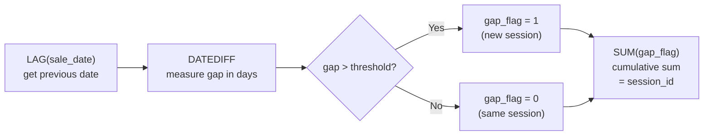

# :material-numeric-5-circle: Sessionisation

Detect gaps of more than 3 days between consecutive sales for the same rep
and assign a session id by accumulating gap flags.

______________________________________________________________________

## :material-flask-outline: Practical Examples

```sql
CREATE OR REPLACE TEMP VIEW sales AS
SELECT * FROM VALUES
  ('Alice', '2024-01-01', 100),
  ('Alice', '2024-01-03', 200),  -- 2-day gap  → same session
  ('Alice', '2024-01-05', 150),  -- 2-day gap  → same session
  ('Alice', '2024-01-10', 300),  -- 5-day gap  → new session
  ('Alice', '2024-01-11', 250),  -- 1-day gap  → same session
  ('Bob',   '2024-01-02', 150),
  ('Bob',   '2024-01-06', 300),  -- 4-day gap  → new session
  ('Bob',   '2024-01-07', 100),  -- 1-day gap  → same session
  ('Carol', '2024-01-03', 400),
  ('Carol', '2024-01-07', 500)   -- 4-day gap  → new session
AS sales(rep, sale_date, amount);
```

### Step 1 — Compute the Gap Flag

Use `LAG` to fetch the previous sale date per rep, then flag rows where the
gap exceeds the threshold:

```sql
SELECT
    rep,
    sale_date,
    amount,
    LAG(sale_date) OVER (PARTITION BY rep ORDER BY sale_date) AS prev_date,
    DATEDIFF(
        sale_date,
        LAG(sale_date) OVER (PARTITION BY rep ORDER BY sale_date)
    ) AS days_since_prev,
    CASE
        WHEN DATEDIFF(
            sale_date,
            LAG(sale_date) OVER (PARTITION BY rep ORDER BY sale_date)
        ) > 3 THEN 1
        ELSE 0
    END AS gap_flag
FROM sales
ORDER BY rep, sale_date;
```

??? success "Expected Output"

    | rep   | sale_date  | amount | prev_date  | days_since_prev | gap_flag |
    | ----- | ---------- | -----: | ---------- | --------------: | -------: |
    | Alice | 2024-01-01 |    100 | NULL       |            NULL |        0 |
    | Alice | 2024-01-03 |    200 | 2024-01-01 |               2 |        0 |
    | Alice | 2024-01-05 |    150 | 2024-01-03 |               2 |        0 |
    | Alice | 2024-01-10 |    300 | 2024-01-05 |               5 |        1 |
    | Alice | 2024-01-11 |    250 | 2024-01-10 |               1 |        0 |
    | Bob   | 2024-01-02 |    150 | NULL       |            NULL |        0 |
    | Bob   | 2024-01-06 |    300 | 2024-01-02 |               4 |        1 |
    | Bob   | 2024-01-07 |    100 | 2024-01-06 |               1 |        0 |
    | Carol | 2024-01-03 |    400 | NULL       |            NULL |        0 |
    | Carol | 2024-01-07 |    500 | 2024-01-03 |               4 |        1 |

    - The first row per rep has no previous date → `days_since_prev` is NULL → `gap_flag = 0`.
    - Gaps ≤ 3 days → `gap_flag = 0` (same session).
    - Gaps > 3 days → `gap_flag = 1` (new session starts here).

### Step 2 — Assign Session IDs

A cumulative `SUM` of `gap_flag` turns the binary flags into an incrementing
session identifier:

```sql
SELECT
    rep,
    sale_date,
    amount,
    gap_flag,
    SUM(gap_flag) OVER (
        PARTITION BY rep
        ORDER BY sale_date
        ROWS BETWEEN UNBOUNDED PRECEDING AND CURRENT ROW
    ) AS session_id
FROM (
    SELECT
        rep,
        sale_date,
        amount,
        CASE
            WHEN DATEDIFF(
                sale_date,
                LAG(sale_date) OVER (PARTITION BY rep ORDER BY sale_date)
            ) > 3 THEN 1
            ELSE 0
        END AS gap_flag
    FROM sales
)
ORDER BY rep, sale_date;
```

??? success "Expected Output"

    | rep   | sale_date  | amount | gap_flag | session_id |
    | ----- | ---------- | -----: | -------: | ---------: |
    | Alice | 2024-01-01 |    100 |        0 |          0 |
    | Alice | 2024-01-03 |    200 |        0 |          0 |
    | Alice | 2024-01-05 |    150 |        0 |          0 |
    | Alice | 2024-01-10 |    300 |        1 |          1 |
    | Alice | 2024-01-11 |    250 |        0 |          1 |
    | Bob   | 2024-01-02 |    150 |        0 |          0 |
    | Bob   | 2024-01-06 |    300 |        1 |          1 |
    | Bob   | 2024-01-07 |    100 |        0 |          1 |
    | Carol | 2024-01-03 |    400 |        0 |          0 |
    | Carol | 2024-01-07 |    500 |        1 |          1 |

    **Alice** has two sessions: Jan 01–05 (session 0) and Jan 10–11 (session 1).
    Every time `gap_flag = 1`, the cumulative sum increments — starting a new session.

______________________________________________________________________

## :material-information-outline: How It Works

The technique chains two window passes:



1. **`LAG(sale_date)`** — fetches the previous row's date within each rep partition.
2. **`DATEDIFF(current, previous)`** — measures the gap in days between consecutive rows.
3. **`CASE ... > 3 THEN 1 ELSE 0`** — flags rows where the gap exceeds the threshold.
4. **Cumulative `SUM(gap_flag)`** — each `1` increments the counter, creating a
    monotonically increasing session id. Rows with `0` inherit the current session.

!!! tip "Threshold is configurable"

    Replace `> 3` with any gap threshold: `> 30` for 30-minute web sessions
    (using `TIMESTAMPDIFF`), `> 7` for weekly activity bursts, etc.

!!! note "Session IDs are zero-based"

    The first session per partition is `0`. If you prefer 1-based IDs, add `+ 1`
    to the cumulative sum or wrap in a CTE.

______________________________________________________________________

## :material-clock-outline: Working with Timestamps Instead of Dates

The examples above use `DATEDIFF` because the sample data is daily sales. For
event-level data (clickstreams, API logs) the gap is usually measured in **minutes or
seconds**, so swap `DATEDIFF` for `UNIX_TIMESTAMP` subtraction on a `TIMESTAMP` column:

```sql
CREATE OR REPLACE TEMP VIEW clicks AS
SELECT * FROM VALUES
  ('u1', TIMESTAMP'2024-01-01 09:00:00'),
  ('u1', TIMESTAMP'2024-01-01 09:05:00'),   -- 5-min gap  → same session
  ('u1', TIMESTAMP'2024-01-01 09:40:00'),   -- 35-min gap → new session
  ('u1', TIMESTAMP'2024-01-01 09:41:00'),   -- 1-min gap  → same session
  ('u2', TIMESTAMP'2024-01-01 10:00:00')
AS t(user_id, event_ts);

WITH lagged AS (
    SELECT
        user_id, event_ts,
        LAG(event_ts) OVER (PARTITION BY user_id ORDER BY event_ts) AS prev_ts
    FROM clicks
),
flagged AS (
    SELECT
        user_id, event_ts,
        CASE
            WHEN prev_ts IS NULL THEN 0
            WHEN UNIX_TIMESTAMP(event_ts) - UNIX_TIMESTAMP(prev_ts) > 1800 THEN 1  -- 30-min threshold, in seconds
            ELSE 0
        END AS gap_flag
    FROM lagged
)
SELECT
    user_id, event_ts, gap_flag,
    SUM(gap_flag) OVER (
        PARTITION BY user_id ORDER BY event_ts
        ROWS BETWEEN UNBOUNDED PRECEDING AND CURRENT ROW
    ) AS session_id
FROM flagged
ORDER BY user_id, event_ts;
```

??? success "Expected Output"

    | user_id | event_ts            | gap_flag | session_id |
    | ------- | ------------------- | -------: | ---------: |
    | u1      | 2024-01-01 09:00:00 |        0 |          0 |
    | u1      | 2024-01-01 09:05:00 |        0 |          0 |
    | u1      | 2024-01-01 09:40:00 |        1 |          1 |
    | u1      | 2024-01-01 09:41:00 |        0 |          1 |
    | u2      | 2024-01-01 10:00:00 |        0 |          0 |

    35 minutes (2100 seconds) exceeds the 1800-second threshold, so `u1`'s third event
    starts session `1`; every other gap is under the threshold.

`UNIX_TIMESTAMP()` converts to epoch seconds, so the comparison threshold is in
**seconds** here versus **days** for `DATEDIFF` — pick whichever unit matches the
column's natural precision and adjust the threshold accordingly.

______________________________________________________________________

## :material-lightbulb-outline: When to Use

- Clickstream analysis — group page views into user sessions.
- IoT event processing — cluster sensor readings into activity bursts.
- User engagement — identify active vs inactive periods.

______________________________________________________________________

## :material-arrow-right: Related

- [Gap Detection](gap-detection.md) — find and flag gaps without grouping into sessions
- [Running Balance](running-balance.md) — same cumulative `SUM` technique
- [Sessionization (deep dive)](../../patterns/sequence/sessionization.md) — session
    aggregation, funnels, globally unique IDs, and event-type-aware splits
- [Session Windows](../../patterns/timeseries/windowing/session-window.md) — Spark's
    built-in `session_window()` for streaming/batch tumbling-by-inactivity windows,
    as an alternative to the manual `LAG`/`SUM` technique above
