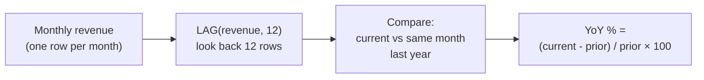

# :material-numeric-10-circle: Year-over-Year (YoY) Comparison

Compare each month's revenue to the same month in the prior year.

---

## :material-flask-outline: Practical Examples

```sql
CREATE OR REPLACE TEMP VIEW monthly_revenue AS
SELECT * FROM VALUES
  ('2023-01-01', 'North', 1000),
  ('2023-02-01', 'North', 1200),
  ('2023-03-01', 'North', 1100),
  ('2023-04-01', 'North', 1300),
  ('2023-05-01', 'North', 1400),
  ('2023-06-01', 'North', 1500),
  ('2023-07-01', 'North', 1600),
  ('2023-08-01', 'North', 1450),
  ('2023-09-01', 'North', 1350),
  ('2023-10-01', 'North', 1550),
  ('2023-11-01', 'North', 1700),
  ('2023-12-01', 'North', 1800),
  ('2024-01-01', 'North', 1150),
  ('2024-02-01', 'North', 1350),
  ('2024-03-01', 'North', 1250),
  ('2024-04-01', 'North', 1500),
  ('2024-05-01', 'North', 1600),
  ('2024-06-01', 'North', 1700)
AS monthly_revenue(month, region, revenue);

SELECT
    month,
    region,
    revenue,
    LAG(revenue, 12) OVER (
        PARTITION BY region
        ORDER BY month
    ) AS revenue_prior_year,
    ROUND(
        100.0 * (revenue - LAG(revenue, 12) OVER (PARTITION BY region ORDER BY month))
              / NULLIF(LAG(revenue, 12) OVER (PARTITION BY region ORDER BY month), 0),
        1
    ) AS yoy_pct
FROM monthly_revenue
ORDER BY region, month;
```

??? success "Expected Output"

    | month      | region | revenue | revenue_prior_year | yoy_pct |
    |------------|--------|--------:|-------------------:|--------:|
    | 2023-01-01 | North  |    1000 |               NULL |    NULL |
    | 2023-02-01 | North  |    1200 |               NULL |    NULL |
    | 2023-03-01 | North  |    1100 |               NULL |    NULL |
    | ...        | ...    |     ... |                ... |     ... |
    | 2023-12-01 | North  |    1800 |               NULL |    NULL |
    | 2024-01-01 | North  |    1150 |               1000 |    15.0 |
    | 2024-02-01 | North  |    1350 |               1200 |    12.5 |
    | 2024-03-01 | North  |    1250 |               1100 |    13.6 |
    | 2024-04-01 | North  |    1500 |               1300 |    15.4 |
    | 2024-05-01 | North  |    1600 |               1400 |    14.3 |
    | 2024-06-01 | North  |    1700 |               1500 |    13.3 |

    - The first 12 rows (2023) have no prior-year data → `NULL`.
    - Starting Jan 2024, `LAG(revenue, 12)` reaches back to Jan 2023.
    - **YoY %** = (current - prior) / prior × 100.

---

## :material-information-outline: How It Works



| Step | Logic | Purpose |
|------|-------|---------|
| 1 | Aggregate raw data into monthly totals | Ensure exactly one row per month per region |
| 2 | `LAG(revenue, 12)` | Fetch the revenue from the same month, 12 rows back |
| 3 | `NULLIF(..., 0)` | Prevent division by zero if prior year had zero revenue |
| 4 | `(current - prior) / prior × 100` | Compute percentage growth |

!!! warning "LAG offset assumes contiguous months"
    `LAG(col, 12)` works correctly only when **every month has a row** in the
    partition. If months can be missing, the offset won't align to the same
    calendar month. Use a `JOIN` on the calendar month instead (see below).

---

## :material-swap-horizontal: Alternative — JOIN for Non-Contiguous Data

When months may be missing, a self-join on the calendar month is safer:

```sql
SELECT
    curr.month,
    curr.region,
    curr.revenue,
    prev.revenue AS revenue_prior_year,
    ROUND(
        100.0 * (curr.revenue - prev.revenue) / NULLIF(prev.revenue, 0),
        1
    ) AS yoy_pct
FROM monthly_revenue curr
LEFT JOIN monthly_revenue prev
  ON  curr.region = prev.region
  AND prev.month  = ADD_MONTHS(curr.month, -12)
ORDER BY curr.region, curr.month;
```

??? success "Expected Output"

    | month      | region | revenue | revenue_prior_year | yoy_pct |
    |------------|--------|--------:|-------------------:|--------:|
    | 2023-01-01 | North  |    1000 |               NULL |    NULL |
    | ...        | ...    |     ... |                ... |     ... |
    | 2024-01-01 | North  |    1150 |               1000 |    15.0 |
    | 2024-02-01 | North  |    1350 |               1200 |    12.5 |
    | 2024-03-01 | North  |    1250 |               1100 |    13.6 |
    | 2024-04-01 | North  |    1500 |               1300 |    15.4 |
    | 2024-05-01 | North  |    1600 |               1400 |    14.3 |
    | 2024-06-01 | North  |    1700 |               1500 |    13.3 |

    `ADD_MONTHS(curr.month, -12)` precisely targets the same calendar month
    regardless of gaps in the data.

---

## :material-compare: LAG vs JOIN Approach

| Aspect | `LAG(col, 12)` | Self-JOIN on calendar month |
|--------|:--------------:|:---------------------------:|
| Requires contiguous months | Yes | No |
| Performance | Single shuffle (window) | Join shuffle |
| Handles gaps | :material-close: Wrong alignment | :material-check: Correct |
| Readability | Concise | More verbose |
| Best for | Dense time series (no missing months) | Sparse or irregular data |

---

## :material-flask-outline: Bonus — CTE Pattern from Raw Orders

When starting from raw order data, aggregate into months first:

```sql
WITH monthly AS (
    SELECT
        DATE_TRUNC('month', order_date) AS month,
        region,
        SUM(amount)                     AS revenue
    FROM orders
    GROUP BY 1, 2
)
SELECT
    month,
    region,
    revenue,
    LAG(revenue, 12) OVER (PARTITION BY region ORDER BY month) AS revenue_prior_year,
    ROUND(
        100.0 * (revenue - LAG(revenue, 12) OVER (PARTITION BY region ORDER BY month))
              / NULLIF(LAG(revenue, 12) OVER (PARTITION BY region ORDER BY month), 0),
        1
    ) AS yoy_pct
FROM monthly
ORDER BY region, month;
```

!!! tip "Avoid repeated LAG calls"
    The query calls `LAG(revenue, 12)` three times. Use a CTE to compute it once:
    ```sql
    WITH monthly AS (...),
    lagged AS (
        SELECT *, LAG(revenue, 12) OVER (PARTITION BY region ORDER BY month) AS prev_yr
        FROM monthly
    )
    SELECT month, region, revenue, prev_yr,
           ROUND(100.0 * (revenue - prev_yr) / NULLIF(prev_yr, 0), 1) AS yoy_pct
    FROM lagged;
    ```

---

## :material-lightbulb-outline: When to Use

- Executive dashboards — YoY growth by region or product line.
- Seasonal businesses — compare same-season performance.
- Trend analysis — detect acceleration or deceleration over years.

---

## :material-arrow-right: Related

- [Period-over-Period](period_comparison.md) — MoM / WoW comparison with `LAG(col, 1)`
- [Window Types — Navigation](../functions/navigation.md) — `LAG`, `LEAD` reference
