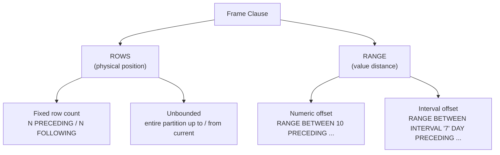

# :material-border-all: Frame Specification

A window frame limits the rows included in an aggregate calculation to a subset of
the current partition. Two modes are available: **`ROWS`** (physical offset) and
**`RANGE`** (value-based offset).

!!! abstract "Key Insight"
    The frame determines **which rows** contribute to the window function result for
    the **current row**. Without a frame clause, you get default behaviour that often
    surprises — always be explicit.

---

## :material-sitemap: Frame Overview



---

## :material-pin: Syntax

```sql
{ ROWS | RANGE } BETWEEN frame_start AND frame_end
```

Where `frame_start` / `frame_end` is one of:

```sql
UNBOUNDED PRECEDING   -- first row of partition
N PRECEDING           -- N rows / N value-units before current row
CURRENT ROW           -- the current row
N FOLLOWING           -- N rows / N value-units after current row
UNBOUNDED FOLLOWING   -- last row of partition
```

!!! note "Shorthand"
    `ROWS UNBOUNDED PRECEDING` is shorthand for
    `ROWS BETWEEN UNBOUNDED PRECEDING AND CURRENT ROW`.

---

## :material-table: Frame Boundaries Visualised

For a partition with 7 rows, here's what each boundary means relative to row 4 (current):

```text
Row:     1       2       3      [4]      5       6       7
         ↑                       ↑                       ↑
    UNBOUNDED              CURRENT ROW              UNBOUNDED
    PRECEDING                                      FOLLOWING

         |←─── 2 PRECEDING ───→|
                                |←── 2 FOLLOWING ──→|
         |←──────── UNBOUNDED PRECEDING ──────────→|
```

### :material-animation-play: Interactive Frame Explorer

Click any row to set it as **CURRENT ROW**, then adjust the PRECEDING / FOLLOWING
controls to see how the frame and SUM change.

<div id="viz-frame-rows" class="ts-viz"></div>

| Boundary | Meaning |
|----------|---------|
| `UNBOUNDED PRECEDING` | Start of the partition |
| `N PRECEDING` | N rows / N value-units before the current row |
| `CURRENT ROW` | The current row itself |
| `N FOLLOWING` | N rows / N value-units after the current row |
| `UNBOUNDED FOLLOWING` | End of the partition |

---

## :material-compare: ROWS vs RANGE

| Property | ROWS | RANGE |
|----------|------|-------|
| Offset type | Physical row count — integer only | Value distance — numeric or interval |
| Tie handling | Each row is treated independently | All rows with the same ORDER BY value share the same frame |
| Multi-column ORDER BY | Supported | Not supported with numeric/interval offsets |
| Performance | Faster — row position is pre-computed | Slightly slower — value comparison per row |
| Interval support | No | Yes — use `INTERVAL '7' DAY` for date/timestamp columns |
| Use case | Fixed row windows (last 3 rows) | Time-based windows (last 7 days) |

---

## :material-magnify: Default Frame Behavior

| Condition | Default Frame | Implication |
|-----------|--------------|-------------|
| `ORDER BY` present, no frame clause | `RANGE BETWEEN UNBOUNDED PRECEDING AND CURRENT ROW` | Running aggregate (ties included) |
| No `ORDER BY`, no frame clause | `ROWS BETWEEN UNBOUNDED PRECEDING AND UNBOUNDED FOLLOWING` | Full partition aggregate (same value every row) |

!!! warning "The LAST_VALUE trap"
    `LAST_VALUE` with the default frame returns the **current row** — not the last row
    of the partition. Always specify `ROWS BETWEEN UNBOUNDED PRECEDING AND UNBOUNDED FOLLOWING`
    to get the actual last value.

    ```sql
    -- ❌ Wrong: returns current row value
    LAST_VALUE(amount) OVER (PARTITION BY region ORDER BY sale_date)

    -- ✅ Correct: returns actual last row of partition
    LAST_VALUE(amount) OVER (
        PARTITION BY region ORDER BY sale_date
        ROWS BETWEEN UNBOUNDED PRECEDING AND UNBOUNDED FOLLOWING
    )
    ```

---

## :material-flask-outline: Common Frame Patterns

| Pattern | Frame Clause | Example Use |
|---------|-------------|-------------|
| Running total | `ROWS BETWEEN UNBOUNDED PRECEDING AND CURRENT ROW` | Cumulative revenue |
| Full partition | `ROWS BETWEEN UNBOUNDED PRECEDING AND UNBOUNDED FOLLOWING` | Total for comparison |
| 3-row moving average | `ROWS BETWEEN 1 PRECEDING AND 1 FOLLOWING` | Smoothing noisy data |
| 7-day rolling sum | `RANGE BETWEEN INTERVAL '7' DAY PRECEDING AND CURRENT ROW` | Weekly metric |
| Trailing 5 rows | `ROWS BETWEEN 4 PRECEDING AND CURRENT ROW` | Last 5 data points |
| Look-ahead | `ROWS BETWEEN CURRENT ROW AND 3 FOLLOWING` | Next 3 rows preview |

---

## :material-flask-outline: ROWS vs RANGE Side-by-Side

The data has two rows on `2024-01-05` — showing how each mode handles ties differently.

### :material-animation-play: Interactive Comparison

Click a row in either panel to see how the running SUM and frame membership differ:

<div id="viz-frame-compare" class="ts-viz"></div>

### SQL

```sql
CREATE OR REPLACE TEMP VIEW events AS
SELECT * FROM VALUES
  ('2024-01-01', 100),
  ('2024-01-03', 200),
  ('2024-01-05', 150),
  ('2024-01-05', 300),
  ('2024-01-07', 400)
AS events(event_date, amount);
```

```sql
SELECT
    event_date,
    amount,
    SUM(amount) OVER (
        ORDER BY event_date
        ROWS BETWEEN UNBOUNDED PRECEDING AND CURRENT ROW
    ) AS rows_running,
    SUM(amount) OVER (
        ORDER BY event_date
        RANGE BETWEEN UNBOUNDED PRECEDING AND CURRENT ROW
    ) AS range_running
FROM events
ORDER BY event_date, amount;
```

| event_date | amount | rows_running | range_running | Notes |
|------------|-------:|:------------:|:-------------:|-------|
| 2024-01-01 |    100 | 100 | 100 | |
| 2024-01-03 |    200 | 300 | 300 | |
| 2024-01-05 |    150 | 450 | **750** | RANGE includes both 01-05 rows |
| 2024-01-05 |    300 | 750 | **750** | RANGE: same result as above |
| 2024-01-07 |    400 | 1150 | 1150 | |

!!! info "Why the difference?"
    - **ROWS** treats each row independently — row 3 sees rows 1–3, row 4 sees rows 1–4.
    - **RANGE** groups by ORDER BY value — both `2024-01-05` rows see rows 1–4 (all values ≤ `2024-01-05`).

---

## :material-clock: RANGE with INTERVAL (Time-Based Windows)

```sql
SELECT
    event_date,
    amount,
    SUM(amount) OVER (
        ORDER BY CAST(event_date AS DATE)
        RANGE BETWEEN INTERVAL '2' DAY PRECEDING AND CURRENT ROW
    ) AS sum_last_2_days
FROM events
ORDER BY event_date;
```

| event_date | amount | sum_last_2_days | Rows in frame |
|------------|-------:|:---------------:|---------------|
| 2024-01-01 |    100 | 100 | Only 01-01 |
| 2024-01-03 |    200 | 300 | 01-01 through 01-03 |
| 2024-01-05 |    150 | 350 | 01-03, 01-05 (01-01 is >2 days away) |
| 2024-01-05 |    300 | 650 | 01-03, both 01-05 rows |
| 2024-01-07 |    400 | 850 | both 01-05, 01-07 |

!!! tip "Date vs Timestamp"
    For `INTERVAL` frames, the ORDER BY column must be `DATE`, `TIMESTAMP`, or a numeric type.
    Cast string dates: `ORDER BY CAST(event_date AS DATE)`.

---

## :material-brain: When to Use

| Scenario | Use |
|----------|-----|
| Rolling N-row average where each row must be distinct | `ROWS` |
| Rolling date window (e.g., last 7 days) | `RANGE BETWEEN INTERVAL '7' DAY PRECEDING AND CURRENT ROW` |
| Running total where ties must show the same cumulative sum | `RANGE` |
| Multi-column ORDER BY with offsets | `ROWS` — RANGE does not support it |
| Centred moving window (N before, N after) | `ROWS BETWEEN N PRECEDING AND N FOLLOWING` |
| Full partition for FIRST_VALUE / LAST_VALUE | `ROWS BETWEEN UNBOUNDED PRECEDING AND UNBOUNDED FOLLOWING` |
| Strictly forward-looking aggregates | `ROWS BETWEEN CURRENT ROW AND UNBOUNDED FOLLOWING` |

---

## :material-speedometer: Performance Tips

| Tip | Reason |
|-----|--------|
| Prefer `ROWS` over `RANGE` | Avoids value comparison overhead |
| Avoid `UNBOUNDED FOLLOWING` on large partitions | Requires buffering all future rows in memory |
| Use bounded frames when possible | `ROWS BETWEEN 6 PRECEDING AND CURRENT ROW` is cheaper than unbounded |
| Align frames across functions | Same frame spec = same computation stage |

---

## :material-link: See Also

- [ROWS frame](rows.md) — physical row offset examples and edge cases
- [RANGE frame](range.md) — value-based and interval offset examples
- [Aggregate functions](../window/aggregate.md) — SUM, AVG, MIN, MAX with frames
- [Application patterns](../application.md) — running totals, moving averages, forward-fill
