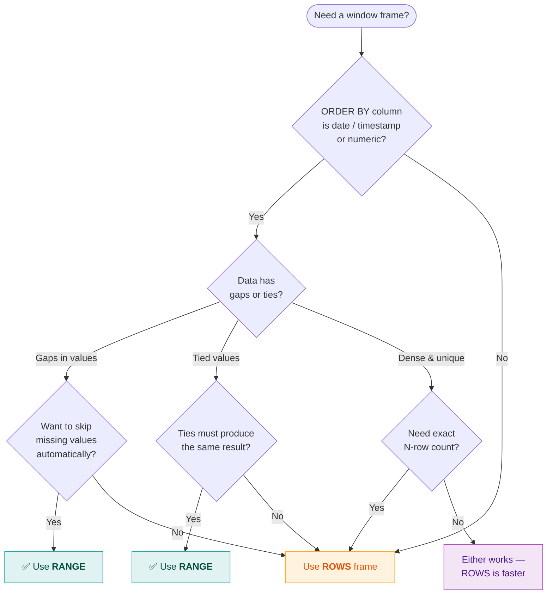
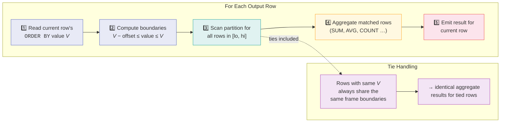

# :material-ruler: RANGE Frame

`RANGE` frames define the window using a **value-based offset** from the current row's
`ORDER BY` value, not a physical row count. All rows whose `ORDER BY` value falls within
the specified distance are included in the frame.

!!! abstract "Key Difference from ROWS"
    `ROWS` counts physical positions (row 1, row 2, …). `RANGE` measures
    **value distance** — so tied ORDER BY values are always grouped together.

---

## :material-pin: Syntax

```sql
RANGE BETWEEN range_start AND range_end
```

Where each boundary is:

```sql
UNBOUNDED PRECEDING                    -- start of partition
N PRECEDING                            -- numeric distance before
INTERVAL 'N' { DAY | HOUR | ... } PRECEDING  -- time distance before
CURRENT ROW                            -- current value (ties included)
N FOLLOWING                            -- numeric distance after
INTERVAL 'N' { DAY | HOUR | ... } FOLLOWING   -- time distance after
UNBOUNDED FOLLOWING                    -- end of partition
```

---

## :material-magnify: Behavior

| Rule | Detail |
|------|--------|
| **Tied values** | All rows sharing the same `ORDER BY` value are always in the same frame — never split |
| **Supported types** | `ORDER BY` column must be numeric, `DATE`, or `TIMESTAMP` for offset boundaries |
| **INTERVAL for dates** | Use `INTERVAL 'N' DAY` (or `HOUR`, `MONTH`, etc.) for date/timestamp columns |
| **Single ORDER BY only** | Offset-based `RANGE` requires exactly one `ORDER BY` column |
| **UNBOUNDED works on any type** | `RANGE BETWEEN UNBOUNDED PRECEDING AND CURRENT ROW` works with strings too |

---

## :material-sitemap: When to Use RANGE — Decision Flowchart



---

## :material-cog-sync: How Spark Evaluates a RANGE Frame



---

## :material-flask-outline: Examples

### Dataset

```sql
CREATE OR REPLACE TEMP VIEW daily_sales AS
SELECT * FROM VALUES
  (CAST('2024-01-01' AS DATE), 'North', 'Alice', 100),
  (CAST('2024-01-02' AS DATE), 'North', 'Bob',   175),
  (CAST('2024-01-03' AS DATE), 'South', 'Carol', 200),
  (CAST('2024-01-04' AS DATE), 'South', 'Dave',  120),
  (CAST('2024-01-05' AS DATE), 'North', 'Alice', 150),
  (CAST('2024-01-05' AS DATE), 'South', 'Carol', 300),
  (CAST('2024-01-07' AS DATE), 'North', 'Bob',   400),
  (CAST('2024-01-10' AS DATE), 'South', 'Dave',  250),
  (CAST('2024-01-12' AS DATE), 'North', 'Alice', 180),
  (CAST('2024-01-14' AS DATE), 'South', 'Carol', 350)
AS daily_sales(sale_date, region, rep, amount);
```

### Example 1 — 7-Day Rolling Total

Include all sales from the current date back to 6 days prior:

```sql
SELECT
    sale_date,
    region,
    rep,
    amount,
    SUM(amount) OVER (
        ORDER BY sale_date
        RANGE BETWEEN INTERVAL '6' DAY PRECEDING AND CURRENT ROW
    ) AS rolling_7d
FROM daily_sales
ORDER BY sale_date;
```

??? success "Expected Output"

    | sale_date  | region | rep   | amount | rolling_7d | Window covers |
    |------------|--------|-------|-------:|-----------:|---------------|
    | 2024-01-01 | North  | Alice |    100 |        100 | Jan 01 only |
    | 2024-01-02 | North  | Bob   |    175 |        275 | Jan 01–02 |
    | 2024-01-03 | South  | Carol |    200 |        475 | Jan 01–03 |
    | 2024-01-04 | South  | Dave  |    120 |        595 | Jan 01–04 |
    | 2024-01-05 | North  | Alice |    150 |       1045 | Jan 01–05 (all 6 rows) |
    | 2024-01-05 | South  | Carol |    300 |       1045 | Jan 01–05 (tied — same frame) |
    | 2024-01-07 | North  | Bob   |    400 |       1445 | Jan 01–07 (Jan 01 = 6 days back, included) |
    | 2024-01-10 | South  | Dave  |    250 |       1220 | Jan 04–10 (Jan 03 = 7 days back, excluded) |
    | 2024-01-12 | North  | Alice |    180 |        830 | Jan 07–12 (Jan 05 = 7 days back, excluded) |
    | 2024-01-14 | South  | Carol |    350 |        780 | Jan 10–14 (Jan 07 = 7 days back, excluded) |

    **Step-by-step for Jan 10 (rolling_7d = 1220):**

    1. Current row value: `2024-01-10`
    2. Lower bound: `2024-01-10 - 6 days = 2024-01-04`
    3. Include all rows where `sale_date >= '2024-01-04' AND sale_date <= '2024-01-10'`
    4. Matching: Jan 04 (120) + Jan 05 (150) + Jan 05 (300) + Jan 07 (400) + Jan 10 (250)
    5. SUM = **1220**

    Note: Jan 01, 02, 03 are more than 6 days before Jan 10, so they're excluded.

!!! tip "Why INTERVAL '6' DAY for a 7-day window?"
    The current row is day 0. Going back 6 days covers 7 calendar days total
    (today + 6 preceding). This is equivalent to `WHERE sale_date >= current_date - 6`.

### Example 2 — 3-Day Rolling Average (Partitioned by Region)

```sql
SELECT
    sale_date,
    region,
    rep,
    amount,
    ROUND(AVG(amount) OVER (
        PARTITION BY region
        ORDER BY sale_date
        RANGE BETWEEN INTERVAL '2' DAY PRECEDING AND CURRENT ROW
    ), 0) AS avg_3d,
    COUNT(*) OVER (
        PARTITION BY region
        ORDER BY sale_date
        RANGE BETWEEN INTERVAL '2' DAY PRECEDING AND CURRENT ROW
    ) AS rows_in_frame
FROM daily_sales
ORDER BY region, sale_date;
```

??? success "Expected Output — 3-Day Rolling Average"

    **North region:**

    | sale_date  | region | rep   | amount | avg_3d | rows_in_frame | Frame dates |
    |------------|--------|-------|-------:|:------:|:-------------:|-------------|
    | 2024-01-01 | North  | Alice |    100 | 100 | 1 | Jan 01 only |
    | 2024-01-02 | North  | Bob   |    175 | 138 | 2 | Jan 01–02 |
    | 2024-01-05 | North  | Alice |    150 | 150 | 1 | Jan 05 only (Jan 02 is 3 days away) |
    | 2024-01-07 | North  | Bob   |    400 | 275 | 2 | Jan 05–07 |
    | 2024-01-12 | North  | Alice |    180 | 180 | 1 | Jan 12 only (Jan 07 is 5 days away) |

    **South region:**

    | sale_date  | region | rep   | amount | avg_3d | rows_in_frame | Frame dates |
    |------------|--------|-------|-------:|:------:|:-------------:|-------------|
    | 2024-01-03 | South  | Carol |    200 | 200 | 1 | Jan 03 only |
    | 2024-01-04 | South  | Dave  |    120 | 160 | 2 | Jan 03–04 |
    | 2024-01-05 | South  | Carol |    300 | 207 | 3 | Jan 03–05 |
    | 2024-01-10 | South  | Dave  |    250 | 250 | 1 | Jan 10 only |
    | 2024-01-14 | South  | Carol |    350 | 350 | 1 | Jan 14 only |

!!! note "Sparse dates"
    Unlike `ROWS BETWEEN 2 PRECEDING`, `RANGE` doesn't guarantee 3 rows in the
    frame — only rows within the date distance. With sparse data, the frame may
    contain just 1 row. The `rows_in_frame` column makes this visible.

### Example 3 — Numeric Range: Peers Within ±100 Tolerance

```sql
CREATE OR REPLACE TEMP VIEW scores AS
SELECT * FROM VALUES
  ('Alice', 100), ('Bob', 150), ('Carol', 200),
  ('Dave',  280), ('Eve', 320), ('Frank', 500)
AS scores(name, score);

SELECT
    name,
    score,
    COUNT(*) OVER w AS peer_count,
    ROUND(AVG(score) OVER w, 0) AS peer_avg,
    MIN(score) OVER w AS peer_min,
    MAX(score) OVER w AS peer_max,
    COLLECT_LIST(name) OVER w AS peer_names
FROM scores
WINDOW w AS (
    ORDER BY score
    RANGE BETWEEN 100 PRECEDING AND 100 FOLLOWING
)
ORDER BY score;
```

??? success "Expected Output — Peer Tolerance Band"

    | name  | score | peer_count | peer_avg | peer_min | peer_max | peer_names |
    |-------|------:|:----------:|:--------:|:--------:|:--------:|------------|
    | Alice |   100 | 3 | 150 | 100 | 200 | [Alice, Bob, Carol] |
    | Bob   |   150 | 4 | 183 | 100 | 280 | [Alice, Bob, Carol, Dave] |
    | Carol |   200 | 4 | 208 | 100 | 280 | [Alice, Bob, Carol, Dave] |
    | Dave  |   280 | 3 | 267 | 200 | 320 | [Carol, Dave, Eve] |
    | Eve   |   320 | 2 | 300 | 280 | 320 | [Dave, Eve] |
    | Frank |   500 | 1 | 500 | 500 | 500 | [Frank] |

    Notice how Frank (500) has no peers — nobody else is within ±100 of 500.

!!! tip "Symmetric ranges"
    Use both PRECEDING and FOLLOWING for "neighbourhood" queries. The named
    `WINDOW` clause avoids repeating the same frame across multiple functions.

### Example 4 — Tie Handling: RANGE vs ROWS

Demonstrates the critical difference when ORDER BY values repeat:

```sql
SELECT
    sale_date,
    rep,
    amount,
    SUM(amount) OVER (
        ORDER BY sale_date
        ROWS BETWEEN UNBOUNDED PRECEDING AND CURRENT ROW
    ) AS rows_sum,
    SUM(amount) OVER (
        ORDER BY sale_date
        RANGE BETWEEN UNBOUNDED PRECEDING AND CURRENT ROW
    ) AS range_sum
FROM daily_sales
WHERE sale_date <= CAST('2024-01-07' AS DATE)
ORDER BY sale_date, amount;
```

??? success "Expected Output — ROWS vs RANGE on Tied Dates"

    | sale_date  | rep   | amount | rows_sum | range_sum | Difference? |
    |------------|-------|-------:|:--------:|:---------:|:-----------:|
    | 2024-01-01 | Alice |    100 | 100 | 100 | — |
    | 2024-01-02 | Bob   |    175 | 275 | 275 | — |
    | 2024-01-03 | Carol |    200 | 475 | 475 | — |
    | 2024-01-04 | Dave  |    120 | 595 | 595 | — |
    | 2024-01-05 | Alice |    150 | 745 | **1045** | ← RANGE includes both Jan 05 |
    | 2024-01-05 | Carol |    300 | 1045 | **1045** | ← RANGE: same total as above |
    | 2024-01-07 | Bob   |    400 | 1445 | 1445 | — |

    **Key insight**: ROWS processes row 5 (amount=150) seeing only rows 1–5, then
    row 6 (amount=300) seeing rows 1–6. RANGE sees both Jan 05 rows as a group —
    both get the cumulative total including all values ≤ Jan 05.

!!! warning "Determinism"
    `ROWS` gives different cumulative sums for the two Jan 05 rows (745 vs 1045).
    `RANGE` gives the same sum for both. If your report requires tied dates to show
    identical running totals, use `RANGE`.

### Example 5 — Forward-Looking Range

Preview future sales within the next 3 days:

```sql
SELECT
    sale_date,
    rep,
    amount,
    SUM(amount) OVER (
        ORDER BY sale_date
        RANGE BETWEEN CURRENT ROW AND INTERVAL '3' DAY FOLLOWING
    ) AS next_3d_total,
    COUNT(*) OVER (
        ORDER BY sale_date
        RANGE BETWEEN CURRENT ROW AND INTERVAL '3' DAY FOLLOWING
    ) AS sales_next_3d,
    MAX(amount) OVER (
        ORDER BY sale_date
        RANGE BETWEEN CURRENT ROW AND INTERVAL '3' DAY FOLLOWING
    ) AS max_next_3d
FROM daily_sales
ORDER BY sale_date;
```

??? success "Expected Output"

    | sale_date  | rep   | amount | next_3d_total | sales_next_3d | max_next_3d | Window covers |
    |------------|-------|-------:|--------------:|--------------:|------------:|---------------|
    | 2024-01-01 | Alice |    100 |           595 |             4 |         200 | Jan 01–04 |
    | 2024-01-02 | Bob   |    175 |           945 |             5 |         300 | Jan 02–05 (incl. both Jan 05) |
    | 2024-01-03 | Carol |    200 |           770 |             4 |         300 | Jan 03–06 (both Jan 05 included) |
    | 2024-01-04 | Dave  |    120 |           970 |             4 |         400 | Jan 04–07 |
    | 2024-01-05 | Alice |    150 |           850 |             3 |         400 | Jan 05–08 (ties grouped) |
    | 2024-01-05 | Carol |    300 |           850 |             3 |         400 | Jan 05–08 (same frame) |
    | 2024-01-07 | Bob   |    400 |           650 |             2 |         400 | Jan 07–10 |
    | 2024-01-10 | Dave  |    250 |           430 |             2 |         250 | Jan 10–13 |
    | 2024-01-12 | Alice |    180 |           530 |             2 |         350 | Jan 12–15 |
    | 2024-01-14 | Carol |    350 |           350 |             1 |         350 | Jan 14–17 |

    **Step-by-step for Jan 04:**

    1. Frame: `[Jan 04, Jan 04 + 3 days]` = `[Jan 04, Jan 07]`
    2. Rows in range: Jan 04 (120), Jan 05 (150), Jan 05 (300), Jan 07 (400)
    3. SUM = 970, COUNT = 4, MAX = 400

### Example 6 — Month-over-Month with RANGE INTERVAL

Compare each day's running monthly total:

```sql
SELECT
    sale_date,
    rep,
    amount,
    SUM(amount) OVER (
        ORDER BY sale_date
        RANGE BETWEEN INTERVAL '30' DAY PRECEDING AND CURRENT ROW
    ) AS rolling_30d,
    SUM(amount) OVER (
        ORDER BY sale_date
        RANGE BETWEEN INTERVAL '6' DAY PRECEDING AND CURRENT ROW
    ) AS rolling_7d,
    ROUND(
        SUM(amount) OVER (
            ORDER BY sale_date
            RANGE BETWEEN INTERVAL '6' DAY PRECEDING AND CURRENT ROW
        ) * 100.0
        / NULLIF(SUM(amount) OVER (
            ORDER BY sale_date
            RANGE BETWEEN INTERVAL '30' DAY PRECEDING AND CURRENT ROW
        ), 0),
        1
    ) AS week_pct_of_month
FROM daily_sales
ORDER BY sale_date;
```

??? success "Expected Output"

    | sale_date  | rep   | amount | rolling_30d | rolling_7d | week_pct_of_month |
    |------------|-------|-------:|------------:|-----------:|------------------:|
    | 2024-01-01 | Alice |    100 |         100 |        100 |             100.0 |
    | 2024-01-02 | Bob   |    175 |         275 |        275 |             100.0 |
    | 2024-01-03 | Carol |    200 |         475 |        475 |             100.0 |
    | 2024-01-04 | Dave  |    120 |         595 |        595 |             100.0 |
    | 2024-01-05 | Alice |    150 |        1045 |       1045 |             100.0 |
    | 2024-01-05 | Carol |    300 |        1045 |       1045 |             100.0 |
    | 2024-01-07 | Bob   |    400 |        1445 |       1445 |             100.0 |
    | 2024-01-10 | Dave  |    250 |        1695 |       1220 |              72.0 |
    | 2024-01-12 | Alice |    180 |        1875 |        830 |              44.3 |
    | 2024-01-14 | Carol |    350 |        2225 |        780 |              35.1 |

    As data accumulates beyond 7 days, `week_pct_of_month` decreases — showing
    what fraction of the trailing month's revenue came from the last 7 days.

    **Jan 10 breakdown:**

    - `rolling_30d` (Jan 01–10): all 8 rows = 100+175+200+120+150+300+400+250 = 1695
    - `rolling_7d` (Jan 04–10): 120+150+300+400+250 = 1220
    - `week_pct_of_month`: 1220/1695 × 100 = 72.0%

### Example 7 — Invalid: String Column with RANGE Offset

```sql
-- ❌ ERROR: RANGE offset requires numeric or date/timestamp ORDER BY
SELECT
    name,
    score,
    SUM(score) OVER (
        ORDER BY name          -- string column
        RANGE BETWEEN 1 PRECEDING AND CURRENT ROW
    ) AS bad_range
FROM scores;
```

??? failure "Error Output"

    ```
    SparkException: RANGE frame with value offset requires the ORDER BY
    expression to be of a numeric or date/timestamp type.
    ```

    **Fix:** Use `ROWS` instead, or change `ORDER BY` to a numeric/date column:

    ```sql
    -- ✅ Option 1: use ROWS
    SUM(score) OVER (ORDER BY name ROWS BETWEEN 1 PRECEDING AND CURRENT ROW)

    -- ✅ Option 2: ORDER BY the numeric column
    SUM(score) OVER (ORDER BY score RANGE BETWEEN 1 PRECEDING AND CURRENT ROW)
    ```

---

## :material-compare: RANGE Frame Patterns

| Pattern | Frame | Use Case |
|---------|-------|----------|
| 7-day rolling | `RANGE BETWEEN INTERVAL '6' DAY PRECEDING AND CURRENT ROW` | Weekly metrics |
| 30-day rolling | `RANGE BETWEEN INTERVAL '29' DAY PRECEDING AND CURRENT ROW` | Monthly metrics |
| Calendar month | `RANGE BETWEEN INTERVAL '1' MONTH PRECEDING AND CURRENT ROW` | Month-to-date |
| ±100 tolerance band | `RANGE BETWEEN 100 PRECEDING AND 100 FOLLOWING` | Peer comparison |
| Running total (tie-safe) | `RANGE BETWEEN UNBOUNDED PRECEDING AND CURRENT ROW` | Deterministic cumulative |
| Full partition | `RANGE BETWEEN UNBOUNDED PRECEDING AND UNBOUNDED FOLLOWING` | Group total on every row |
| Future-only window | `RANGE BETWEEN CURRENT ROW AND INTERVAL '3' DAY FOLLOWING` | Forecast / look-ahead |

---

## :material-flask-outline: Real-World Scenarios

### Scenario 1 — SLA Compliance: Incidents Per Rolling 24 Hours

```sql
CREATE OR REPLACE TEMP VIEW incidents AS
SELECT * FROM VALUES
  (CAST('2024-01-01 08:00:00' AS TIMESTAMP), 'P1', 'Database timeout'),
  (CAST('2024-01-01 14:30:00' AS TIMESTAMP), 'P2', 'Slow API'),
  (CAST('2024-01-01 22:00:00' AS TIMESTAMP), 'P1', 'Connection pool'),
  (CAST('2024-01-02 06:00:00' AS TIMESTAMP), 'P3', 'Disk warning'),
  (CAST('2024-01-02 10:00:00' AS TIMESTAMP), 'P1', 'Memory leak'),
  (CAST('2024-01-02 23:00:00' AS TIMESTAMP), 'P2', 'Timeout spike'),
  (CAST('2024-01-03 12:00:00' AS TIMESTAMP), 'P1', 'Deadlock')
AS incidents(incident_ts, severity, description);

SELECT
    incident_ts,
    severity,
    description,
    COUNT(*) OVER (
        ORDER BY incident_ts
        RANGE BETWEEN INTERVAL '24' HOUR PRECEDING AND CURRENT ROW
    ) AS incidents_24h,
    COUNT(*) OVER (
        ORDER BY incident_ts
        RANGE BETWEEN INTERVAL '24' HOUR PRECEDING AND CURRENT ROW
    ) > 3 AS sla_breach
FROM incidents
ORDER BY incident_ts;
```

??? success "Expected Output"

    | incident_ts         | severity | description     | incidents_24h | sla_breach |
    |---------------------|----------|-----------------|:-------------:|:----------:|
    | 2024-01-01 08:00:00 | P1       | Database timeout |            1 | false      |
    | 2024-01-01 14:30:00 | P2       | Slow API         |            2 | false      |
    | 2024-01-01 22:00:00 | P1       | Connection pool  |            3 | false      |
    | 2024-01-02 06:00:00 | P3       | Disk warning     |            3 | false      |
    | 2024-01-02 10:00:00 | P1       | Memory leak      |            4 | true       |
    | 2024-01-02 23:00:00 | P2       | Timeout spike    |            4 | true       |
    | 2024-01-03 12:00:00 | P1       | Deadlock         |            2 | false      |

    The 24-hour RANGE window naturally handles timestamps — no need to truncate
    to dates. At `2024-01-02 10:00:00`, it looks back to `2024-01-01 10:00:00`
    and counts 4 incidents (all of Jan 01 afternoon + Jan 02 morning).

### Scenario 2 — Price Volatility: Range Within ±10% of Current Value

```sql
CREATE OR REPLACE TEMP VIEW stock_trades AS
SELECT * FROM VALUES
  ('2024-01-01', 100), ('2024-01-02', 105), ('2024-01-03', 98),
  ('2024-01-04', 110), ('2024-01-05', 102), ('2024-01-06', 115),
  ('2024-01-07', 108), ('2024-01-08', 120), ('2024-01-09', 130)
AS stock_trades(trade_date, price);

SELECT
    trade_date,
    price,
    COUNT(*) OVER (
        ORDER BY price
        RANGE BETWEEN 10 PRECEDING AND 10 FOLLOWING
    ) AS similar_count,
    ROUND(AVG(price) OVER (
        ORDER BY price
        RANGE BETWEEN 10 PRECEDING AND 10 FOLLOWING
    ), 1) AS nearby_avg
FROM stock_trades
ORDER BY price;
```

??? success "Expected Output"

    | trade_date | price | similar_count | nearby_avg |
    |------------|------:|--------------:|-----------:|
    | 2024-01-03 |    98 |             3 |      101.7 |
    | 2024-01-01 |   100 |             4 |      101.3 |
    | 2024-01-05 |   102 |             4 |      103.8 |
    | 2024-01-02 |   105 |             4 |      103.8 |
    | 2024-01-07 |   108 |             3 |      107.7 |
    | 2024-01-04 |   110 |             4 |      113.3 |
    | 2024-01-06 |   115 |             3 |      115.0 |
    | 2024-01-08 |   120 |             3 |      121.7 |
    | 2024-01-09 |   130 |             2 |      125.0 |

    Each row sees its "neighbourhood" — all prices within ±10. Useful for identifying
    clustering and outliers in numeric distributions.

---

## :material-brain: When to Use

| Scenario | Recommended Pattern |
|----------|---------------------|
| Rolling N-day revenue window | `RANGE BETWEEN INTERVAL 'N' DAY PRECEDING AND CURRENT ROW` |
| All rows within a numeric tolerance band | `RANGE BETWEEN N PRECEDING AND N FOLLOWING` |
| Running total where tied dates show the same cumulative | `RANGE BETWEEN UNBOUNDED PRECEDING AND CURRENT ROW` |
| Sparse time-series (gaps in dates) | `RANGE` — automatically excludes missing dates |
| Dense, uniform data needing exactly N rows | Use `ROWS` instead — guarantees row count |
| Multi-column ORDER BY | Use `ROWS` instead — RANGE doesn't support it |

---

## :material-chart-scatter-plot: Interactive Visualization

Drag the slider to change the **INTERVAL** days and click any dot to set the **CURRENT ROW**.
The shaded region shows which values fall inside the `RANGE` frame.

<div id="viz-range-timeline" class="ts-viz" style="min-height:280px"></div>

!!! tip "What to notice"
    - **Tied dates** (Jan 05) are always grouped together — you can't split them with RANGE.
    - **Date gaps** (e.g., Jan 03 → Jan 05) mean fewer rows in the frame despite the gap being small.
    - Increase the INTERVAL to see how the frame expands to capture more distant values.

---

## :material-speedometer: Performance Notes

| Tip | Reason |
|-----|--------|
| `RANGE` is slightly slower than `ROWS` | Requires value comparison instead of position lookup |
| Avoid large INTERVAL on big partitions | Wide frames = more rows aggregated per output row |
| Use `PARTITION BY` to reduce partition size | Smaller partitions = faster frame evaluation |
| Prefer `ROWS` for fixed-count windows | If data is dense (no gaps), ROWS and RANGE produce the same result, but ROWS is faster |

---

## :material-link: See Also

- [ROWS frame](rows.md) — physical row offset examples and edge cases
- [Frame overview](index.md) — syntax, defaults, and ROWS vs RANGE comparison
- [Aggregate functions](../functions/aggregate.md) — SUM, AVG, MIN, MAX with frames
- [Application patterns](../application/index.md) — running totals, moving averages, forward-fill
