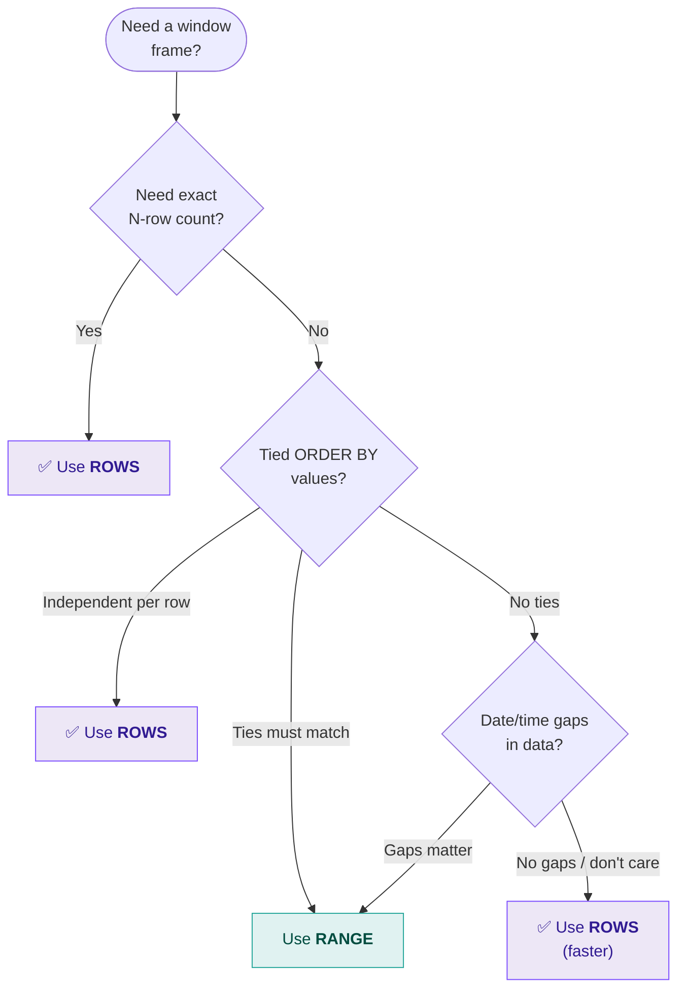
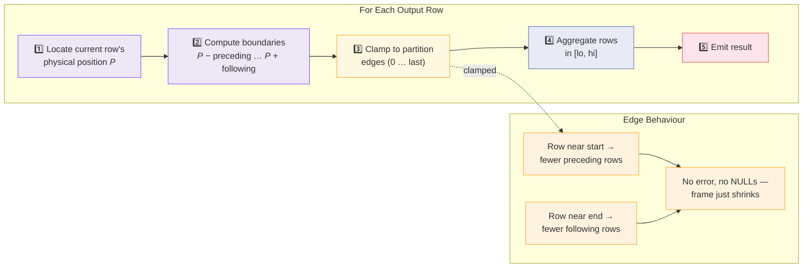

# :material-table-row: ROWS Frame

`ROWS` frames define the window using a **physical row offset** from the current row.
Each row is treated independently regardless of its `ORDER BY` value.

!!! abstract "Key Difference from RANGE"
    `RANGE` measures **value distance** and groups tied values. `ROWS` counts
    **physical positions** — row 1, row 2, row 3 — so even tied ORDER BY values
    get different running results.

---

## :material-pin: Syntax

```sql
ROWS BETWEEN frame_start AND frame_end
```

Where each boundary is:

```sql
UNBOUNDED PRECEDING      -- first row of partition
N PRECEDING              -- N rows before current
CURRENT ROW              -- the current row itself
N FOLLOWING              -- N rows after current
UNBOUNDED FOLLOWING      -- last row of partition
```

---

## :material-magnify: Behavior

| Rule | Detail |
|------|--------|
| **Physical offset** | Frame boundary is a fixed row count above / below the current row — not a value distance |
| **Edge contraction** | Near partition edges the frame silently shrinks to available rows (no error, no NULL padding) |
| **Tie handling** | Tied ORDER BY values are treated independently — running totals will differ per row |
| **Determinism** | Add a unique tiebreaker column (e.g., `id`) to `ORDER BY` when deterministic results matter |
| **Any ORDER BY type** | Works with any sortable type — no restriction to numeric / date |

---

## :material-sitemap: When to Choose ROWS — Decision Flowchart



---

## :material-cog-sync: How Spark Evaluates a ROWS Frame



---

## :material-flask-outline: Examples

### Dataset

```sql
CREATE OR REPLACE TEMP VIEW daily_sales AS
SELECT * FROM VALUES
  ('East', '2024-01-01', 100),
  ('East', '2024-01-02', 200),
  ('East', '2024-01-03', 150),
  ('East', '2024-01-04', 300),
  ('East', '2024-01-05', 250),
  ('West', '2024-01-01', 175),
  ('West', '2024-01-02', 225),
  ('West', '2024-01-03', 350)
AS daily_sales(region, sale_date, amount);
```

### Example 1 — Running Total

```sql
SELECT
    region,
    sale_date,
    amount,
    SUM(amount) OVER (
        PARTITION BY region
        ORDER BY sale_date
        ROWS BETWEEN UNBOUNDED PRECEDING AND CURRENT ROW
    ) AS running_total
FROM daily_sales
ORDER BY region, sale_date;
```

??? example "Output"

    === "East"

        | region | sale_date  | amount | running_total |
        |--------|------------|--------|---------------|
        | East   | 2024-01-01 |    100 |           100 |
        | East   | 2024-01-02 |    200 |           300 |
        | East   | 2024-01-03 |    150 |           450 |
        | East   | 2024-01-04 |    300 |           750 |
        | East   | 2024-01-05 |    250 |          1000 |

    === "West"

        | region | sale_date  | amount | running_total |
        |--------|------------|--------|---------------|
        | West   | 2024-01-01 |    175 |           175 |
        | West   | 2024-01-02 |    225 |           400 |
        | West   | 2024-01-03 |    350 |           750 |

!!! tip "Classic running total"
    `UNBOUNDED PRECEDING` to `CURRENT ROW` is the most common window frame and is
    actually the **default** for `ORDER BY` with no explicit frame clause.

### Example 2 — 3-Row Centred Moving Average

```sql
SELECT
    region,
    sale_date,
    amount,
    ROUND(AVG(amount) OVER (
        PARTITION BY region
        ORDER BY sale_date
        ROWS BETWEEN 1 PRECEDING AND 1 FOLLOWING
    ), 2) AS moving_avg_3,
    COUNT(*) OVER (
        PARTITION BY region
        ORDER BY sale_date
        ROWS BETWEEN 1 PRECEDING AND 1 FOLLOWING
    ) AS rows_in_frame
FROM daily_sales
ORDER BY region, sale_date;
```

??? example "Output — notice frame shrinks at edges"

    === "East"

        | region | sale_date  | amount | moving_avg_3 | rows_in_frame |
        |--------|------------|--------|--------------|---------------|
        | East   | 2024-01-01 |    100 |       150.00 |             2 |
        | East   | 2024-01-02 |    200 |       150.00 |             3 |
        | East   | 2024-01-03 |    150 |       216.67 |             3 |
        | East   | 2024-01-04 |    300 |       233.33 |             3 |
        | East   | 2024-01-05 |    250 |       275.00 |             2 |

    === "West"

        | region | sale_date  | amount | moving_avg_3 | rows_in_frame |
        |--------|------------|--------|--------------|---------------|
        | West   | 2024-01-01 |    175 |       200.00 |             2 |
        | West   | 2024-01-02 |    225 |       250.00 |             3 |
        | West   | 2024-01-03 |    350 |       287.50 |             2 |

!!! warning "Edge rows get fewer data points"
    The first row of East has only 2 rows in its frame (no preceding row exists).
    The average is `(100+200)/2 = 150`, not `(0+100+200)/3`. The frame **shrinks** — it
    does **not** pad with zeroes or NULLs.

### Example 3 — Trailing 2-Row Window

```sql
SELECT
    sale_date,
    amount,
    SUM(amount) OVER (
        ORDER BY sale_date
        ROWS BETWEEN 2 PRECEDING AND CURRENT ROW
    ) AS trailing_3_sum
FROM daily_sales
WHERE region = 'East'
ORDER BY sale_date;
```

??? example "Output"

    | sale_date  | amount | trailing_3_sum |
    |------------|--------|----------------|
    | 2024-01-01 |    100 |            100 |
    | 2024-01-02 |    200 |            300 |
    | 2024-01-03 |    150 |            450 |
    | 2024-01-04 |    300 |            650 |
    | 2024-01-05 |    250 |            700 |

### Example 4 — Future Lookahead

```sql
SELECT
    sale_date,
    amount,
    SUM(amount) OVER (
        ORDER BY sale_date
        ROWS BETWEEN CURRENT ROW AND 2 FOLLOWING
    ) AS next_3_sum
FROM daily_sales
WHERE region = 'East'
ORDER BY sale_date;
```

??? example "Output"

    | sale_date  | amount | next_3_sum |
    |------------|--------|------------|
    | 2024-01-01 |    100 |        450 |
    | 2024-01-02 |    200 |        650 |
    | 2024-01-03 |    150 |        700 |
    | 2024-01-04 |    300 |        550 |
    | 2024-01-05 |    250 |        250 |

!!! note "Frame shrinks at the end"
    Row 5 (Jan 05) has no following rows, so the frame contains only the current row.

### Example 5 — Full Partition (Percentage of Total)

```sql
SELECT
    sale_date,
    amount,
    SUM(amount) OVER (
        ORDER BY sale_date
        ROWS BETWEEN UNBOUNDED PRECEDING AND UNBOUNDED FOLLOWING
    ) AS grand_total,
    ROUND(100.0 * amount / SUM(amount) OVER (
        ORDER BY sale_date
        ROWS BETWEEN UNBOUNDED PRECEDING AND UNBOUNDED FOLLOWING
    ), 1) AS pct_of_total
FROM daily_sales
WHERE region = 'East'
ORDER BY sale_date;
```

??? example "Output"

    | sale_date  | amount | grand_total | pct_of_total |
    |------------|--------|-------------|--------------|
    | 2024-01-01 |    100 |        1000 |         10.0 |
    | 2024-01-02 |    200 |        1000 |         20.0 |
    | 2024-01-03 |    150 |        1000 |         15.0 |
    | 2024-01-04 |    300 |        1000 |         30.0 |
    | 2024-01-05 |    250 |        1000 |         25.0 |

!!! tip "Percentage of total pattern"
    `UNBOUNDED PRECEDING` to `UNBOUNDED FOLLOWING` spans the entire partition,
    giving the same grand total on every row — perfect for `amount / grand_total`.

### Example 6 — FIRST_VALUE / LAST_VALUE with ROWS

```sql
SELECT
    sale_date,
    amount,
    FIRST_VALUE(amount) OVER (
        ORDER BY sale_date
        ROWS BETWEEN UNBOUNDED PRECEDING AND UNBOUNDED FOLLOWING
    ) AS first_amt,
    LAST_VALUE(amount) OVER (
        ORDER BY sale_date
        ROWS BETWEEN UNBOUNDED PRECEDING AND UNBOUNDED FOLLOWING  -- (1)!
    ) AS last_amt
FROM daily_sales
WHERE region = 'East'
ORDER BY sale_date;
```

1. Without explicit `UNBOUNDED FOLLOWING`, the default frame ends at `CURRENT ROW` — so `LAST_VALUE` would just return the current row's amount!

??? example "Output"

    | sale_date  | amount | first_amt | last_amt |
    |------------|--------|-----------|----------|
    | 2024-01-01 |    100 |       100 |      250 |
    | 2024-01-02 |    200 |       100 |      250 |
    | 2024-01-03 |    150 |       100 |      250 |
    | 2024-01-04 |    300 |       100 |      250 |
    | 2024-01-05 |    250 |       100 |      250 |

??? failure "Common mistake — LAST_VALUE without explicit frame"

    ```sql
    -- ❌ Bug: default frame is UNBOUNDED PRECEDING to CURRENT ROW
    LAST_VALUE(amount) OVER (ORDER BY sale_date) AS wrong_last
    ```

    | sale_date  | amount | wrong_last |
    |------------|--------|------------|
    | 2024-01-01 |    100 |        100 |
    | 2024-01-02 |    200 |        200 |
    | 2024-01-03 |    150 |        150 |

    Each row returns **itself** as the "last" value — not what you want!

---

## :material-chart-bar: Interactive Visualization

Click any bar to set **CURRENT ROW**. Use the sliders to adjust
**preceding** and **following** offsets and watch the frame expand / contract.

<div id="viz-rows-bars" class="ts-viz" style="min-height:320px"></div>

!!! tip "What to notice"
    - **Edge contraction**: move the current row to the first or last bar — the frame
      shrinks because there are no rows beyond the partition boundary.
    - **Fixed count**: unlike RANGE, ROWS always selects exactly N rows (minus edge effects),
      regardless of gaps or ties in the data.

---

## :material-brain: When to Use

| Scenario | Frame |
|----------|-------|
| Cumulative total from first row to current | `ROWS BETWEEN UNBOUNDED PRECEDING AND CURRENT ROW` |
| Centred N-row smoothing window | `ROWS BETWEEN N PRECEDING AND N FOLLOWING` |
| Trailing N-row window (e.g., last 3 sales) | `ROWS BETWEEN N PRECEDING AND CURRENT ROW` |
| Look ahead N rows | `ROWS BETWEEN CURRENT ROW AND N FOLLOWING` |
| Static partition total on every row | `ROWS BETWEEN UNBOUNDED PRECEDING AND UNBOUNDED FOLLOWING` |

---

## :material-speedometer: Performance Notes

| Tip | Reason |
|-----|--------|
| `ROWS` is faster than `RANGE` | Position-based lookup avoids value comparisons |
| Keep frame width small | Smaller frames = fewer rows aggregated per output row |
| Use `PARTITION BY` to reduce partition size | Smaller partitions = less memory and faster evaluation |
| Avoid `UNBOUNDED FOLLOWING` when possible | Forces Spark to buffer the entire partition before emitting any row |
| Add tiebreaker to `ORDER BY` | Ensures deterministic results and enables Spark to optimize sliding frames |

---

## :material-link: See Also

- [RANGE frame](range.md) — value-based offset examples and tied-value handling
- [Frame overview](index.md) — syntax, defaults, and ROWS vs RANGE comparison
- [Aggregate functions](../window/aggregate.md) — SUM, AVG, MIN, MAX with frames
- [Application patterns](../application.md) — running totals, moving averages, forward-fill
