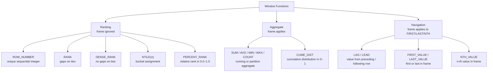
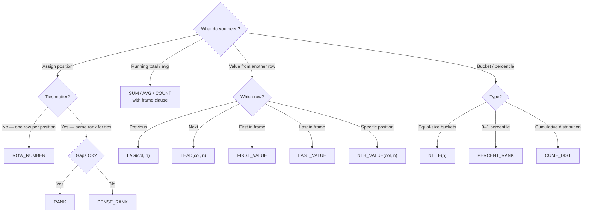

# :material-view-list: Window Function Types

Window functions fall into three categories: **Ranking**, **Aggregate**, and **Navigation**.
Each has distinct behaviour around `ORDER BY` requirements, frame support, and NULL handling.

!!! info "Spark 4.0"

    All window functions work with **pipe syntax** (`|>`). QUALIFY filtering on window
    results is available since Spark 3.3+ and works seamlessly in Spark 4.0.

______________________________________________________________________

## :material-sitemap: Category Map



______________________________________________________________________

## :material-table: Full Function Reference

| Category   | Function                           | Requires ORDER BY | Respects Frame |        Supports IGNORE NULLS        |
| ---------- | ---------------------------------- | :---------------: | :------------: | :---------------------------------: |
| Ranking    | `ROW_NUMBER()`                     |        Yes        |       No       |                 No                  |
| Ranking    | `RANK()`                           |        Yes        |       No       |                 No                  |
| Ranking    | `DENSE_RANK()`                     |        Yes        |       No       |                 No                  |
| Ranking    | `NTILE(n)`                         |        Yes        |       No       |                 No                  |
| Ranking    | `PERCENT_RANK()`                   |        Yes        |       No       |                 No                  |
| Aggregate  | `SUM(expr)`                        |     Optional      |      Yes       | No — NULLs excluded from arithmetic |
| Aggregate  | `AVG(expr)`                        |     Optional      |      Yes       |                 No                  |
| Aggregate  | `MIN(expr)`                        |     Optional      |      Yes       |                 No                  |
| Aggregate  | `MAX(expr)`                        |     Optional      |      Yes       |                 No                  |
| Aggregate  | `COUNT(expr)`                      |     Optional      |      Yes       |                 No                  |
| Aggregate  | `CUME_DIST()`                      |        Yes        |       No       |                 No                  |
| Navigation | `LAG(col [,n [,default]])`         |        Yes        |       No       |                 Yes                 |
| Navigation | `LEAD(col [,n [,default]])`        |        Yes        |       No       |                 Yes                 |
| Navigation | `FIRST_VALUE(col [IGNORE NULLS])`  |        Yes        |      Yes       |                 Yes                 |
| Navigation | `LAST_VALUE(col [IGNORE NULLS])`   |        Yes        |      Yes       |                 Yes                 |
| Navigation | `NTH_VALUE(col, n [IGNORE NULLS])` |        Yes        |      Yes       |                 Yes                 |

______________________________________________________________________

## :material-compare: Category Differences

| Property                         |      Ranking      | Aggregate |                Navigation                |
| -------------------------------- | :---------------: | :-------: | :--------------------------------------: |
| Requires `ORDER BY`              |      Always       | Optional  | Always (LAG/LEAD); optional (FIRST/LAST) |
| Respects frame clause            |       Never       |    Yes    |           FIRST/LAST/NTH only            |
| Returns a value from another row |        No         |    No     |                Yes (all)                 |
| Can produce ties                 | RANK / DENSE_RANK |    N/A    |                   N/A                    |
| Default: `NULL` at boundary      |        No         |    No     | Yes — use default argument for LAG/LEAD  |

______________________________________________________________________

## :material-alert: Common Pitfalls

| Pitfall                              | Explanation                                                                                      | Fix                                                            |
| ------------------------------------ | ------------------------------------------------------------------------------------------------ | -------------------------------------------------------------- |
| `LAST_VALUE` returns current row     | Default frame is `… AND CURRENT ROW`                                                             | Add `ROWS BETWEEN UNBOUNDED PRECEDING AND UNBOUNDED FOLLOWING` |
| `NTH_VALUE` returns NULL             | Same default frame issue                                                                         | Explicit full-partition frame                                  |
| `ROW_NUMBER` non-deterministic       | Tied rows have undefined order                                                                   | Make `ORDER BY` unique (add a tiebreaker column)               |
| `RANK` gaps confuse consumers        | After a tie at rank 1 and 1, next rank is 3                                                      | Use `DENSE_RANK` for gap-free ranking                          |
| `PERCENT_RANK` is 0.0 with 1 row     | Formula: `(rank-1)/(n-1)` — division by zero avoided, returns 0.0                                | Expected behaviour                                             |
| `COUNT(*)` vs `COUNT(col)`           | `COUNT(*)` includes NULLs, `COUNT(col)` excludes NULLs                                           | Use the right variant for your intent                          |
| Multiple OVER specs = multiple sorts | Each distinct `PARTITION BY`/`ORDER BY` pair triggers its own `Sort` + `Window` node (see below) | Align specs or use a named `WINDOW`                            |

______________________________________________________________________

## :material-alert-octagon-outline: Window-Function Explosion: Multiple Expensive Sorts

Every distinct `PARTITION BY` / `ORDER BY` combination across the `OVER` clauses in one
query gets its **own** `Sort` (and `Window` exec) in the physical plan — even when every
clause partitions by the same column. If the `ORDER BY` direction differs, Spark cannot
reuse the previous sort order and re-sorts the same data from scratch:

```sql
SELECT
    rep, sale_date, amount,
    RANK() OVER (PARTITION BY rep ORDER BY sale_date ASC)  AS rnk_asc,
    RANK() OVER (PARTITION BY rep ORDER BY sale_date DESC) AS rnk_desc
FROM sales;
```

```text
EXPLAIN shows:
+- Window [rank(...) AS rnk_desc], [rep], [sale_date DESC NULLS LAST]
   +- Sort [rep ASC, sale_date DESC], false, 0        ← 2nd sort
      +- Window [rank(...) AS rnk_asc], [rep], [sale_date ASC NULLS FIRST]
         +- Sort [rep ASC, sale_date ASC], false, 0   ← 1st sort
            +- Exchange hashpartitioning(rep, 200)     ← only ONE shuffle (partition col is shared)
```

Only **one** `Exchange` is needed (the partition column `rep` is the same on both), but
the two incompatible sort orders (`ASC` vs `DESC`) force **two full sorts** and two
separate `Window` exec passes over the data.

### The Fix: Consolidate Compatible Windows

Window specs are **compatible** — and get merged into a single `Sort` + `Window` node —
whenever `PARTITION BY` and `ORDER BY` match exactly, **even if the frame clause
differs** between functions:

```sql
SELECT
    rep, sale_date, amount,
    RANK() OVER w                                                              AS rnk,
    SUM(amount) OVER w                                                          AS running_total,
    AVG(amount) OVER (PARTITION BY rep ORDER BY sale_date
                       ROWS BETWEEN UNBOUNDED PRECEDING AND UNBOUNDED FOLLOWING) AS rep_avg
FROM sales
WINDOW w AS (PARTITION BY rep ORDER BY sale_date ROWS BETWEEN UNBOUNDED PRECEDING AND CURRENT ROW);
```

```text
EXPLAIN shows:
+- Window [rank(...) AS rnk, sum(...) AS running_total, avg(...) AS rep_avg],
          [rep], [sale_date ASC NULLS FIRST]
   +- Sort [rep ASC, sale_date ASC], false, 0        ← one sort for all three functions
      +- Exchange hashpartitioning(rep, 200)
```

All three functions — `RANK`, `SUM` (default running-total frame), and `AVG` (explicit
full-partition frame) — share the same `PARTITION BY rep ORDER BY sale_date`, so Spark's
Catalyst optimizer places them in a **single** `Window` node behind a **single** `Sort`,
even though one uses a named `WINDOW` and the others don't, and even though their frame
clauses differ.

!!! tip "What makes specs compatible"

    Only `PARTITION BY` and `ORDER BY` (including sort direction) need to match — the
    frame clause (`ROWS BETWEEN ...`) does **not** have to. If two `OVER` clauses
    partition/order identically, write them with a named `WINDOW` for readability; Spark
    will merge them into one sort/shuffle regardless, but the named form makes the shared
    spec explicit and prevents an accidental mismatch (e.g. one clause silently losing the
    tiebreaker column).

!!! warning "What still forces a separate sort"

    - A different `ORDER BY` column, or the same column with a different sort direction
        (`ASC` vs `DESC`).
    - A different `PARTITION BY` column set.

    When the business logic genuinely needs both directions (e.g. "rank ascending" and
    "rank descending" side by side), the second sort is unavoidable — but it's still
    worth checking whether the second ranking can be derived from the first instead
    (e.g. `total_count - rnk_asc + 1` avoids re-sorting for a simple reversed rank).

______________________________________________________________________

## :material-head-question: Which Function Should I Use?



______________________________________________________________________

## :material-flask-outline: Quick Examples

### Ranking

```sql
SELECT
    product,
    revenue,
    ROW_NUMBER() OVER (ORDER BY revenue DESC)  AS row_num,   -- 1, 2, 3, 4
    RANK()       OVER (ORDER BY revenue DESC)  AS rnk,       -- 1, 2, 2, 4 (gaps)
    DENSE_RANK() OVER (ORDER BY revenue DESC)  AS dense_rnk, -- 1, 2, 2, 3 (no gaps)
    NTILE(2)     OVER (ORDER BY revenue DESC)  AS bucket     -- 1, 1, 2, 2
FROM products;
```

### Aggregate

```sql
SELECT
    sale_date,
    amount,
    SUM(amount) OVER (ORDER BY sale_date ROWS UNBOUNDED PRECEDING)    AS running_total,
    AVG(amount) OVER (ORDER BY sale_date ROWS BETWEEN 2 PRECEDING AND CURRENT ROW) AS moving_avg_3,
    COUNT(*)    OVER ()                                                AS total_rows
FROM sales;
```

### Navigation

```sql
SELECT
    sale_date,
    amount,
    LAG(amount, 1, 0)    OVER (ORDER BY sale_date)  AS prev_amount,
    LEAD(amount, 1, 0)   OVER (ORDER BY sale_date)  AS next_amount,
    FIRST_VALUE(amount)  OVER (ORDER BY sale_date ROWS BETWEEN UNBOUNDED PRECEDING AND UNBOUNDED FOLLOWING) AS first_sale,
    LAST_VALUE(amount)   OVER (ORDER BY sale_date ROWS BETWEEN UNBOUNDED PRECEDING AND UNBOUNDED FOLLOWING) AS last_sale
FROM sales;
```

______________________________________________________________________

## :material-link: Detailed Pages

- [Ranking Functions](ranking.md) — `ROW_NUMBER`, `RANK`, `DENSE_RANK`, `NTILE`, `PERCENT_RANK`
- [Aggregate Functions](aggregate.md) — `SUM`, `AVG`, `MIN`, `MAX`, `COUNT`, `CUME_DIST`
- [Navigation Functions](navigation.md) — `LAG`, `LEAD`, `FIRST_VALUE`, `LAST_VALUE`, `NTH_VALUE`
