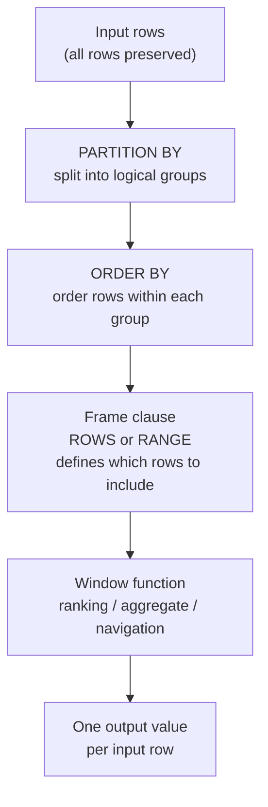

# :material-view-grid: Window Functions

Window functions compute a value for each row using a **sliding or bounded set of rows
— the *window* — without collapsing the result set** the way `GROUP BY` does.
Every input row is preserved in the output.

!!! tip "Window vs GROUP BY"
    `GROUP BY` produces **one row per group**. Window functions produce
    **one value per row** while still being able to reference other rows in the partition.

---

## :material-head-question: When to Use Window Functions

| Use Case | Example |
|----------|---------|
| Ranking / top-N per group | Top 3 products per category by revenue |
| Running totals & averages | Cumulative sales per region over time |
| Row-to-row comparison | Compare each sale to the previous one (`LAG`) |
| Percent of total | Each row's contribution to its group total |
| De-duplication | Keep only the latest record per entity |
| Gap detection | Find missing sequence numbers or time gaps |
| Moving averages | 7-day rolling average of daily metrics |

---

## :material-sitemap: How Window Functions Work



---

## :material-animation-play: Interactive Demo

### Row-by-Row Computation

Select a window function and click any row to see how it computes a result
using its partition and ordering context.

<div id="viz-window-concept" class="ts-viz"></div>

### PARTITION BY Visualizer

Each partition is processed independently — the animation highlights how the
window scans rows within each group.

<div id="viz-partition-demo" class="ts-viz"></div>

---

## :material-code-braces: Full Syntax

```sql
function_name([expression]) OVER (
    [PARTITION BY partition_col [, ...]]
    [ORDER BY    sort_col [ASC | DESC] [NULLS FIRST | NULLS LAST] [, ...]]
    [{ ROWS | RANGE } BETWEEN frame_start AND frame_end]
)
```

Frame boundary keywords:

```
UNBOUNDED PRECEDING   -- start of partition
N PRECEDING           -- N rows / N value-units before current row
CURRENT ROW           -- current row
N FOLLOWING           -- N rows / N value-units after current row
UNBOUNDED FOLLOWING   -- end of partition
```

---

## :material-table: Clause Reference

| Clause | Required | Default | Purpose |
|--------|----------|---------|---------|
| `PARTITION BY` | No | Entire result set = one partition | Resets the window per distinct combination of partition columns |
| `ORDER BY` | Depends | — | Defines row sequence within each partition; required for ranking and navigation |
| `ROWS / RANGE BETWEEN` | No | See below | Limits which rows in the partition are included in the aggregate |

**Default frame when `ORDER BY` is present:** `RANGE BETWEEN UNBOUNDED PRECEDING AND CURRENT ROW`  
**Default frame when `ORDER BY` is absent:** `ROWS BETWEEN UNBOUNDED PRECEDING AND UNBOUNDED FOLLOWING` (full partition)

---

## :material-compare: Function Categories

| Category | Functions | Requires ORDER BY | Respects Frame |
|----------|-----------|:-----------------:|:--------------:|
| Ranking | `ROW_NUMBER`, `RANK`, `DENSE_RANK`, `NTILE`, `PERCENT_RANK` | Yes | No — always full partition |
| Aggregate | `SUM`, `AVG`, `MIN`, `MAX`, `COUNT`, `CUME_DIST` | Optional | Yes |
| Navigation | `LAG`, `LEAD` | Yes | No |
| Navigation | `FIRST_VALUE`, `LAST_VALUE`, `NTH_VALUE` | Yes | Yes |

---

## :material-window-open: Named Windows (WINDOW Clause)

When multiple window functions share the same `OVER (...)` specification,
define the window once with a `WINDOW` clause and reference it by name.
This avoids repetition and ensures consistency.

```sql
SELECT
    region,
    rep,
    sale_date,
    amount,
    ROW_NUMBER()  OVER w       AS row_num,
    SUM(amount)   OVER w       AS running_total,
    AVG(amount)   OVER w       AS running_avg,
    LAG(amount)   OVER w       AS prev_amount
FROM sales
WINDOW w AS (
    PARTITION BY region
    ORDER BY sale_date
    ROWS BETWEEN UNBOUNDED PRECEDING AND CURRENT ROW
)
ORDER BY region, sale_date;
```

Named windows can also be inherited and extended:

```sql
SELECT
    region,
    rep,
    sale_date,
    amount,
    -- Base window: partitioned by region
    SUM(amount) OVER (w ORDER BY sale_date
                      ROWS BETWEEN UNBOUNDED PRECEDING AND CURRENT ROW) AS running,
    -- Full partition total (no ORDER BY)
    SUM(amount) OVER w AS region_total
FROM sales
WINDOW w AS (PARTITION BY region)
ORDER BY region, sale_date;
```

---

## :material-check-all: QUALIFY — Filter on Window Results

`QUALIFY` filters rows based on a window function result **without needing a subquery**.

```sql
-- Keep only the top sale per rep (equivalent to ROW_NUMBER subquery, but cleaner)
SELECT region, rep, sale_date, amount
FROM sales
QUALIFY ROW_NUMBER() OVER (PARTITION BY rep ORDER BY amount DESC) = 1;

-- Keep rows where the amount exceeds the partition average
SELECT region, rep, sale_date, amount
FROM sales
QUALIFY amount > AVG(amount) OVER (PARTITION BY region);

-- Keep the 3 most recent sales per region
SELECT region, rep, sale_date, amount
FROM sales
QUALIFY ROW_NUMBER() OVER (PARTITION BY region ORDER BY sale_date DESC) <= 3;
```

!!! note "QUALIFY vs subquery"
    `QUALIFY` is cleaner but requires Spark 3.3+ or Databricks Runtime. For older
    versions, wrap the window function in a subquery and filter with `WHERE`.

---

## :material-speedometer: Performance Notes

| Practice | Reason |
|----------|--------|
| Minimise distinct `OVER` clauses | Each unique `OVER` spec causes a separate shuffle stage |
| Use named `WINDOW` for shared specs | Avoids duplicate shuffles for identical windows |
| Prefer `ROWS` over `RANGE` | `ROWS` uses row position — faster; `RANGE` requires value comparison |
| Add `PARTITION BY` when possible | Smaller partitions = less data per task, better parallelism |
| Avoid window functions on raw large tables | Pre-filter / aggregate first, then apply window |
| Check EXPLAIN for `Exchange` nodes | Each shuffle = one window stage; too many = slow |

```sql
-- Check how many Exchange nodes a windowed query generates
EXPLAIN FORMATTED
SELECT
    region, rep, sale_date, amount,
    SUM(amount) OVER (PARTITION BY region ORDER BY sale_date
                      ROWS BETWEEN UNBOUNDED PRECEDING AND CURRENT ROW) AS running,
    ROW_NUMBER() OVER (PARTITION BY region ORDER BY amount DESC) AS rnk
FROM sales;
-- Two different OVER specs → two separate Exchange (shuffle) stages
```

---

## :material-flask-outline: Quick Example — All Three Categories

```sql
CREATE OR REPLACE TEMP VIEW sales AS
SELECT * FROM VALUES
  ('North', 'Alice', '2024-01-01', 100),
  ('North', 'Alice', '2024-01-05', 200),
  ('North', 'Alice', '2024-01-10', 300),
  ('North', 'Bob',   '2024-01-02', 150),
  ('North', 'Bob',   '2024-01-06', 300),
  ('South', 'Carol', '2024-01-03', 400),
  ('South', 'Carol', '2024-01-07', 500)
AS sales(region, rep, sale_date, amount);

SELECT
    region,
    rep,
    sale_date,
    amount,
    -- Ranking
    RANK()       OVER (PARTITION BY region ORDER BY amount DESC) AS rnk,
    -- Aggregate
    SUM(amount)  OVER (PARTITION BY region ORDER BY sale_date
                       ROWS BETWEEN UNBOUNDED PRECEDING AND CURRENT ROW) AS running_total,
    ROUND(amount * 100.0 /
          SUM(amount) OVER (PARTITION BY region), 1)             AS pct_of_region,
    -- Navigation
    LAG(amount)  OVER (PARTITION BY rep ORDER BY sale_date)       AS prev_amount
FROM sales
ORDER BY region, sale_date;
```

---

## :material-book-open-variant: In This Section

| Page | Contents |
|------|----------|
| [Window Types](window/index.md) | Ranking, aggregate, navigation — full function reference |
| [Frame](frame/index.md) | ROWS vs RANGE, boundary syntax, default frames |
| [Application](application/index.md) | De-duplication, top-N, running balance, sessionisation, percentile |
| [NULL Options](nulls/null_options_wf.md) | `IGNORE NULLS`, `RESPECT NULLS`, `NULLS FIRST / LAST` |

---

## :material-compare-horizontal: Window Functions vs Alternatives

| Approach | Preserves Rows | Cross-row Access | Performance |
|----------|:--------------:|:----------------:|-------------|
| `GROUP BY` | :material-close: | :material-close: | Fast — single pass |
| Correlated subquery | :material-check: | :material-check: | Slow — row-by-row |
| Self-join | :material-check: | :material-check: | Expensive shuffle |
| **Window function** | :material-check: | :material-check: | Efficient — single shuffle per unique `OVER` spec |

---

## :material-lightbulb-outline: Common Patterns Cheat Sheet

```sql
-- De-duplicate: keep latest per key
SELECT * FROM (
    SELECT *, ROW_NUMBER() OVER (PARTITION BY user_id ORDER BY updated_at DESC) AS rn
    FROM users
) WHERE rn = 1;

-- Running total
SUM(amount) OVER (PARTITION BY account ORDER BY txn_date ROWS UNBOUNDED PRECEDING)

-- 7-day moving average
AVG(value) OVER (ORDER BY event_date ROWS BETWEEN 6 PRECEDING AND CURRENT ROW)

-- Percent of group total
amount * 100.0 / SUM(amount) OVER (PARTITION BY region)

-- Previous and next row
LAG(amount, 1)  OVER (PARTITION BY account ORDER BY txn_date) AS prev_amount
LEAD(amount, 1) OVER (PARTITION BY account ORDER BY txn_date) AS next_amount
```
