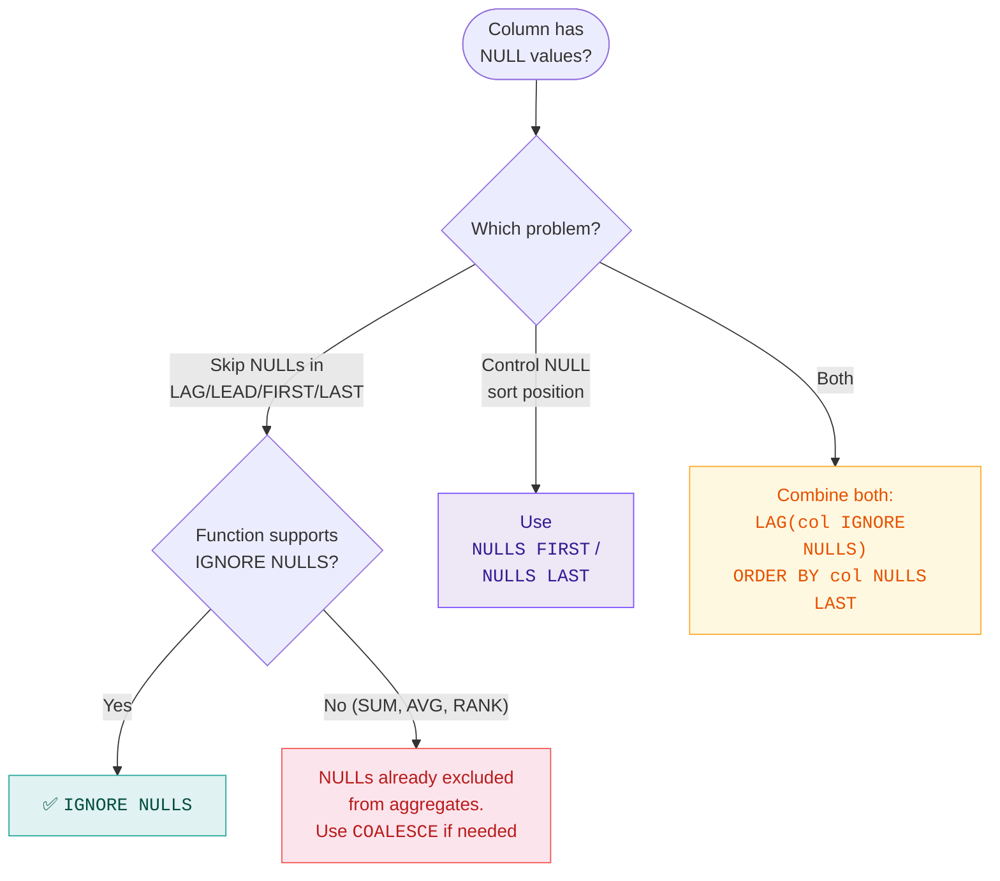
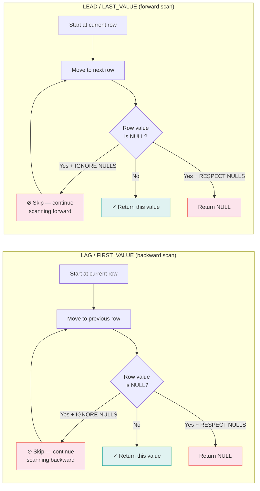

# :material-null: NULL Options in Window Functions

Spark SQL lets you control whether `NULL` values are skipped or included when scanning
a window frame, using the `IGNORE NULLS` / `RESPECT NULLS` clause, and control where
`NULL` values appear in an ordered partition with `NULLS FIRST` / `NULLS LAST`.

!!! abstract "Two Separate Concepts"
    **`IGNORE NULLS`** controls how a function _scans_ the frame (skip NULLs or not).
    **`NULLS FIRST / LAST`** controls where NULLs _sort_ inside the partition. They solve
    different problems and can be combined.

---

## :material-pin: Syntax

```sql
-- NULL option on navigation functions
function_name(col [IGNORE NULLS | RESPECT NULLS]) OVER (...)

-- NULL placement in ORDER BY
ORDER BY col [ASC | DESC] [NULLS FIRST | NULLS LAST]
```

---

## :material-table: IGNORE NULLS Support

| Function | Supports IGNORE NULLS | Notes |
|----------|-----------------------|-------|
| `LAG` | ✅ Yes | Skips NULLs when looking backward |
| `LEAD` | ✅ Yes | Skips NULLs when looking forward |
| `FIRST_VALUE` | ✅ Yes | Finds first non-NULL in frame |
| `LAST_VALUE` | ✅ Yes | Finds last non-NULL in frame |
| `NTH_VALUE` | ✅ Yes | Finds Nth non-NULL in frame |
| `SUM` / `AVG` | ❌ No | NULLs are always excluded from arithmetic aggregates |
| `RANK` / `DENSE_RANK` | ❌ No | NULL is treated as a value and ranked |

---

## :material-magnify: Behavior

| Rule | Detail |
|------|--------|
| **`IGNORE NULLS`** | Function skips any row where the expression is `NULL` and continues to the next non-`NULL` row |
| **`RESPECT NULLS`** (default) | `NULL` rows are included in the scan; returns `NULL` if the targeted row contains `NULL` |
| **Default NULL placement** | ASC → NULLs sort **last**; DESC → NULLs sort **first** |
| **Override placement** | `NULLS FIRST` / `NULLS LAST` explicitly controls position regardless of sort direction |
| **Affects rankings** | NULL placement changes physical row positions, which changes `ROW_NUMBER`, `RANK`, etc. |

---

## :material-sitemap: Decision Flowchart



---

## :material-cog-sync: How IGNORE NULLS Scans the Frame



---

## :material-flask-outline: Examples

### Dataset

```sql
CREATE OR REPLACE TEMP VIEW readings AS
SELECT * FROM VALUES
  ('Alice', '2024-01-01', 100),
  ('Alice', '2024-01-02', NULL),
  ('Alice', '2024-01-03', 200),
  ('Alice', '2024-01-04', NULL),
  ('Alice', '2024-01-05', 300),
  ('Alice', '2024-01-06', NULL),
  ('Alice', '2024-01-07', 150)
AS readings(rep, reading_date, amount);
```

### Example 1 — FIRST_VALUE: IGNORE NULLS vs RESPECT NULLS

```sql
SELECT
    rep,
    reading_date,
    amount,
    FIRST_VALUE(amount IGNORE NULLS)  OVER (PARTITION BY rep ORDER BY reading_date
        ROWS BETWEEN UNBOUNDED PRECEDING AND CURRENT ROW) AS first_non_null,
    FIRST_VALUE(amount RESPECT NULLS) OVER (PARTITION BY rep ORDER BY reading_date
        ROWS BETWEEN UNBOUNDED PRECEDING AND CURRENT ROW) AS first_any
FROM readings
ORDER BY reading_date;
```

??? example "Output"

    | rep   | reading_date | amount | first_non_null | first_any |
    |-------|--------------|--------|----------------|-----------|
    | Alice | 2024-01-01   |    100 |            100 |       100 |
    | Alice | 2024-01-02   |   NULL |            100 |       100 |
    | Alice | 2024-01-03   |    200 |            100 |       100 |
    | Alice | 2024-01-04   |   NULL |            100 |       100 |
    | Alice | 2024-01-05   |    300 |            100 |       100 |
    | Alice | 2024-01-06   |   NULL |            100 |       100 |
    | Alice | 2024-01-07   |    150 |            100 |       100 |

    Both columns return `100` because the first row is non-NULL. The difference
    shows when the first row _is_ NULL.

### Example 2 — LAST_VALUE IGNORE NULLS (Forward-Fill)

```sql
SELECT
    rep,
    reading_date,
    amount,
    LAST_VALUE(amount IGNORE NULLS) OVER (
        PARTITION BY rep ORDER BY reading_date
        ROWS BETWEEN UNBOUNDED PRECEDING AND CURRENT ROW  -- (1)!
    ) AS forward_filled
FROM readings
ORDER BY reading_date;
```

1. Frame ends at `CURRENT ROW` — this is the **forward-fill** pattern. Each row gets the most recent non-NULL value.

??? example "Output — classic forward-fill"

    | rep   | reading_date | amount | forward_filled |
    |-------|--------------|--------|----------------|
    | Alice | 2024-01-01   |    100 |            100 |
    | Alice | 2024-01-02   |   NULL |            100 |
    | Alice | 2024-01-03   |    200 |            200 |
    | Alice | 2024-01-04   |   NULL |            200 |
    | Alice | 2024-01-05   |    300 |            300 |
    | Alice | 2024-01-06   |   NULL |            300 |
    | Alice | 2024-01-07   |    150 |            150 |

!!! tip "Forward-fill is the #1 use case"
    `LAST_VALUE(col IGNORE NULLS)` with a frame ending at `CURRENT ROW` is the
    standard way to fill gaps in time-series data — no self-joins needed.

### Example 3 — LAG IGNORE NULLS

Skip back past `NULL` rows to find the previous non-null value.

```sql
SELECT
    rep,
    reading_date,
    amount,
    LAG(amount IGNORE NULLS)  OVER w AS prev_non_null,
    LAG(amount RESPECT NULLS) OVER w AS prev_any
FROM readings
WINDOW w AS (PARTITION BY rep ORDER BY reading_date)
ORDER BY reading_date;
```

??? example "Output — compare IGNORE vs RESPECT"

    | rep   | reading_date | amount | prev_non_null | prev_any |
    |-------|--------------|--------|---------------|----------|
    | Alice | 2024-01-01   |    100 |          NULL |     NULL |
    | Alice | 2024-01-02   |   NULL |           100 |      100 |
    | Alice | 2024-01-03   |    200 |           100 |     NULL |
    | Alice | 2024-01-04   |   NULL |           200 |      200 |
    | Alice | 2024-01-05   |    300 |           200 |     NULL |
    | Alice | 2024-01-06   |   NULL |           300 |      300 |
    | Alice | 2024-01-07   |    150 |           300 |     NULL |

    Notice row Jan 03: `RESPECT NULLS` returns `NULL` (the Jan 02 value), while
    `IGNORE NULLS` skips it and returns `100` (Jan 01).

### Example 4 — LEAD IGNORE NULLS

Skip forward past `NULL` rows to find the next non-null value.

```sql
SELECT
    rep,
    reading_date,
    amount,
    LEAD(amount IGNORE NULLS)  OVER w AS next_non_null,
    LEAD(amount RESPECT NULLS) OVER w AS next_any
FROM readings
WINDOW w AS (PARTITION BY rep ORDER BY reading_date)
ORDER BY reading_date;
```

??? example "Output"

    | rep   | reading_date | amount | next_non_null | next_any |
    |-------|--------------|--------|---------------|----------|
    | Alice | 2024-01-01   |    100 |           200 |     NULL |
    | Alice | 2024-01-02   |   NULL |           200 |      200 |
    | Alice | 2024-01-03   |    200 |           300 |     NULL |
    | Alice | 2024-01-04   |   NULL |           300 |      300 |
    | Alice | 2024-01-05   |    300 |           150 |     NULL |
    | Alice | 2024-01-06   |   NULL |           150 |      150 |
    | Alice | 2024-01-07   |    150 |          NULL |     NULL |

### Example 5 — NTH_VALUE IGNORE NULLS

Return the 2nd non-null amount in the partition.

```sql
SELECT
    rep,
    reading_date,
    amount,
    NTH_VALUE(amount IGNORE NULLS, 2) OVER (
        PARTITION BY rep ORDER BY reading_date
        ROWS BETWEEN UNBOUNDED PRECEDING AND UNBOUNDED FOLLOWING
    ) AS second_non_null
FROM readings
ORDER BY reading_date;
```

??? example "Output"

    | rep   | reading_date | amount | second_non_null |
    |-------|--------------|--------|-----------------|
    | Alice | 2024-01-01   |    100 |             200 |
    | Alice | 2024-01-02   |   NULL |             200 |
    | Alice | 2024-01-03   |    200 |             200 |
    | Alice | 2024-01-04   |   NULL |             200 |
    | Alice | 2024-01-05   |    300 |             200 |
    | Alice | 2024-01-06   |   NULL |             200 |
    | Alice | 2024-01-07   |    150 |             200 |

    The 2nd non-null value is `200` (Jan 03). NULL rows on Jan 02 and Jan 04 are skipped.

### Example 6 — NULL Placement in ORDER BY

Control where `NULL` rows appear in the partition, which changes the `ROW_NUMBER` assigned.

```sql
SELECT
    rep,
    reading_date,
    amount,
    ROW_NUMBER() OVER (PARTITION BY rep ORDER BY amount ASC NULLS FIRST)  AS rn_nulls_first,
    ROW_NUMBER() OVER (PARTITION BY rep ORDER BY amount ASC NULLS LAST)   AS rn_nulls_last
FROM readings
ORDER BY reading_date;
```

??? example "Output — same data, different row numbers"

    | rep   | reading_date | amount | rn_nulls_first | rn_nulls_last |
    |-------|--------------|--------|----------------|---------------|
    | Alice | 2024-01-01   |    100 |              4 |             1 |
    | Alice | 2024-01-02   |   NULL |              1 |             5 |
    | Alice | 2024-01-03   |    200 |              6 |             3 |
    | Alice | 2024-01-04   |   NULL |              2 |             6 |
    | Alice | 2024-01-05   |    300 |              7 |             4 |
    | Alice | 2024-01-06   |   NULL |              3 |             7 |
    | Alice | 2024-01-07   |    150 |              5 |             2 |

    NULLs get row numbers 1–3 with `NULLS FIRST`, but 5–7 with `NULLS LAST`.

---

## :material-play-circle: Interactive Visualizations

### IGNORE NULLS Scanner

Select a function, toggle **IGNORE NULLS**, and click any row to set the **CURRENT ROW**.
Watch how the scan path changes — skipped NULLs are marked with ⊘.

<div id="viz-null-scan" class="ts-viz" style="min-height:320px"></div>

!!! tip "What to notice"
    - **LAG** scans _backward_ from the current row; **LEAD** scans _forward_.
    - **FIRST_VALUE** scans from the start of the frame; **LAST_VALUE** from the end.
    - With `IGNORE NULLS` off, the first NULL encountered is returned immediately.

### NULLS FIRST vs NULLS LAST

Side-by-side comparison showing how NULL placement affects physical row ordering
and `ROW_NUMBER` assignments.

<div id="viz-null-ordering" class="ts-viz" style="min-height:260px"></div>

---

## :material-brain: When to Use

| Scenario | Recommended Pattern |
|----------|---------------------|
| Forward-fill missing values | `LAST_VALUE(col IGNORE NULLS) OVER (ORDER BY date ROWS BETWEEN UNBOUNDED PRECEDING AND CURRENT ROW)` |
| Backward-fill missing values | `FIRST_VALUE(col IGNORE NULLS) OVER (ORDER BY date DESC ROWS BETWEEN UNBOUNDED PRECEDING AND CURRENT ROW)` |
| Get previous non-null reading | `LAG(col IGNORE NULLS) OVER (...)` |
| Get next non-null forecast | `LEAD(col IGNORE NULLS) OVER (...)` |
| Place NULLs at beginning of ranking | `ORDER BY col ASC NULLS FIRST` |
| Treat NULLs as low values (sort last) | `ORDER BY col ASC NULLS LAST` (default for ASC) |

---

## :material-speedometer: Performance Notes

| Tip | Reason |
|-----|--------|
| `IGNORE NULLS` may scan more rows | Must skip past NULLs to find a non-NULL, extending scan distance |
| Reduce NULLs before the window | `COALESCE` or `WHERE IS NOT NULL` upstream can speed up frame scans |
| `NULLS FIRST / LAST` has no extra cost | It's just a sort comparator change — same performance as default |
| Combine with `PARTITION BY` | Smaller partitions = shorter scans when seeking non-NULL values |

---

## :material-link: See Also

- [ROWS frame](../frame/rows.md) — physical row offset examples
- [RANGE frame](../frame/range.md) — value-based offset examples
- [Application patterns](../application/index.md) — forward-fill, gap-filling patterns
- [Aggregate functions](../window/aggregate.md) — how SUM/AVG handle NULLs natively
