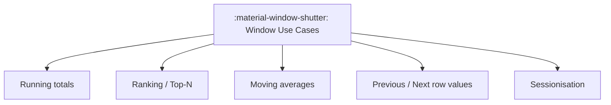

# :material-window-shutter: Application

### :material-sitemap: Overview



## Duplicate

```sql
CREATE OR REPLACE TEMP VIEW employees AS
SELECT * FROM VALUES
    (1, 'Alice',  'HR'),
    (2, 'Bob',    'Sales'),
    (3, 'Alice',  'HR'),
    (4, 'Alice',  'IT'),
    (5, 'Bob',    'Sales')
AS employees(id, name, department);
with partition_by_dept as (
    SELECT *,
           ROW_NUMBER() OVER (PARTITION BY name, department ORDER BY id) AS rn
    FROM employees
)
select 
    *
from partition_by_dept
where rn > 1;
```

```sql
CREATE OR REPLACE TEMP VIEW employees AS
SELECT * FROM VALUES
    (1, 'Alice',  'HR'),
    (2, 'Bob',    'Sales'),
    (3, 'Alice',  'HR'),
    (4, 'Alice',  'IT'),
    (5, 'Bob',    'Sales')
AS employees(id, name, department);
SELECT *
FROM (
    SELECT *,
           ROW_NUMBER() OVER (PARTITION BY name, department ORDER BY id) AS rn
    FROM employees
) sub
WHERE rn > 1;
```

```sql
CREATE OR REPLACE TEMP VIEW employees AS
SELECT * FROM VALUES
    (1, 'Alice',  'HR'),
    (2, 'Bob',    'Sales'),
    (3, 'Alice',  'HR'),
    (4, 'Alice',  'IT'),
    (5, 'Bob',    'Sales')
AS employees(id, name, department);
SELECT *
FROM (
    SELECT *,
           COUNT(*) OVER (PARTITION BY name, department) AS dup_count
    FROM employees
) sub
WHERE dup_count > 1;
```
