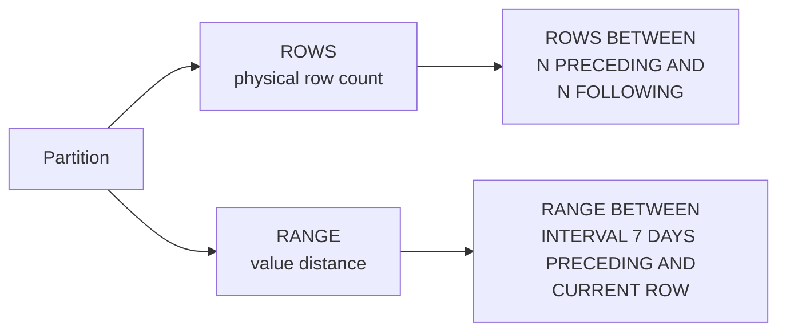

# :material-border-all: Frame Specification

A window frame limits the rows included in an aggregate calculation to a subset of the current partition. Two modes are available: `ROWS` (physical offset) and `RANGE` (value-based offset).

---

## :material-sitemap: Frame Overview



---

## :material-pin: Syntax

```sql
{ ROWS | RANGE } BETWEEN frame_start AND frame_end
```

Where `frame_start` / `frame_end` is one of:

```sql
UNBOUNDED PRECEDING
N PRECEDING
CURRENT ROW
N FOLLOWING
UNBOUNDED FOLLOWING
```

---

## :material-table: Frame Boundaries

| Boundary | Meaning |
|----------|---------|
| `UNBOUNDED PRECEDING` | Start of the partition |
| `N PRECEDING` | N rows / N value-units before the current row |
| `CURRENT ROW` | The current row itself |
| `N FOLLOWING` | N rows / N value-units after the current row |
| `UNBOUNDED FOLLOWING` | End of the partition |

---

## :material-compare: ROWS vs RANGE

| Property | ROWS | RANGE |
|----------|------|-------|
| Offset type | Physical row count — integer only | Value distance — numeric or interval |
| Tie handling | Each row is treated independently | All rows with the same ORDER BY value are always in the same frame |
| Multi-column ORDER BY | Supported | Not supported with numeric/interval offsets |
| Performance | Faster — row position is pre-computed | Slightly slower — value comparison required per row |
| Interval support | No | Yes — use `INTERVAL N DAYS` for date/timestamp columns |

---

## :material-magnify: Default Frame Behavior

| Condition | Default Frame |
|-----------|--------------|
| `ORDER BY` present, no frame clause | `RANGE BETWEEN UNBOUNDED PRECEDING AND CURRENT ROW` |
| No `ORDER BY`, no frame clause | `ROWS BETWEEN UNBOUNDED PRECEDING AND UNBOUNDED FOLLOWING` (full partition) |

!!! warning "LAST_VALUE and NTH_VALUE"
    Both default to `RANGE BETWEEN UNBOUNDED PRECEDING AND CURRENT ROW`, which means they return the *current* row's value unless you explicitly specify `ROWS BETWEEN UNBOUNDED PRECEDING AND UNBOUNDED FOLLOWING`.

---

## :material-flask-outline: ROWS vs RANGE Side-by-Side

The data has two rows on `2024-01-05` — showing how each mode handles ties differently.

```sql
CREATE OR REPLACE TEMP VIEW events AS
SELECT * FROM VALUES
  ('2024-01-01', 100),
  ('2024-01-03', 200),
  ('2024-01-05', 150),
  ('2024-01-05', 300),
  ('2024-01-07', 400)
AS events(event_date, amount);
```

```sql
SELECT
    event_date,
    amount,
    SUM(amount) OVER (
        ORDER BY event_date
        ROWS BETWEEN UNBOUNDED PRECEDING AND CURRENT ROW
    ) AS rows_running,
    SUM(amount) OVER (
        ORDER BY event_date
        RANGE BETWEEN UNBOUNDED PRECEDING AND CURRENT ROW
    ) AS range_running
FROM events
ORDER BY event_date, amount;
-- Result:
-- | event_date | amount | rows_running | range_running |
-- |------------|--------|--------------|---------------|
-- | 2024-01-01 |    100 |          100 |           100 |
-- | 2024-01-03 |    200 |          300 |           300 |
-- | 2024-01-05 |    150 |          450 |           750 |  -- RANGE includes both 2024-01-05 rows
-- | 2024-01-05 |    300 |          750 |           750 |  -- RANGE: same frame as row above
-- | 2024-01-07 |    400 |         1150 |          1150 |
--
-- ROWS treats the two 2024-01-05 rows independently (row-by-row).
-- RANGE treats them as a tied group — both see the full group in their frame.
```

---

## :material-brain: When to Use

| Scenario | Use |
|----------|-----|
| Rolling N-row average where each row must be distinct | `ROWS` |
| Rolling date window (e.g., last 7 days) | `RANGE BETWEEN INTERVAL 7 DAYS PRECEDING AND CURRENT ROW` |
| Running total where ties must all show the same cumulative sum | `RANGE` |
| Multi-column ORDER BY with offsets | `ROWS` — RANGE does not support it |
| Centred moving window (N before, N after) | `ROWS BETWEEN N PRECEDING AND N FOLLOWING` |

---

## :material-link: See Also

- [ROWS frame](rows.md) — physical row offset examples
- [RANGE frame](range.md) — value-based offset examples
