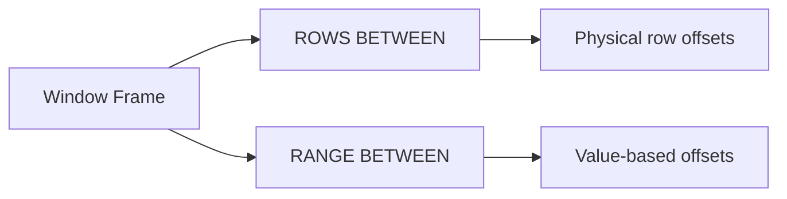

# :material-table-row: 🧱 What Is a Window Frame?

Specifies which row to start the window on and where to end it.
Window frames are a crucial part of window functions in Spark SQL / Databricks SQL — they define which rows are included in the calculation relative to the current row.

A window frame defines how many rows around the current row should be included when computing window function results.

Used mainly with:

1. Aggregate window functions (SUM, AVG, MIN, MAX, etc.)
2. Value functions (FIRST_VALUE, LAST_VALUE, NTH_VALUE)

### :material-sitemap: Overview



## 🔧 Syntax

```sql
<function>() OVER (
  PARTITION BY ...
  ORDER BY ...
  ROWS | RANGE BETWEEN <start> AND <end>
)
```

```text
{ RANGE | ROWS } { frame_start | BETWEEN frame_start AND frame_end }
```

Frame Type| Meaning
---|---
ROWS |Exact number of rows relative to current
RANGE |Based on value of ORDER BY column

### Frame start

```text
UNBOUNDED PRECEDING | offset PRECEDING | CURRENT ROW | offset FOLLOWING | UNBOUNDED FOLLOWING
```

`offset`: specifies the offset from the position of the current row.

### Frame end

Note: If `frame_end` is omitted it defaults to `CURRENT ROW`.

## 🔍 Frame Boundaries

Boundary Type| Meaning
---|---
UNBOUNDED PRECEDING| Start of the partition
CURRENT ROW |The current row
N PRECEDING| N rows before current row
N FOLLOWING |N rows after current row
UNBOUNDED FOLLOWING| End of the partition

## 📘 1. Running Total (Cumulative Sum)

```sql

CREATE OR REPLACE TEMP VIEW sales AS
SELECT * FROM VALUES
  ('North', 'Alice', '2024-01-01', 100),
  ('North', 'Alice', '2024-01-05', 200),
  ('North', 'Alice', '2024-01-10', 300),
  ('North', 'Bob',   '2024-01-02', 150),
  ('North', 'Bob',   '2024-01-06', 250)
AS sales(region, rep, sale_date, amount);
SELECT *,
  SUM(amount) OVER (
    PARTITION BY rep ORDER BY sale_date
    ROWS BETWEEN UNBOUNDED PRECEDING AND CURRENT ROW
  ) AS running_total
FROM sales;
```

## 📘 2. Moving Average (3-row window)

```sql
CREATE OR REPLACE TEMP VIEW sales AS
SELECT * FROM VALUES
  ('North', 'Alice', '2024-01-01', 100),
  ('North', 'Alice', '2024-01-05', 200),
  ('North', 'Alice', '2024-01-10', 300),
  ('North', 'Bob',   '2024-01-02', 150),
  ('North', 'Bob',   '2024-01-06', 250)
AS sales(region, rep, sale_date, amount);
SELECT *,
  AVG(amount) OVER (
    PARTITION BY rep ORDER BY sale_date
    ROWS BETWEEN 1 PRECEDING AND 1 FOLLOWING
  ) AS moving_avg
FROM sales;
```

## 📘 3. Entire Partition Total (No Running Logic)

```sql
CREATE OR REPLACE TEMP VIEW sales AS
SELECT * FROM VALUES
  ('North', 'Alice', '2024-01-01', 100),
  ('North', 'Alice', '2024-01-05', 200),
  ('North', 'Alice', '2024-01-10', 300),
  ('North', 'Bob',   '2024-01-02', 150),
  ('North', 'Bob',   '2024-01-06', 250)
AS sales(region, rep, sale_date, amount);
SELECT *,
  SUM(amount) OVER (
    PARTITION BY rep
    ROWS BETWEEN UNBOUNDED PRECEDING AND UNBOUNDED FOLLOWING
  ) AS total_per_rep
FROM sales;
```

### 📘 4. Difference Between 3rd and Current Value (Custom Frame)

```sql
CREATE OR REPLACE TEMP VIEW sales AS
SELECT * FROM VALUES
  ('North', 'Alice', '2024-01-01', 100),
  ('North', 'Alice', '2024-01-05', 200),
  ('North', 'Alice', '2024-01-10', 300),
  ('North', 'Bob',   '2024-01-02', 150),
  ('North', 'Bob',   '2024-01-06', 250)
AS sales(region, rep, sale_date, amount);
SELECT *,
  FIRST_VALUE(amount) OVER (
    PARTITION BY rep ORDER BY sale_date
    ROWS BETWEEN 2 PRECEDING AND CURRENT ROW
  ) AS third_latest_amt
FROM sales;
```
