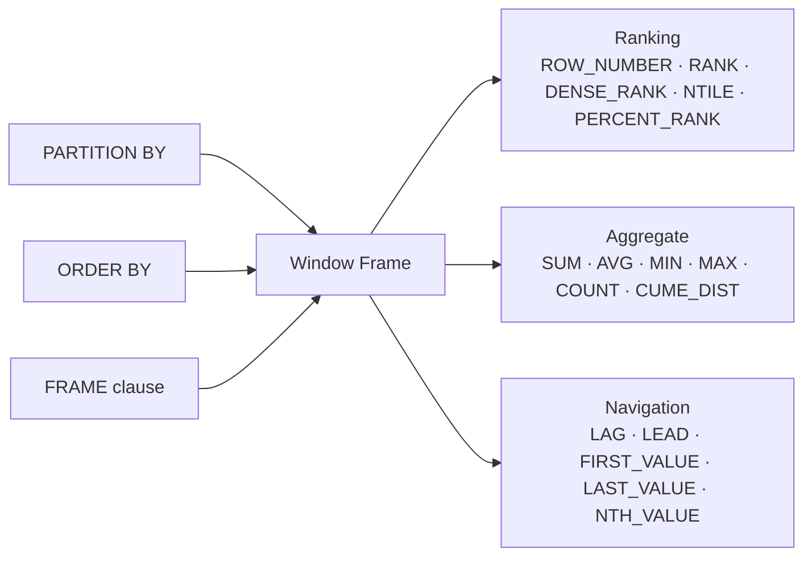

# :material-view-grid: Window Functions

Window functions compute a value for each row using a sliding or bounded set of rows — the *window* — without collapsing the result into a single group.

---

## :material-sitemap: Anatomy of a Window Function



---

## :material-pin: Syntax

```sql
function_name([expression]) OVER (
    [PARTITION BY partition_expression [, ...]]
    [ORDER BY    sort_expression [ASC | DESC] [NULLS FIRST | NULLS LAST] [, ...]]
    [frame_spec]
)
```

Where `frame_spec` is:

```sql
{ ROWS | RANGE } BETWEEN frame_start AND frame_end
```

---

## :material-magnify: Clause Reference

| Clause | Required | Purpose |
|--------|----------|---------|
| `PARTITION BY` | No | Resets the window for each distinct combination of the partition columns; omit to treat the entire result set as one partition |
| `ORDER BY` | Depends on function | Defines the row sequence within each partition; required by ranking and navigation functions, optional for pure aggregates |
| `FRAME` | No | Limits the aggregate to a sub-range of the partition; defaults to `RANGE BETWEEN UNBOUNDED PRECEDING AND CURRENT ROW` when `ORDER BY` is present, or the full partition when `ORDER BY` is absent |

---

## :material-table: Function Categories

| Category | Functions | Requires ORDER BY | Supports Frame |
|----------|-----------|-------------------|---------------|
| Ranking | `ROW_NUMBER`, `RANK`, `DENSE_RANK`, `NTILE`, `PERCENT_RANK` | Yes | No — always uses full partition |
| Aggregate | `SUM`, `AVG`, `MIN`, `MAX`, `COUNT`, `CUME_DIST` | Optional | Yes |
| Navigation | `LAG`, `LEAD`, `FIRST_VALUE`, `LAST_VALUE`, `NTH_VALUE` | Yes (LAG/LEAD) | Yes (FIRST/LAST/NTH) |

---

## :material-flask-outline: Quick Example

```sql
CREATE OR REPLACE TEMP VIEW sales AS
SELECT * FROM VALUES
  ('North', 'Alice', '2024-01-01', 100),
  ('North', 'Alice', '2024-01-05', 200),
  ('North', 'Alice', '2024-01-10', 300),
  ('North', 'Bob',   '2024-01-02', 150),
  ('North', 'Bob',   '2024-01-06', 300),
  ('South', 'Carol', '2024-01-03', 400),
  ('South', 'Carol', '2024-01-07', 500)
AS sales(region, rep, sale_date, amount);
```

Combine ranking and aggregate in a single query:

```sql
SELECT
    region,
    rep,
    sale_date,
    amount,
    ROW_NUMBER() OVER (PARTITION BY region ORDER BY amount DESC)          AS row_num,
    SUM(amount)  OVER (PARTITION BY region ORDER BY sale_date
                       ROWS BETWEEN UNBOUNDED PRECEDING AND CURRENT ROW) AS running_total
FROM sales
ORDER BY region, sale_date;
-- Result:
-- | region | rep   | sale_date  | amount | row_num | running_total |
-- |--------|-------|------------|--------|---------|---------------|
-- | North  | Alice | 2024-01-01 |    100 |       5 |           100 |
-- | North  | Bob   | 2024-01-02 |    150 |       3 |           250 |
-- | North  | Alice | 2024-01-05 |    200 |       3 |           450 |
-- | North  | Bob   | 2024-01-06 |    300 |       1 |           750 |
-- | North  | Alice | 2024-01-10 |    300 |       1 |          1050 |
-- | South  | Carol | 2024-01-03 |    400 |       2 |           400 |
-- | South  | Carol | 2024-01-07 |    500 |       1 |           900 |
```

---

## :material-brain: When to Use

| Scenario | Recommended Approach |
|----------|---------------------|
| Rank rows within a group without losing rows | Ranking functions with `PARTITION BY` |
| Compute a running total or moving average | Aggregate with `ORDER BY` and a frame clause |
| Compare each row to its predecessor | `LAG` / `LEAD` |
| Find first or last value in a group | `FIRST_VALUE` / `LAST_VALUE` with explicit frame |
| Assign percentile buckets | `NTILE(n)` or `PERCENT_RANK` |
