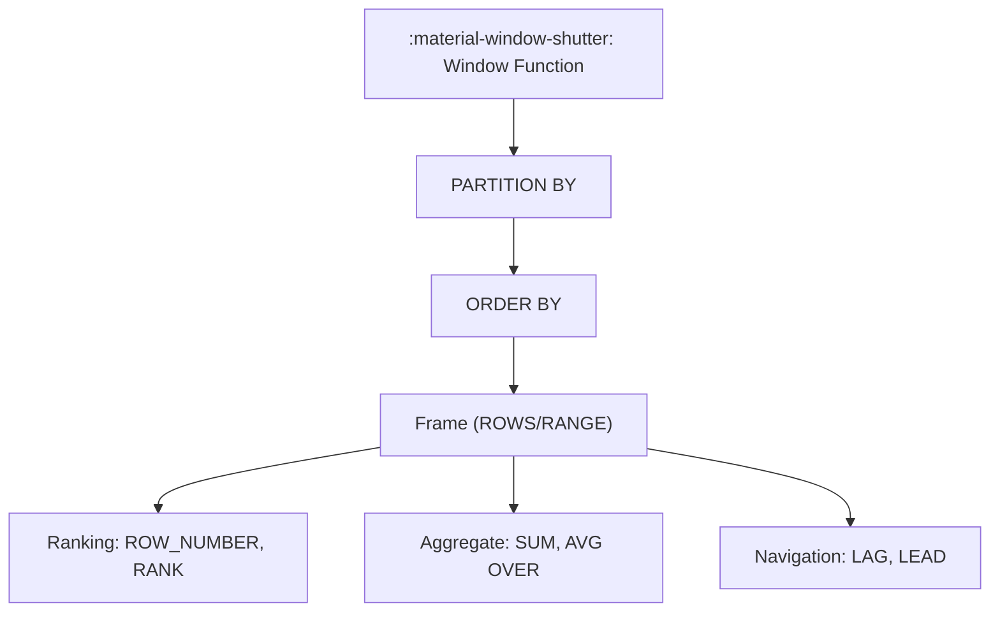

# :material-window-shutter: Window Functions

Window functions compute values across related rows while preserving row-level
output.

### :material-sitemap: Overview



---

## 📌 Common Categories

| Category | Examples |
|----------|----------|
| Ranking | `ROW_NUMBER`, `RANK`, `DENSE_RANK` |
| Aggregates | `SUM(...) OVER`, `AVG(...) OVER` |
| Navigation | `LAG`, `LEAD` |

---

## 🧪 Example

```sql
SELECT order_id,
       ROW_NUMBER() OVER (PARTITION BY customer_id ORDER BY order_date) AS rn
FROM orders;
```

---

## 🧠 When to Use

| Scenario | Recommendation |
|----------|----------------|
| Top-N per group | Ranking windows |
| Running totals | Aggregate windows |
| Previous/next row | Navigation windows |
