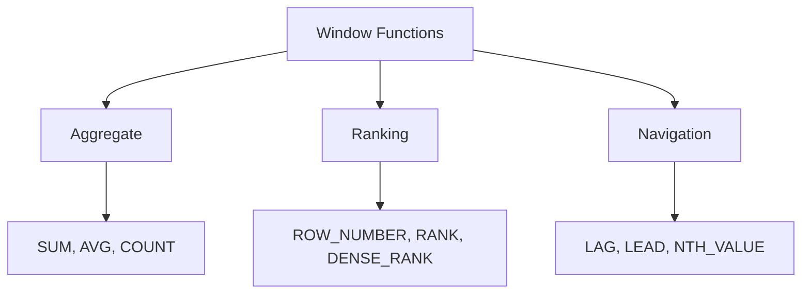

# :material-window-shutter: Window Function Categories

Window functions fall into three main categories.

### :material-sitemap: Overview



---

## 📌 Categories

| Category | Examples |
|----------|----------|
| Aggregate | `SUM`, `AVG` over window |
| Ranking | `ROW_NUMBER`, `RANK` |
| Navigation | `LAG`, `LEAD` |

---

## 🧪 Example

```sql
SELECT order_id,
       SUM(amount) OVER (PARTITION BY customer_id) AS total
FROM orders;
```

---

## 🧠 When to Use

| Scenario | Recommendation |
|----------|----------------|
| Running totals | Aggregate windows |
| Top-N per group | Ranking windows |
| Compare rows | Navigation windows |
