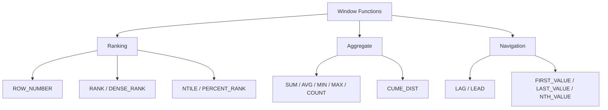

# :material-view-list: Window Function Types

Window functions fall into three categories: **Ranking**, **Aggregate**, and **Navigation**. Each has distinct behaviour around `ORDER BY` requirements and frame support.

---

## :material-sitemap: Category Overview

---

## :material-table: Function Reference

| Category | Function | Requires ORDER BY | Ignores Frame | Short Description |
|----------|----------|-------------------|---------------|-------------------|
| Ranking | `ROW_NUMBER` | Yes | Yes | Unique sequential integer per partition |
| Ranking | `RANK` | Yes | Yes | Rank with gaps on ties |
| Ranking | `DENSE_RANK` | Yes | Yes | Rank without gaps on ties |
| Ranking | `NTILE(n)` | Yes | Yes | Divides rows into n equal buckets |
| Ranking | `PERCENT_RANK` | Yes | Yes | Relative rank in [0.0, 1.0] |
| Aggregate | `SUM` / `AVG` | No (optional) | No | Running or partition sum / average |
| Aggregate | `MIN` / `MAX` | No (optional) | No | Minimum or maximum over the frame |
| Aggregate | `COUNT` | No (optional) | No | Row count over the frame |
| Aggregate | `CUME_DIST` | Yes | No | Cumulative distribution in [0.0, 1.0] |
| Navigation | `LAG` | Yes | Yes | Value from a preceding row |
| Navigation | `LEAD` | Yes | Yes | Value from a following row |
| Navigation | `FIRST_VALUE` | Yes | No | First value in the frame |
| Navigation | `LAST_VALUE` | Yes | No | Last value in the frame (needs explicit full frame) |
| Navigation | `NTH_VALUE` | Yes | No | N-th value in the frame (needs explicit full frame) |

---

## :material-magnify: Key Differences

| Property | Ranking | Aggregate | Navigation |
|----------|---------|-----------|------------|
| Requires `ORDER BY` | Always | Optional | Always (LAG/LEAD); optional for FIRST/LAST |
| Respects frame | Never | Yes | FIRST/LAST/NTH only |
| Returns a value from another row | No | No | Yes (LAG/LEAD/NTH/FIRST/LAST) |
| Can produce ties | RANK / DENSE_RANK | N/A | N/A |

---

## :material-link: See Also

- [Aggregate functions](aggregate.md) — SUM, AVG, MIN, MAX, COUNT, CUME_DIST with frame examples
- [Navigation functions](navigation.md) — LAG, LEAD, FIRST_VALUE, LAST_VALUE, NTH_VALUE
- [Ranking functions](ranking.md) — ROW_NUMBER, RANK, DENSE_RANK, NTILE, PERCENT_RANK
