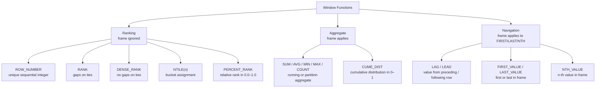

# :material-view-list: Window Function Types

Window functions fall into three categories: **Ranking**, **Aggregate**, and **Navigation**.
Each has distinct behaviour around `ORDER BY` requirements, frame support, and NULL handling.

---

## :material-sitemap: Category Map

---

## :material-table: Full Function Reference

| Category | Function | Requires ORDER BY | Respects Frame | Supports IGNORE NULLS |
|----------|----------|:-----------------:|:--------------:|:---------------------:|
| Ranking | `ROW_NUMBER()` | Yes | No | No |
| Ranking | `RANK()` | Yes | No | No |
| Ranking | `DENSE_RANK()` | Yes | No | No |
| Ranking | `NTILE(n)` | Yes | No | No |
| Ranking | `PERCENT_RANK()` | Yes | No | No |
| Aggregate | `SUM(expr)` | Optional | Yes | No — NULLs excluded from arithmetic |
| Aggregate | `AVG(expr)` | Optional | Yes | No |
| Aggregate | `MIN(expr)` | Optional | Yes | No |
| Aggregate | `MAX(expr)` | Optional | Yes | No |
| Aggregate | `COUNT(expr)` | Optional | Yes | No |
| Aggregate | `CUME_DIST()` | Yes | No | No |
| Navigation | `LAG(col [,n [,default]])` | Yes | No | Yes |
| Navigation | `LEAD(col [,n [,default]])` | Yes | No | Yes |
| Navigation | `FIRST_VALUE(col [IGNORE NULLS])` | Yes | Yes | Yes |
| Navigation | `LAST_VALUE(col [IGNORE NULLS])` | Yes | Yes | Yes |
| Navigation | `NTH_VALUE(col, n [IGNORE NULLS])` | Yes | Yes | Yes |

---

## :material-compare: Category Differences

| Property | Ranking | Aggregate | Navigation |
|----------|:-------:|:---------:|:----------:|
| Requires `ORDER BY` | Always | Optional | Always (LAG/LEAD); optional (FIRST/LAST) |
| Respects frame clause | Never | Yes | FIRST/LAST/NTH only |
| Returns a value from another row | No | No | Yes (all) |
| Can produce ties | RANK / DENSE_RANK | N/A | N/A |
| Default: `NULL` at boundary | No | No | Yes — use default argument for LAG/LEAD |

---

## :material-alert: Common Pitfalls

| Pitfall | Explanation | Fix |
|---------|-------------|-----|
| `LAST_VALUE` returns current row | Default frame is `… AND CURRENT ROW` | Add `ROWS BETWEEN UNBOUNDED PRECEDING AND UNBOUNDED FOLLOWING` |
| `NTH_VALUE` returns NULL | Same default frame issue | Explicit full-partition frame |
| `ROW_NUMBER` non-deterministic | Tied rows have undefined order | Make `ORDER BY` unique (add a tiebreaker column) |
| `RANK` gaps confuse consumers | After a tie at rank 1 and 1, next rank is 3 | Use `DENSE_RANK` for gap-free ranking |
| `PERCENT_RANK` is 0.0 with 1 row | Formula: `(rank-1)/(n-1)` — division by zero avoided, returns 0.0 | Expected behaviour |

---

## :material-link: Detailed Pages

- [Ranking Functions](ranking.md) — `ROW_NUMBER`, `RANK`, `DENSE_RANK`, `NTILE`, `PERCENT_RANK`
- [Aggregate Functions](aggregate.md) — `SUM`, `AVG`, `MIN`, `MAX`, `COUNT`, `CUME_DIST`
- [Navigation Functions](navigation.md) — `LAG`, `LEAD`, `FIRST_VALUE`, `LAST_VALUE`, `NTH_VALUE`
