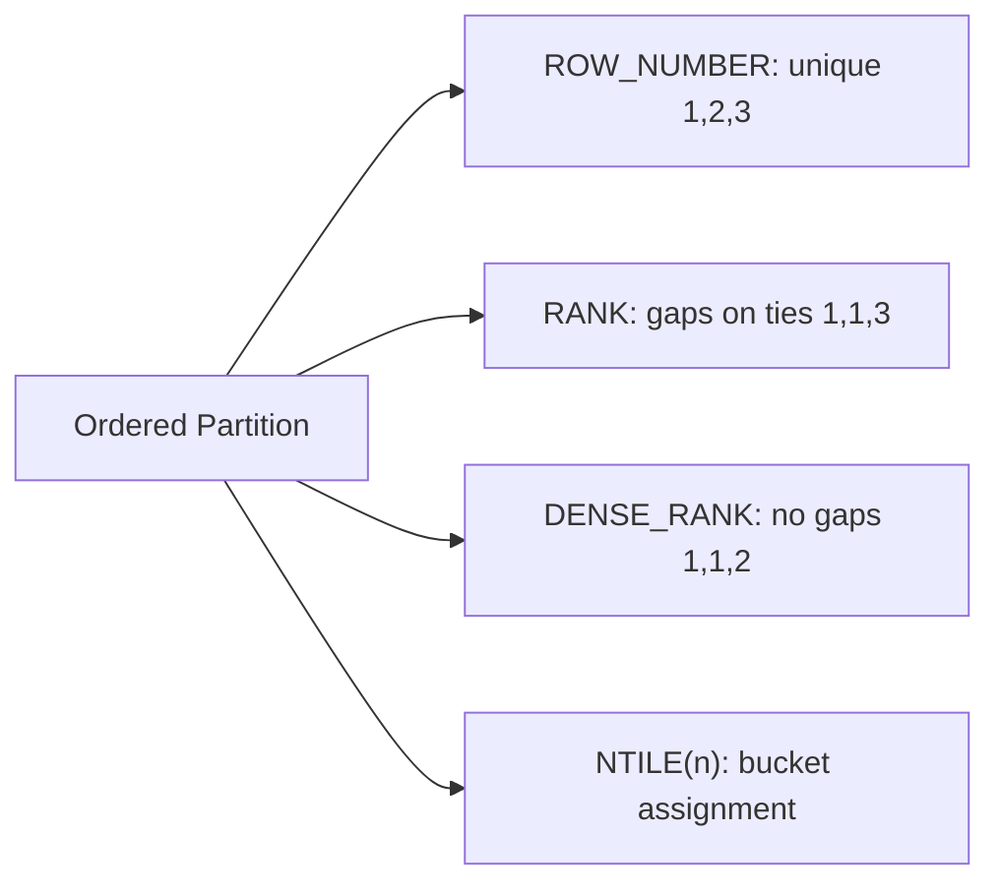

# :material-podium: Ranking Functions

Ranking functions assign a position to each row within a partition based on an ordering expression.

### :material-sitemap: Overview



---

## 📌 Functions

| Function | Syntax | Description |
|----------|--------|-------------|
| `ROW_NUMBER` | `ROW_NUMBER() OVER ([PARTITION BY ...] ORDER BY ...)` | Assigns a unique sequential integer to each row within the partition |
| `RANK` | `RANK() OVER ([PARTITION BY ...] ORDER BY ...)` | Assigns rank with gaps — tied rows share the same rank, the next rank skips |
| `DENSE_RANK` | `DENSE_RANK() OVER ([PARTITION BY ...] ORDER BY ...)` | Assigns rank without gaps — tied rows share the same rank, next rank increments by 1 |
| `NTILE(n)` | `NTILE(n) OVER ([PARTITION BY ...] ORDER BY ...)` | Divides rows into `n` roughly equal buckets and returns the bucket number |
| `PERCENT_RANK` | `PERCENT_RANK() OVER ([PARTITION BY ...] ORDER BY ...)` | Returns relative rank as a value in `[0.0, 1.0]`: `(rank − 1) / (rows − 1)` |

All ranking functions require `ORDER BY` inside the `OVER` clause.

---

## 🔍 Behavior

1. **Tie handling — RANK vs DENSE_RANK**: when rows tie on the `ORDER BY` value, both receive the same rank. `RANK` then skips the next integer (leaving gaps), while `DENSE_RANK` continues from the immediately following integer (no gaps).
2. **ROW_NUMBER determinism**: always produces distinct values, but the relative order of tied rows is non-deterministic unless the `ORDER BY` expression is unique across all rows in the partition.
3. **NTILE distribution**: divides the partition into `n` buckets as evenly as possible. When `partition_size % n != 0`, the first `(partition_size % n)` buckets each contain one extra row.
4. **PERCENT_RANK formula**: `(rank − 1) / (rows_in_partition − 1)`. The first row always yields `0.0`; the last row always yields `1.0`. Returns `0.0` when the partition contains exactly one row.
5. Ranking functions ignore any window frame specification — they always operate over the full partition.

---

## 🧪 Practical Examples

```sql
CREATE OR REPLACE TEMP VIEW sales AS
SELECT * FROM VALUES
  ('North', 'Alice', '2024-01-01', 100),
  ('North', 'Alice', '2024-01-05', 200),
  ('North', 'Alice', '2024-01-10', 300),
  ('North', 'Bob',   '2024-01-02', 150),
  ('North', 'Bob',   '2024-01-06', 300),
  ('South', 'Carol', '2024-01-03', 400),
  ('South', 'Carol', '2024-01-07', 500)
AS sales(region, rep, sale_date, amount);
```

### Example 1 — All Ranking Functions Side-by-Side

Alice and Bob both have `amount = 300` in the North partition, demonstrating tie behaviour across all four functions:

```sql
SELECT
    region,
    rep,
    amount,
    ROW_NUMBER() OVER (PARTITION BY region ORDER BY amount DESC) AS row_num,
    RANK()       OVER (PARTITION BY region ORDER BY amount DESC) AS rnk,
    DENSE_RANK() OVER (PARTITION BY region ORDER BY amount DESC) AS dense_rnk,
    NTILE(3)     OVER (PARTITION BY region ORDER BY amount DESC) AS bucket
FROM sales;
-- Result:
-- | region | rep   | amount | row_num | rnk | dense_rnk | bucket |
-- |--------|-------|--------|---------|-----|-----------|--------|
-- | North  | Alice |    300 |       1 |   1 |         1 |      1 |
-- | North  | Bob   |    300 |       2 |   1 |         1 |      1 |
-- | North  | Alice |    200 |       3 |   3 |         2 |      2 |
-- | North  | Bob   |    150 |       4 |   4 |         3 |      2 |
-- | North  | Alice |    100 |       5 |   5 |         4 |      3 |
-- | South  | Carol |    500 |       1 |   1 |         1 |      1 |
-- | South  | Carol |    400 |       2 |   2 |         2 |      2 |
--
-- RANK skips rank 2 after the tie at rank 1; DENSE_RANK does not.
-- ROW_NUMBER order between the two tied rows (amount = 300) is implementation-defined.
```

### Example 2 — Top-N Per Group

Return the top 2 sales per rep using `ROW_NUMBER` in a subquery:

```sql
SELECT region, rep, sale_date, amount
FROM (
    SELECT
        region,
        rep,
        sale_date,
        amount,
        ROW_NUMBER() OVER (PARTITION BY rep ORDER BY amount DESC) AS rn
    FROM sales
)
WHERE rn <= 2;
-- Result:
-- | region | rep   | sale_date  | amount |
-- |--------|-------|------------|--------|
-- | North  | Alice | 2024-01-10 |    300 |
-- | North  | Alice | 2024-01-05 |    200 |
-- | North  | Bob   | 2024-01-06 |    300 |
-- | North  | Bob   | 2024-01-02 |    150 |
-- | South  | Carol | 2024-01-07 |    500 |
-- | South  | Carol | 2024-01-03 |    400 |
```

### Example 3 — PERCENT_RANK for Percentile Scoring

```sql
SELECT
    region,
    rep,
    amount,
    ROUND(PERCENT_RANK() OVER (PARTITION BY region ORDER BY amount), 2) AS pct_rank
FROM sales;
-- Result:
-- | region | rep   | amount | pct_rank |
-- |--------|-------|--------|----------|
-- | North  | Alice |    100 |     0.00 |
-- | North  | Bob   |    150 |     0.25 |
-- | North  | Alice |    200 |     0.50 |
-- | North  | Alice |    300 |     0.75 |
-- | North  | Bob   |    300 |     0.75 |  -- tied rows share the same percent_rank
-- | South  | Carol |    400 |     0.00 |
-- | South  | Carol |    500 |     1.00 |
```

### Example 4 — De-duplication Using ROW_NUMBER

Keep only the most recent sale per rep:

```sql
SELECT region, rep, sale_date, amount
FROM (
    SELECT
        region,
        rep,
        sale_date,
        amount,
        ROW_NUMBER() OVER (PARTITION BY rep ORDER BY sale_date DESC) AS rn
    FROM sales
)
WHERE rn = 1;
-- Result:
-- | region | rep   | sale_date  | amount |
-- |--------|-------|------------|--------|
-- | North  | Alice | 2024-01-10 |    300 |
-- | North  | Bob   | 2024-01-06 |    300 |
-- | South  | Carol | 2024-01-07 |    500 |
```

---

## 🧠 When to Use

| Scenario | Recommended Pattern |
|----------|---------------------|
| Top-N records per group | `ROW_NUMBER` in a subquery with `WHERE rn <= N` |
| Ranking with ties preserved | `RANK` or `DENSE_RANK` |
| Splitting rows into equal buckets | `NTILE(n)` |
| Percentile scoring / relative position | `PERCENT_RANK` |
| Removing duplicates, keeping latest row | `ROW_NUMBER` ordered by timestamp DESC, filter `rn = 1` |
| Pagination over ordered results | `ROW_NUMBER` with `WHERE rn BETWEEN x AND y` |
